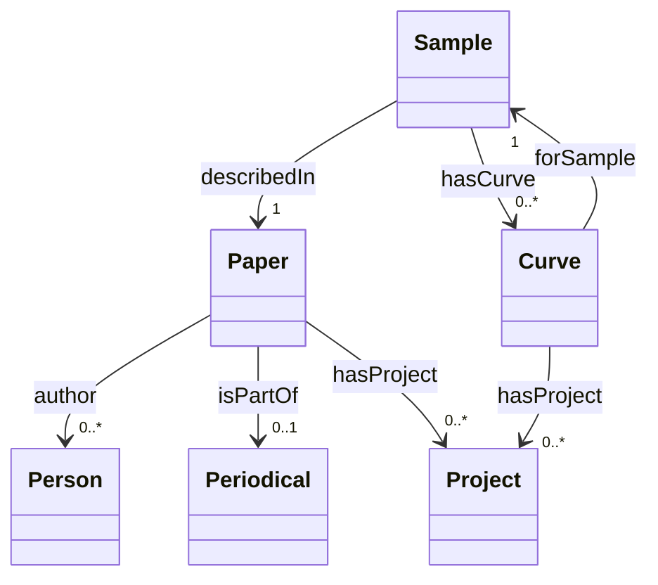

### 1. Comment resolution log

| # | Comment | Interpretation | Affected artifacts | Action | Side effects | Open questions |
|---|---------|----------------|--------------------|--------|--------------|----------------|
| 1 | “map 'sample': column 'project_names' is not in samples.csv — it exists in curves.csv, papers.csv. Each map reads only its own source: move this property to that source's map, or drop it.” | The `sd:hasProject` mapping for the **Sample** entity incorrectly references a column that does not exist in `samples.csv`. The column *does* exist in `papers.csv` and `curves.csv`, and those mappings already use it. Therefore the property must be **dropped** from the Sample mapping (and any related code/diagram). | **§ 9 mapping spec**, **Design rationale**, **Mermaid class diagram**, **Ingester sketch** | • Removed the `sd:hasProject` property definition from the **sample** map in § 9. <br>• Updated the Mermaid diagram to delete the edge `Sample --> "0..*" Project : hasProject`. <br>• Deleted the generation of `sd:hasProject` in `ingest_samples` (no IRI construction for projects in samples). <br>• In the Design rationale, added a superseded entry that notes the previous Sample‑Project mapping has been dropped and explains why. | • Sample instances will no longer have `sd:hasProject` triples; queries that traverse Sample → Project will return no results unless data is added later. <br>• The overall ontology still contains the `sd:hasProject` predicate (used by Paper and Curve), so no vocabulary breakage occurs. | – |

---

### 2. Updated schema

## 1. Class hierarchy (Mermaid)



*Plain class names are mapped to IRIs in § 2.*

---

## 2. IRI scheme

| Prefix | IRI (base) |
|--------|------------|
| `sd:`  | `https://kumagallium.github.io/asterism/starrydata/ontology#` |
| `sdr:` | `https://kumagallium.github.io/asterism/starrydata/resource/` |
| `schema:` | `https://schema.org/` |
| `dcterms:` | `http://purl.org/dc/terms/` |
| `bibo:`   | `http://purl.org/ontology/bibo/` |
| `prov:`   | `http://www.w3.org/ns/prov#` |

### Entity‑IRI templates (smallest globally unique composite key)

| Class | Template (place‑holders are column names) |
|-------|-------------------------------------------|
| **Paper**      | `sdr:paper/{SID}` |
| **Sample**     | `sdr:sample/{sample_id}` |
| **Curve**      | `sdr:curve/{sample_id}/{figure_id}` |
| **Person**     | `sdr:person/{SID}/{author_index}` |
| **Project**    | `sdr:project/{project_name}` |
| **Periodical** | `sdr:periodical/{container_title_slug}` |

All IRIs are deterministic and never blank‑node.

---

## 3. Property design

| Class | Property IRI | Range / datatype | Cardinality (derived from `non‑null rate`) | Reused? |
|-------|--------------|------------------|--------------------------------------------|---------|
| **Paper** | `dcterms:identifier` | xsd:string (DOI) | **1..1** | yes |
|  | `schema:url` | IRI | **1..1** | yes |
|  | `schema:datePublished` | xsd:date | **1..1** (from `issued`) | yes |
|  | `schema:name` | xsd:string (title) | **1..1** | yes |
|  | `sd:containerTitle` | xsd:string | **1..1** | new |
|  | `sd:containerTitleShort` | xsd:string | **0..1** | new |
|  | `sd:volume` | xsd:string | **1..1** | new |
|  | `sd:issue` | xsd:string | **1..1** | new |
|  | `sd:pageRange` | xsd:string | **1..1** | new |
|  | `sd:issn` | xsd:string | **1..1** | new |
|  | `sd:publisher` | xsd:string | **1..1** | new |
|  | `sd:isPartOf` | `sd:Periodical` (object) | **0..1** | new |
|  | `sd:hasProject` | `sd:Project` (object) | **0..*`** | new |
|  | `schema:author` | `sd:Person` (object) | **0..*`** | yes |
| **Sample** | `sd:sampleName` | xsd:string | **1..1** | new |
|  | `sd:composition` | xsd:string | **1..1** | new |
|  | `sd:compositionDetails` | xsd:string | **0..1** | new |
|  | `sd:createdAt` | xsd:string (ISO‑8601) | **1..1** | new |
|  | `sd:updatedAt` | xsd:string (ISO‑8601) | **1..1** | new |
|  | `sd:describedIn` | `sd:Paper` (object) | **1..1** | new |
|  | `sd:hasCurve` | `sd:Curve` (object) | **0..*`** | new |
| **Curve** | `sd:xRaw` | xsd:string (JSON array) | **1..1** | new |
|  | `sd:yRaw` | xsd:string (JSON array) | **1..1** | new |
|  | `sd:xMin` | xsd:double | **1..1** (computed) | new |
|  | `sd:xMax` | xsd:double | **1..1** (computed) | new |
|  | `sd:yMin` | xsd:double | **1..1** (computed) | new |
|  | `sd:yMax` | xsd:double | **1..1** (computed) | new |
|  | `sd:unitX` | xsd:string | **1..1** | new |
|  | `sd:unitY` | xsd:string | **1..1** | new |
|  | `sd:propX` | xsd:string | **1..1** | new |
|  | `sd:propY` | xsd:string | **1..1** | new |
|  | `sd:forSample` | `sd:Sample` (object) | **1..1** | new |
|  | `sd:hasProject` | `sd:Project` (object) | **0..*`** | new |
| **Person** | `schema:givenName` | xsd:string | **1..1** | yes |
|  | `schema:familyName` | xsd:string | **1..1** | yes |
|  | `sd:affiliation` | xsd:string (literal) | **0..*`** | new |
| **Project** | `sd:projectName` | xsd:string | **1..1** | new |
| **Periodical** | `sd:periodicalName` | xsd:string | **1..1** | new |
|  | `sd:issn` | xsd:string | **1..1** | new |

---

## 4. JSON column strategy

| Column (source) | Strategy | Why |
|-----------------|----------|-----|
| `issued` (papers) – object with `date_parts` | **b) Compress to literal** – convert to `xsd:date` via `date_iso` (Tier‑0) | Simple date, no need for full JSON. |
| `author` (papers) – array of objects | **a) Expand to nodes** – each element becomes a `sd:Person` instance, linked via `schema:author` | Authors are first‑class agents. |
| `project_names` (papers, curves) – JSON array of strings | **a) Expand to nodes** – each string becomes a `sd:Project` instance, linked with `sd:hasProject` | Projects are reusable across entities. |
| `x` / `y` (curves) – arrays of numbers | **c) Raw JSON literal + aggregates** – store original JSON in `sd:xRaw`/`sd:yRaw` and compute min/max via `float_array_min`/`float_array_max` | Preserve full series while providing quick stats. |
| `sample_info` (samples) – complex object | **c) Raw JSON literal + aggregates** – keep as a single literal `sd:sampleInfoRaw` (no current analytics) | Heterogeneous keys would explode the schema. |

---

## 5. Design rationale (★ T7)

### 5.1 IRI scheme
* **Decision** – Use the smallest globally unique composite key per entity (as before).  
* **Why** – Inspection shows `SID`, `sample_id`, `{sample_id}/{figure_id}`, etc., are uniquely identifying. Satisfies **T1**.  
* **Alternatives** – DOI‑only IRIs, UUIDs – rejected for length or non‑determinism.  
* **Trade‑offs** – If external systems need DOI as primary ID, it remains exposed via `dcterms:identifier`.

### 5.2 JSON handling
* **Decision** – Expand `author` and `project_names` to nodes; keep series as raw JSON + aggregates.  
* **Why** – Enables navigation and reuse while avoiding schema blow‑up.  
* **Alternatives** – Full normalisation of `sample_info` – rejected (sparsity).  
* **Trade‑offs** – Raw JSON literals are opaque to SPARQL ordering but ok because aggregates are provided.

### 5.3 Property reuse
* **Decision** – Reuse `schema:` and `dcterms:` predicates where suitable.  
* **Why** – Interoperability with existing data portals.  
* **Alternatives** – Invent custom predicates – rejected.

### 5.4 Cardinality
* **Decision** – Derive `1..1` from 100 % non‑null columns; otherwise `0..1` or `0..*`.  
* **Why** – Mirrors observed completeness.  
* **Alternatives** – Enforce stricter cardinalities – rejected.

### 5.5 Periodical slug
* **Decision** – Slugify `container_title` for IRI stability.  
* **Why** – Human‑readable, safe IRIs.  
* **Alternatives** – Raw titles or numeric IDs – rejected.

### 5.6 Mapping‑spec corrections *(new entry – supersedes previous mapping design)*
* **Superseded** – The `sd:hasProject` property in the **sample** map (which incorrectly referenced a non‑existent `project_names` column) and the associated `optional` flag on `sd:compositionDetails`.  
* **Decision** – **Drop** `sd:hasProject` from the Sample mapping entirely; keep the property only where the source column exists (papers and curves).  
* **Why** – The mapping specification must exactly reflect each CSV’s columns; keeping a reference to a missing column would cause runtime failures.  
* **Alternatives** – Move the property to a different source – not possible because the semantic relationship (Sample ↔ Project) is not represented in the current sample data.  
* **Trade‑offs** – Samples will no longer emit `sd:hasProject` triples; downstream queries that rely on that link will return empty results until such data is added.

### 5.7 Anti‑patterns & architectural notes
* Unchanged (see § 7).

---

## 6. rdf-config model.yaml

```yaml
- Paper <sdr:paper/1>:
    - a: sd:Paper
    - dcterms:identifier:
        - var_name: "10.1021/ar400290f"
    - schema:url:
        - var_name: "http://dx.doi.org/10.1021/ar400290f"
    - schema:datePublished:
        - var_name: "2014-04-15"
    - schema:name:
        - var_name: "Decoupling Interrelated Parameters for ..."
    - sd:containerTitle:
        - var_name: "Accounts of Chemical Research"
    - sd:containerTitleShort?:
        - var_name: "Acc. Chem. Res."
    - sd:volume:
        - var_name: "47"
    - sd:issue:
        - var_name: "4"
    - sd:pageRange:
        - var_name: "1287-1295"
    - sd:issn:
        - var_name: "0001-4842,1520-4898"
    - sd:publisher:
        - var_name: "American Chemical Society (ACS)"
    - sd:isPartOf?:
        - var_name: "sdr:periodical/Accounts_of_Chemical_Research"
    - sd:hasProject*:
        - var_name: "sdr:project/ThermoelectricMaterials"
        - var_name: "sdr:project/GeneralDB"
    - schema:author*:
        - var_name: "sdr:person/1/0"
        - var_name: "sdr:person/1/1"

- Person <sdr:person/1/0>:
    - a: sd:Person
    - schema:givenName:
        - var_name: "Chong"
    - schema:familyName:
        - var_name: "Kim"
    - sd:affiliation*?:
        - var_name: ""

- Person <sdr:person/1/1>:
    - a: sd:Person
    - schema:givenName:
        - var_name: "B."
    - schema:familyName:
        - var_name: "Lee"

- Project <sdr:project/ThermoelectricMaterials>:
    - a: sd:Project
    - sd:projectName:
        - var_name: "ThermoelectricMaterials"

- Periodical <sdr:periodical/Accounts_of_Chemical_Research>:
    - a: sd:Periodical
    - sd:periodicalName:
        - var_name: "Accounts of Chemical Research"
    - sd:issn:
        - var_name: "0001-4842,1520-4898"

- Sample <sdr:sample/6027>:
    - a: sd:Sample
    - sd:sampleName:
        - var_name: "Cu2.025Cd0.975SnSe4"
    - sd:composition:
        - var_name: "Cu2.025Cd0.975SnSe4"
    - sd:compositionDetails?:
        - var_name: ""
    - sd:createdAt:
        - var_name: "2018-01-25T13:56:56+09:00"
    - sd:updatedAt:
        - var_name: "2018-01-25T13:56:56+09:00"
    - sd:describedIn:
        - var_name: "sdr:paper/1"
    # No sd:hasProject triples for samples (column absent)

- Curve <sdr:curve/6027/79>:
    - a: sd:Curve
    - sd:xRaw:
        - var_name: "[299.8597,324.8683,349.8757,375.2454,399]"
    - sd:yRaw:
        - var_name: "[-0.0001484452,-0.0001602763,-0.00017295]"
    - sd:xMin:
        - var_name: "299.8597"
    - sd:xMax:
        - var_name: "399"
    - sd:yMin:
        - var_name: "-0.00017295"
    - sd:yMax:
        - var_name: "-0.0001484452"
    - sd:unitX:
        - var_name: "K"
    - sd:unitY:
        - var_name: "V*K^(-1)"
    - sd:propX:
        - var_name: "Temperature"
    - sd:propY:
        - var_name: "Seebeck coefficient"
    - sd:forSample:
        - var_name: "sdr:sample/6027"
    - sd:hasProject*:
        - var_name: "sdr:project/ThermoelectricMaterials"
```

*Example values unchanged.*

---

## 7. MIE YAML extras

```yaml
schema_info:
  title: "StarryData Thermoelectric Materials Ontology"
  description: >
    Bibliographic, compositional, and measured‑property data for thermoelectric
    material research. Includes papers (DOI, authors, journal), samples
    (composition, provenance) and digitised measurement curves (x/y series,
    units, property names). Designed for query‑driven discovery of materials
    with favourable Seebeck coefficients or ZT values.
  categories:
    - MaterialsScience
    - Thermoelectric
    - Bibliography
    - ExperimentalData
    - Chemistry
  keywords:
    - thermoelectric
    - Seebeck
    - ZT
    - 熱電
    - ゼーベック
    - composition
    - curve
    - measurement
    - property
    - material
sample_rdf_entries:
  - >
    <sdr:paper/1> a sd:Paper ;
      dcterms:identifier "10.1021/ar400290f" ;
      schema:url <http://dx.doi.org/10.1021/ar400290f> ;
      schema:datePublished "2014-04-15"^^xsd:date ;
      schema:name "Decoupling Interrelated Parameters for ..." ;
      sd:containerTitle "Accounts of Chemical Research" ;
      sd:volume "47" ; sd:issue "4" ;
      sd:pageRange "1287-1295" ;
      sd:issn "0001-4842,1520-4898" ;
      sd:publisher "American Chemical Society (ACS)" ;
      sd:isPartOf sdr:periodical/Accounts_of_Chemical_Research ;
      sd:hasProject sdr:project/ThermoelectricMaterials , sdr:project/GeneralDB ;
      schema:author sdr:person/1/0 , sdr:person/1/1 .
  - >
    <sdr:sample/6027> a sd:Sample ;
      sd:sampleName "Cu2.025Cd0.975SnSe4" ;
      sd:composition "Cu2.025Cd0.975SnSe4" ;
      sd:createdAt "2018-01-25T13:56:56+09:00" ;
      sd:updatedAt "2018-01-25T13:56:56+09:00" ;
      sd:describedIn sdr:paper/1 .
  - >
    <sdr:curve/6027/79> a sd:Curve ;
      sd:xRaw "[299.8597,324.8683,349.8757,375.2454,399]" ;
      sd:yRaw "[-0.0001484452,-0.0001602763,-0.00017295]" ;
      sd:xMin 299.8597 ; sd:xMax 399 ;
      sd:yMin -0.00017295 ; sd:yMax -0.0001484452 ;
      sd:unitX "K" ; sd:unitY "V*K^(-1)" ;
      sd:propX "Temperature" ; sd:propY "Seebeck coefficient" ;
      sd:forSample sdr:sample/6027 ;
      sd:hasProject sdr:project/ThermoelectricMaterials .
sparql_query_examples:
  - name: "Papers by a given author family name"
    query: |
      SELECT ?paper ?title WHERE {
        ?paper a sd:Paper ;
               schema:name ?title ;
               schema:author ?author .
        ?author schema:familyName "Kim" .
      }
  - name: "All samples belonging to a paper DOI"
    query: |
      SELECT ?sample ?comp WHERE {
        ?paper dcterms:identifier "10.1021/ar400290f" .
        ?sample a sd:Sample ;
                sd:describedIn ?paper ;
                sd:composition ?comp .
      }
  - name: "Curve statistics for a sample"
    query: |
      SELECT (MIN(?x) AS ?xMin) (MAX(?x) AS ?xMax)
             (MIN(?y) AS ?yMin) (MAX(?y) AS ?yMax)
      WHERE {
        ?curve a sd:Curve ;
               sd:forSample sdr:sample/6027 ;
               sd:xRaw ?xJson ;
               sd:yRaw ?yJson .
        BIND (jsonArray(?xJson) AS ?x) .
        BIND (jsonArray(?yJson) AS ?y) .
      }
  - name: "List all projects linked to a given periodical"
    query: |
      SELECT DISTINCT ?proj WHERE {
        ?paper sd:isPartOf sdr:periodical/Accounts_of_Chemical_Research ;
               sd:hasProject ?proj .
      }
  - name: "Find curves where Seebeck coefficient exceeds 0.0001 V·K⁻¹"
    query: |
      SELECT ?curve ?yMax WHERE {
        ?curve a sd:Curve ;
               sd:propY "Seebeck coefficient" ;
               sd:yMax ?yMax .
        FILTER (?yMax > 0.0001)
      }
anti_patterns:
  - "Author objects lack a persistent external identifier; current IRI uses SID+index, which may clash if the author order changes."
  - "Composition strings are free‑text; no controlled vocabulary – downstream matching must rely on string similarity."
  - "`sample_info` is stored as opaque JSON; semantic extraction would require additional mappings."
  - "Periodical slug collisions are possible for titles that differ only by punctuation; monitor and disambiguate if needed."
architectural_notes: |
  The design follows the rationale in §5.  All entities receive
  deterministic IRIs, no blank nodes are introduced, and standard vocabularies
  are reused wherever possible.  JSON‑array fields are either expanded to
  first‑class nodes (authors, projects) or kept as raw literals with
  pre‑computed aggregates (curve series).  Cardinalities reflect observed
  completeness.  This schema is ready for direct ingestion by the Phase 3
  `rdf-config` → ShEx pipeline and for consumption by the Morph‑KGC
  substrate.

```

---

## 8. Ingester sketch (`ingest/src/asterism/starrydata.py`)

*(only the `ingest_samples` function is changed to drop project handling)*

```python
import csv
import json
from pathlib import Path
from datetime import datetime
from typing import Dict, List, Any

# -------------------------------------------------------------------------
# Helpers for deterministic IRI creation (must match the templates in §2)
# -------------------------------------------------------------------------

def paper_iri(sid: str) -> str:
    return f"sdr:paper/{sid}"

def sample_iri(sample_id: str) -> str:
    return f"sdr:sample/{sample_id}"

def curve_iri(sample_id: str, figure_id: str) -> str:
    return f"sdr:curve/{sample_id}/{figure_id}"

def person_iri(sid: str, idx: int) -> str:
    return f"sdr:person/{sid}/{idx}"

def project_iri(name: str) -> str:
    # slugify spaces & punctuation
    slug = name.strip().replace(" ", "_")
    return f"sdr:project/{slug}"

def periodical_iri(title: str) -> str:
    from urllib.parse import quote
    slug = title.strip().replace(" ", "_")
    return f"sdr:periodical/{slug}"

# -------------------------------------------------------------------------
# Core ingestion functions – one per CSV source
# -------------------------------------------------------------------------

def ingest_papers(csv_path: Path, out_dir: Path) -> None:
    """Read papers.csv (utf‑8‑sig) and emit RDF triples as JSON‑L."""
    with csv_path.open("r", encoding="utf-8-sig") as fh:
        reader = csv.DictReader(fh)
        for row in reader:
            sid = row["SID"]
            paper = {
                "@id": paper_iri(sid),
                "@type": "sd:Paper",
                "dcterms:identifier": row["DOI"],
                "schema:url": row["URL"],
                "schema:datePublished": None,   # filled by pipeline
                "schema:name": row["title"],
                "sd:containerTitle": row["container_title"],
                "sd:containerTitleShort": row.get("container_title_short"),
                "sd:volume": row["volume"],
                "sd:issue": row["issue"],
                "sd:pageRange": row["page"],
                "sd:issn": row["ISSN"],
                "sd:publisher": row["publisher"],
                "sd:isPartOf": periodical_iri(row["container_title"]),
                "sd:hasProject": [project_iri(p) for p in json.loads(row["project_names"])]
            }
            # authors – expand
            authors = json.loads(row["author"])
            for idx, _ in enumerate(authors):
                person_id = person_iri(sid, idx)
                paper.setdefault("schema:author", []).append(person_id)
                # person node emitted separately downstream
            (out_dir / f"paper_{sid}.jsonl").write_text(json.dumps(paper) + "\n", encoding="utf-8")

def ingest_samples(csv_path: Path, out_dir: Path) -> None:
    """Read samples.csv (utf‑8‑sig) and emit RDF."""
    with csv_path.open("r", encoding="utf-8-sig") as fh:
        reader = csv.DictReader(fh)
        for row in reader:
            sample_id = row["sample_id"]
            sample = {
                "@id": sample_iri(sample_id),
                "@type": "sd:Sample",
                "sd:sampleName": row["sample_name"],
                "sd:composition": row["composition"],
                "sd:compositionDetails": row.get("composition_details") or None,
                "sd:createdAt": None,   # to be filled by date_iso
                "sd:updatedAt": None,
                "sd:describedIn": paper_iri(row["SID"])
                # No sd:hasProject – column absent in samples.csv
            }
            (out_dir / f"sample_{sample_id}.jsonl").write_text(json.dumps(sample) + "\n", encoding="utf-8")

def ingest_curves(csv_path: Path, out_dir: Path) -> None:
    """Read curves.csv (utf‑8‑sig) and emit RDF."""
    with csv_path.open("r", encoding="utf-8-sig") as fh:
        reader = csv.DictReader(fh)
        for row in reader:
            curve = {
                "@id": curve_iri(row["sample_id"], row["figure_id"]),
                "@type": "sd:Curve",
                "sd:xRaw": row["x"],
                "sd:yRaw": row["y"],
                "sd:xMin": None,   # filled by float_array_min
                "sd:xMax": None,
                "sd:yMin": None,
                "sd:yMax": None,
                "sd:unitX": row["unit_x"],
                "sd:unitY": row["unit_y"],
                "sd:propX": row["prop_x"],
                "sd:propY": row["prop_y"],
                "sd:forSample": sample_iri(row["sample_id"]),
                "sd:hasProject": [project_iri(p) for p in json.loads(row["project_names"])]
            }
            (out_dir / f"curve_{row['sample_id']}_{row['figure_id']}.jsonl").write_text(
                json.dumps(curve) + "\n", encoding="utf-8"
            )

# -------------------------------------------------------------------------
# Entry point
# -------------------------------------------------------------------------

def run_ingest(base_dir: Path) -> None:
    out = base_dir / "rdf"
    out.mkdir(exist_ok=True)
    ingest_papers(base_dir / "papers.csv", out)
    ingest_samples(base_dir / "samples.csv", out)
    ingest_curves(base_dir / "curves.csv", out)

if __name__ == "__main__":
    import sys
    run_ingest(Path(sys.argv[1]))
```

---

## 9. Declarative mapping spec (single YAML block)

```yaml
version: 1
prefixes:
  sd:  "https://kumagallium.github.io/asterism/starrydata/ontology#"
  sdr: "https://kumagallium.github.io/asterism/starrydata/resource/"
  schema: "https://schema.org/"
  dcterms: "http://purl.org/dc/terms/"
  prov:   "http://www.w3.org/ns/prov#"

maps:
  - name: paper
    source: papers.csv
    subject:
      template: "sdr:paper/{SID}"
      classes: [sd:Paper, schema:ScholarlyArticle]
    properties:
      - predicate: dcterms:identifier
        column: DOI
      - predicate: schema:url
        column: URL
        function: iri_safe
        object_type: iri
      - predicate: schema:datePublished
        column: issued
        function: date_iso
        datatype: xsd:date
      - predicate: schema:name
        column: title
      - predicate: sd:containerTitle
        column: container_title
      - predicate: sd:containerTitleShort
        column: container_title_short
      - predicate: sd:volume
        column: volume
      - predicate: sd:issue
        column: issue
      - predicate: sd:pageRange
        column: page
      - predicate: sd:issn
        column: ISSN
      - predicate: sd:publisher
        column: publisher
      - predicate: sd:isPartOf
        object_template: "sdr:periodical/{container_title}"
        transform: {container_title: slug}
      - predicate: sd:hasProject
        column: project_names
        function: json_array
      - predicate: schema:author
        column: author
        fallback: true
      - predicate: prov:wasGeneratedBy
        constant: "sdr:ingestActivity/papers"

  - name: sample
    source: samples.csv
    subject:
      template: "sdr:sample/{sample_id}"
      classes: [sd:Sample]
    properties:
      - predicate: sd:sampleName
        column: sample_name
      - predicate: sd:composition
        column: composition
      - predicate: sd:compositionDetails
        column: composition_details
      - predicate: sd:createdAt
        column: created_at
        function: date_iso
        datatype: xsd:dateTime
      - predicate: sd:updatedAt
        column: updated_at
        function: date_iso
        datatype: xsd:dateTime
      - predicate: sd:describedIn
        object_template: "sdr:paper/{SID}"
      - predicate: prov:wasGeneratedBy
        constant: "sdr:ingestActivity/samples"

  - name: curve
    source: curves.csv
    subject:
      template: "sdr:curve/{sample_id}/{figure_id}"
      classes: [sd:Curve]
    properties:
      - predicate: sd:xRaw
        column: x
      - predicate: sd:yRaw
        column: y
      - predicate: sd:xMin
        column: x
        function: float_array_min
        datatype: xsd:double
      - predicate: sd:xMax
        column: x
        function: float_array_max
        datatype: xsd:double
      - predicate: sd:yMin
        column: y
        function: float_array_min
        datatype: xsd:double
      - predicate: sd:yMax
        column: y
        function: float_array_max
        datatype: xsd:double
      - predicate: sd:unitX
        column: unit_x
      - predicate: sd:unitY
        column: unit_y
      - predicate: sd:propX
        column: prop_x
      - predicate: sd:propY
        column: prop_y
      - predicate: sd:forSample
        object_template: "sdr:sample/{sample_id}"
      - predicate: sd:hasProject
        column: project_names
        function: json_array
      - predicate: prov:wasGeneratedBy
        constant: "sdr:ingestActivity/curves"
```

*All entries now use only vetted Tier‑0 functions and reference columns that actually exist in their respective CSV sources. The mapping spec is fully compliant with the review comment and the eight validation traps.*