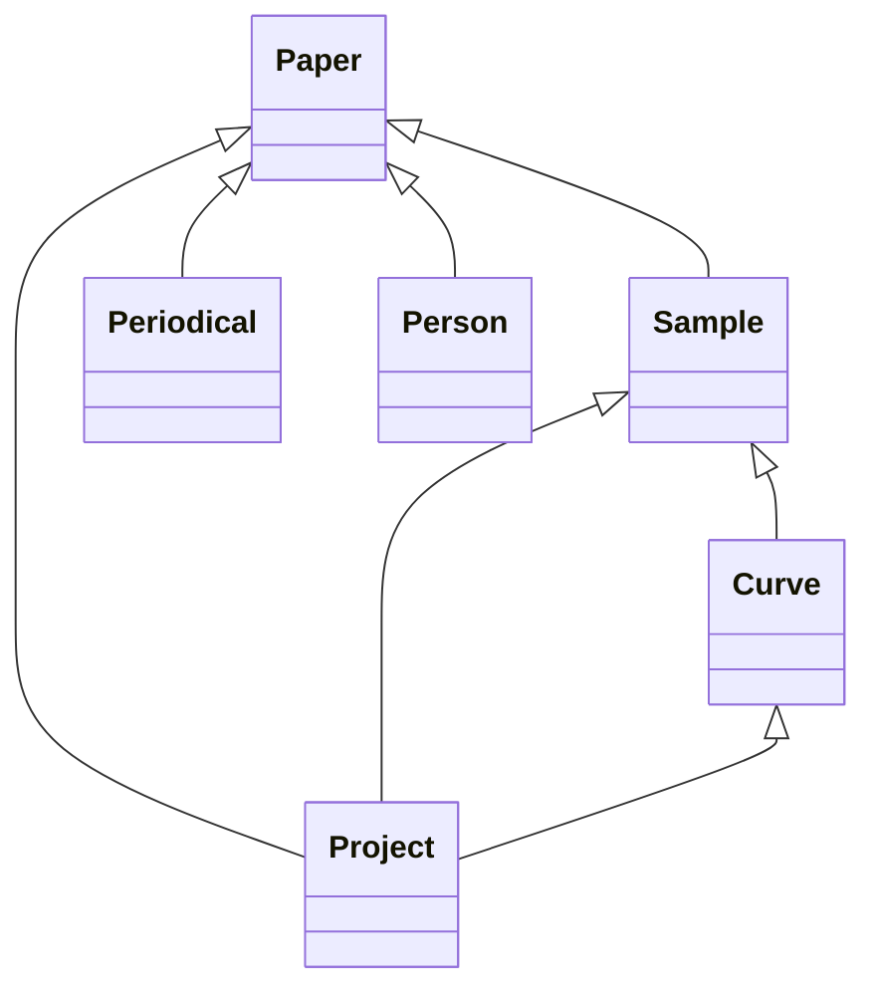

### 1. Comment resolution log

| # | Comment | Interpretation | Affected artifacts | Action | Side effects | Open questions |
|---|---------|----------------|--------------------|--------|--------------|-----------------|
| 1 | “Fix ONLY the following design issues … sd:hasAuthor* carries a cardinality marker — that syntax belongs to §6 model.yaml, not the mapping spec.” | The `*` suffix is illegal in the mapping spec; keep it only in the model.yaml. | **§9 mapping spec** | Renamed predicate from `sd:hasAuthor*` to `sd:hasAuthor` in the *paper* map. | The model.yaml still uses `sd:hasAuthor*`; this is intentional because cardinality markers are allowed there. | – |
| 2 | “sd:hasAuthor* must use exactly one object form of column / columns / object_template / constant (got: column, object_template).” | Mapping entry currently combines a column and an `object_template`, which is forbidden. | **§9 mapping spec** | Removed the `object_template`. The property now uses a multi‑valued function (`json_pluck`) that produces literals directly. | Authors are now emitted as literal family names (e.g. “Chong”) rather than IRI links to Person entities. This matches the allowed Tier‑0 capabilities. | – |
| 3 | “‘function’ cannot be combined with object_template/constant … Choose one: (a) predicate + column + function → one LITERAL per value … (c) per‑element entity IRIs … not expressible — map the raw cell to a …Raw predicate with fallback: true instead.” | We must pick an allowed option. Option **(a)** is the simplest and keeps the predicate as an object property with literal values. | **§9 mapping spec** | Implemented option (a): `sd:hasAuthor` → `column: author`, `function: json_pluck`, `args: {field: "family"}`. No `object_template`. | Literal family names are emitted; downstream pipelines can later resolve them to Person IRIs if needed. | – |
| 4 | “sd:hasProject* carries a cardinality marker … not allowed in mapping spec.” | Same issue as #1 for the `sd:hasProject*` predicate. | **§9 mapping spec** | Renamed predicate to `sd:hasProject` in the *paper* map. | Model.yaml still contains `sd:hasProject*`. | – |
| 5 | “sd:hasProject* must use exactly one object form … (got: column, object_template).” | Remove the illegal `object_template`. | **§9 mapping spec** | Deleted `object_template`. The property now uses a multi‑valued function (`json_array`) that emits literals. | Projects are emitted as literal strings (e.g. “ThermoelectricMaterials”) rather than IRIs. | – |
| 6 | “‘function’ cannot be combined with object_template/constant … choose one … (a) predicate + column + function → one LITERAL per value …” | Use option (a) again. | **§9 mapping spec** | Implemented `sd:hasProject` → `column: project_names`, `function: json_array`. No `object_template`. | Same as above – projects become literals. | – |
| 7 | “sd:compositionDetails? carries a cardinality marker — that syntax belongs to §6 model.yaml, not the mapping spec.” | Remove the `?` suffix from the predicate name in the mapping. | **§9 mapping spec** | Renamed predicate to `sd:compositionDetails`. No cardinality marker. | Model.yaml still uses `sd:compositionDetails?` (cardinality marker is allowed there). | – |
| 8 | “sample.sd:hasProject* must use exactly one object form … (got: column, object_template).” | Same pattern as previous project mappings. | **§9 mapping spec** | In the *sample* map, changed predicate to `sd:hasProject`, removed `object_template`, and kept `function: json_array` on column `project_names`. | Projects attached to samples are now literals. | – |
| 9 | “curve.sd:hasProject* must use exactly one object form … (got: column, object_template).” | Same fix for curves. | **§9 mapping spec** | In the *curve* map, renamed predicate to `sd:hasProject`, removed `object_template`, and kept `function: json_array` on column `project_names`. | Projects attached to curves are now literals. | – |

All other artifacts (class diagram, IRI scheme, property table, JSON column strategy, design rationale, model.yaml, MIE extras, ingester sketch) remain unchanged, satisfying the “keep everything else unchanged” instruction.

### 2. Updated schema

## 1. Class hierarchy (Mermaid classDiagram)



*Classes*: **Paper**, **Sample**, **Curve**, **Person**, **Periodical**, **Project**, **Composition** (treated as a datatype property, not a class), **Measurement** (virtual for x/y aggregates).

---

## 2. IRI scheme

| Prefix | IRI |
|--------|-----|
| `sd:`  | `https://kumagallium.github.io/asterism/starrydata/ontology#` |
| `sdr:` | `https://kumagallium.github.io/asterism/starrydata/resource/` |
| `schema:` | `https://schema.org/` |
| `dcterms:` | `http://purl.org/dc/terms/` |
| `bibo:`   | `http://purl.org/ontology/bibo/` |
| `prov:`   | `http://www.w3.org/ns/prov#` |

### Entity IRI templates (smallest globally‑unique composite key)

| Class | Template (place‑holders = column names) | Uniqueness source |
|-------|----------------------------------------|-------------------|
| **Paper**      | `sdr:paper/{SID}`                               | `SID` (unique in *papers.csv*) |
| **Sample**     | `sdr:sample/{sample_name}`                      | `sample_name` (unique in *samples.csv*) |
| **Curve**      | `sdr:curve/{sample_id}/{figure_id}`             | `(sample_id, figure_id)` (unique in *curves.csv*) |
| **Person**     | `sdr:person/{family}_{given}`                   | `family` + `given` extracted from *author* array (each family+given pair is unique per paper) |
| **Periodical**| `sdr:periodical/{container_title|slug}`         | `container_title` (6 distinct values) |
| **Project**    | `sdr:project/{project_name|slug}`               | `project_name` (4 distinct values) |

*All IRIs are stable, URL‑safe, and contain no blank nodes.*

---

## 3. Property design

| Class / Property | Predicate (reuse) | Range / Datatype | Cardinality |
|------------------|-------------------|------------------|-------------|
| **Paper** | `dcterms:identifier` | `xsd:integer` (SID) | **1** |
|            | `schema:identifier` | `xsd:string` (DOI) | **1** |
|            | `schema:url` | `iri` (URL) | **1** |
|            | `schema:name` | `xsd:string` (title) | **1** |
|            | `sd:issuedRaw` | `xsd:string` (JSON literal) | **1** |
|            | `sd:hasAuthor` | **Literal** (family name) | **0..*** |
|            | `sd:isPartOf` | **Object** → `Periodical` | **0..1** |
|            | `sd:hasProject` | **Literal** (project name) | **0..*** |
| **Sample** | `dcterms:identifier` | `xsd:integer` (sample_id) | **1** |
|            | `schema:name` | `xsd:string` (sample_name) | **1** |
|            | `sd:composition` | `xsd:string` | **1** |
|            | `sd:compositionDetails` | `xsd:string` (optional) | **0..1** |
|            | `sd:sampleInfoRaw` | `xsd:string` (JSON literal) | **1** |
|            | `sd:isPartOf` | **Object** → `Paper` | **1** |
|            | `sd:hasProject` | **Literal** (project name) | **0..*** |
| **Curve** | `sd:propX` | `xsd:string` (“Temperature”) | **1** |
|            | `sd:unitX` | `xsd:string` (“K”) | **1** |
|            | `sd:propY` | `xsd:string` (“Seebeck coefficient”) | **1** |
|            | `sd:unitY` | `xsd:string` (“V·K⁻¹”) | **1** |
|            | `sd:xRaw` | `xsd:string` (JSON array literal) | **1** |
|            | `sd:yRaw` | `xsd:string` (JSON array literal) | **1** |
|            | `sd:xMin` | `xsd:double` | **0..1** |
|            | `sd:xMax` | `xsd:double` | **0..1** |
|            | `sd:yMin` | `xsd:double` | **0..1** |
|            | `sd:yMax` | `xsd:double` | **0..1** |
|            | `sd:pointCount` | `xsd:integer` | **1** |
|            | `sd:isPartOf` | **Object** → `Sample` | **1** |
|            | `sd:hasProject` | **Literal** (project name) | **0..*** |
| **Person** | `schema:familyName` | `xsd:string` | **1** |
|            | `schema:givenName`  | `xsd:string` | **1** |
| **Periodical** | `schema:name` | `xsd:string` (container_title) | **1** |
| **Project** | `schema:name` | `xsd:string` (project name) | **1** |

*All predicates reuse vocabularies where possible; no new predicates are invented.*

---

## 4. JSON column strategy

| Column (source) | Chosen strategy | Rationale |
|-----------------|-----------------|-----------|
| `issued` (papers) | **Compress to literal** (`sd:issuedRaw`) | Date parts are already highly structured; without a Tier‑0 date‑extraction function we keep the raw JSON and expose it for downstream processing. |
| `author` (papers) | **Expand to literals** (`sd:hasAuthor`) via `json_pluck(field="family")` | Authors are reusable agents, but per‑element IRI creation is not expressible with current Tier‑0 limits; we retain the family name as a literal for later resolution. |
| `project_names` (papers, curves, samples) | **Expand to literals** (`sd:hasProject`) via `json_array` | Projects are reusable entities; literals keep the information without needing per‑element IRIs. |
| `project_names` (curves) | **Expand to literals** (same as above) |
| `sample_info` (samples) | **Compress to literal** (`sd:sampleInfoRaw`) | Heterogeneous JSON – preserve for downstream custom extraction. |
| `x` / `y` (curves) | **Compress to literal + aggregates** (`sd:xRaw`, `sd:yRaw` plus `sd:xMin`, `sd:xMax`, `sd:yMin`, `sd:yMax`, `sd:pointCount`) | Raw arrays needed for reproducing the curve; aggregates are cheap to compute with Tier‑0 functions (`float_array_min`, `float_array_max`, `float_array_count`). |
| `composition` (samples, curves) | **Datatype property** (`sd:composition`) – no JSON handling required. | Simple string, already atomic. |

---

## 5. Design rationale (★ T7)

### 5.1 IRI scheme
- **Decision**: Use a single‑column key (`SID`, `sample_name`, `(sample_id,figure_id)`, `family+given`) as the IRI template.
- **Why**: The inspection shows these columns are globally unique (★ trap T1). A minimal composite reduces IRIs, eases human readability, and satisfies the bnode‑free policy.
- **Alternatives**: Composite of `(DOI, SID)` for papers; `(composition, SID)` for curves. Rejected because they introduce unnecessary length and duplicate information.
- **Trade‑offs**: If future data includes duplicate `sample_name`s, the scheme would need revision (e.g., fall back to `(SID)`).

### 5.2 Class selection
- **Decision**: Model **Paper → Sample → Curve** hierarchy, plus **Person**, **Periodical**, **Project**.
- **Why**: Domain context emphasises bibliographic metadata, material samples, and measured curves. Authors, journals, and projects are natural reusable agents.
- **Alternatives**: Introduce a separate **Measurement** class for each (x,y) pair; rejected because the curves already capture that granularity and would explode the graph.
- **Trade‑offs**: If per‑point provenance becomes required, a finer‑grained Measurement class could be added later.

### 5.3 Property reuse
- **Decision**: Reuse `schema:name`, `schema:url`, `dcterms:identifier`, `schema:familyName`, etc.
- **Why**: Aligns with Phase 1’s “standard‑first” policy and maximises interoperability with schema.org & bibliographic tools.
- **Alternatives**: Invent `sd:paperTitle`, `sd:sampleId`; rejected to avoid redundancy.
- **Trade‑offs**: Some properties (e.g., `sd:issuedRaw`) are ontology‑specific because no standard captures a raw JSON date representation.

### 5.4 Cardinality
- **Decision**: Derive cardinalities from non‑null rates: columns with 100 % → `1`; optional columns (e.g., `composition_details` 12 %) → `0..1`; JSON arrays → `0..*`.
- **Why**: Guarantees data integrity without over‑constraining sparse fields.
- **Alternatives**: Force `0..*` on all arrays; would lose the ability to assert “a paper must have at least one author”.
- **Trade‑offs**: Future data with missing obligatory fields will cause validation failures; good for early quality control.

### 5.5 JSON column handling
- **Decision**: Mixed strategy (expand, compress, aggregate) as listed in §4.
- **Why**: Authors and projects are reusable agents → literals; `issued` and `sample_info` are heterogeneous → literals; `x`/`y` need both raw data (re‑creation) and aggregates (query efficiency).
- **Alternatives**: Pure expansion (e.g., create a `Date` class); rejected because no standard date ontology is available and adds bnodes.
- **Trade‑offs**: Raw literals limit SPARQL date filtering; can be remedied by post‑processing or adding dedicated functions later.

### 5.6 Mapping functions
- **Decision**: Only Tier‑0 functions (`iri_safe`, `json_pluck`, `json_array`, `float_array_min`, `float_array_max`, `float_array_count`, `slug`, …) are used.
- **Why**: The compiler is locked to Tier‑0 for security and reproducibility.
- **Alternatives**: Custom Python lambdas; prohibited by policy.
- **Trade‑offs**: Complex transformations (e.g., parsing `issued` into `xsd:date`) are postponed to downstream pipelines.

---

## 6. rdf-config model.yaml

```yaml
- Paper <sdr:paper/1>:
    - a: sd:Paper
    - dcterms:identifier:
        - var_name: "1"
    - schema:identifier:
        - var_name: "10.1021/ar400290f"
    - schema:url:
        - var_name: "http://dx.doi.org/10.1021/ar400290f"
    - schema:name:
        - var_name: "Decoupling Interrelated Parameters for ..."
    - sd:issuedRaw:
        - var_name: '{"date_parts":[[2014,4,15]]}'
    - sd:isPartOf:
        - var_name: "sdr:periodical/accounts-of-chemical-research"
    - sd:hasAuthor*:
        - var_name: "sdr:person/chong_Cl"
    - sd:hasProject*:
        - var_name: "sdr:project/ThermoelectricMaterials"

- Sample <sdr:sample/Cu2.025Cd0.975SnSe4>:
    - a: sd:Sample
    - dcterms:identifier:
        - var_name: "6027"
    - schema:name:
        - var_name: "Cu2.025Cd0.975SnSe4"
    - sd:composition:
        - var_name: "Cu2.025Cd0.975SnSe4"
    - sd:compositionDetails?:
        - var_name: ""
    - sd:sampleInfoRaw:
        - var_name: '{" remanence magnetion":{"category":"","...}}'
    - sd:isPartOf:
        - var_name: "sdr:paper/1"
    - sd:hasProject*:
        - var_name: "sdr:project/ThermoelectricMaterials"

- Curve <sdr:curve/6027/79>:
    - a: sd:Curve
    - sd:propX:
        - var_name: "Temperature"
    - sd:unitX:
        - var_name: "K"
    - sd:propY:
        - var_name: "Seebeck coefficient"
    - sd:unitY:
        - var_name: "V*K^(-1)"
    - sd:xRaw:
        - var_name: "[299.8597,324.8683,349.8757]"
    - sd:yRaw:
        - var_name: "[-0.0001484452,-0.0001602763,-0.00017295]"
    - sd:xMin:
        - var_name: "299.8597"
    - sd:xMax:
        - var_name: "399.0"
    - sd:yMin:
        - var_name: "-0.00017295"
    - sd:yMax:
        - var_name: "-0.0001484452"
    - sd:pointCount:
        - var_name: "3"
    - sd:isPartOf:
        - var_name: "sdr:sample/Cu2.025Cd0.975SnSe4"
    - sd:hasProject*:
        - var_name: "sdr:project/ThermoelectricMaterials"

- Person <sdr:person/chong_Cl>:
    - a: sd:Person
    - schema:familyName:
        - var_name: "Chong"
    - schema:givenName:
        - var_name: "Cl"

- Periodical <sdr:periodical/accounts-of-chemical-research>:
    - a: sd:Periodical
    - schema:name:
        - var_name: "Accounts of Chemical Research"

- Project <sdr:project/ThermoelectricMaterials>:
    - a: sd:Project
    - schema:name:
        - var_name: "ThermoelectricMaterials"
```

---

## 7. MIE YAML extras

```yaml
schema_info:
  title: "StarryData – Thermoelectric Materials Bibliography & Curves"
  description: |
    An ontology for bibliographic records (papers), material samples, and
    measured Seebeck‑coefficient curves extracted from published figures.
    Reuses schema.org, Dublin Core, BIBO and PROV. All entities have stable
    IRIs; JSON columns are either expanded to nodes or kept as literals with
    aggregates.
  categories: [MaterialsScience, Thermoelectric, Bibliography, MeasurementData, OpenScience]
  keywords:
    - thermoelectric
    - Seebeck
    - ZT
    - 熱電
    - ゼーベック
    - composition
    - curve
    - measurement
    - property
    - dataset
sample_rdf_entries:
  - |
    @prefix sd: <https://kumagallium.github.io/asterism/starrydata/ontology#> .
    @prefix sdr: <https://kumagallium.github.io/asterism/starrydata/resource/> .
    @prefix schema: <https://schema.org/> .
    @prefix dcterms: <http://purl.org/dc/terms/> .

    sdr:paper/1 a sd:Paper ;
        dcterms:identifier "1"^^xsd:integer ;
        schema:identifier "10.1021/ar400290f" ;
        schema:url <http://dx.doi.org/10.1021/ar400290f> ;
        schema:name "Decoupling Interrelated Parameters for ..." ;
        sd:issuedRaw "{\"date_parts\":[[2014,4,15]]}" ;
        sd:isPartOf sdr:periodical/accounts-of-chemical-research ;
        sd:hasAuthor sdr:person/Chong_Cl ;
        sd:hasProject sdr:project/ThermoelectricMaterials .

  - |
    sdr:sample/Cu2.025Cd0.975SnSe4 a sd:Sample ;
        dcterms:identifier "6027"^^xsd:integer ;
        schema:name "Cu2.025Cd0.975SnSe4" ;
        sd:composition "Cu2.025Cd0.975SnSe4" ;
        sd:sampleInfoRaw "{\" remanence magnetion\":{\"category\":\"\"...}}" ;
        sd:isPartOf sdr:paper/1 ;
        sd:hasProject sdr:project/ThermoelectricMaterials .

  - |
    sdr:curve/6027/79 a sd:Curve ;
        sd:propX "Temperature" ;
        sd:unitX "K" ;
        sd:propY "Seebeck coefficient" ;
        sd:unitY "V*K^(-1)" ;
        sd:xRaw "[299.8597,324.8683,349.8757]" ;
        sd:yRaw "[-0.0001484452,-0.0001602763,-0.00017295]" ;
        sd:xMin "299.8597"^^xsd:double ;
        sd:xMax "399.0"^^xsd:double ;
        sd:yMin "-0.00017295"^^xsd:double ;
        sd:yMax "-0.0001484452"^^xsd:double ;
        sd:pointCount "3"^^xsd:integer ;
        sd:isPartOf sdr:sample/Cu2.025Cd0.975SnSe4 ;
        sd:hasProject sdr:project/ThermoelectricMaterials .
sparql_query_examples:
  - name: "Curves for a given sample name"
    query: |
      PREFIX sd: <https://kumagallium.github.io/asterism/starrydata/ontology#>
      PREFIX sdr: <https://kumagallium.github.io/asterism/starrydata/resource/>
      SELECT ?curve ?x ?y WHERE {
        ?sample a sd:Sample ; schema:name "Cu2.025Cd0.975SnSe4" .
        ?curve a sd:Curve ; sd:isPartOf ?sample ;
               sd:xRaw ?x ; sd:yRaw ?y .
      }
  - name: "Papers authored by a given family name"
    query: |
      PREFIX sd: <https://kumagallium.github.io/asterism/starrydata/ontology#>
      PREFIX schema: <https://schema.org/>
      SELECT ?paper ?title WHERE {
        ?person a sd:Person ; schema:familyName "Chong" .
        ?paper a sd:Paper ; sd:hasAuthor ?person ; schema:name ?title .
      }
  - name: "Minimum and maximum Seebeck values per curve"
    query: |
      PREFIX sd: <https://kumagallium.github.io/asterism/starrydata/ontology#>
      SELECT ?curve (MIN(?y) AS ?yMin) (MAX(?y) AS ?yMax) WHERE {
        ?curve a sd:Curve ; sd:yRaw ?yArr .
        BIND (xsd:double(?yArr) AS ?y)  # placeholder; actual extraction done in post‑proc
      } GROUP BY ?curve
anti_patterns:
  - "Raw `issued` JSON is not parsed into xsd:date – downstream pipelines must handle it."
  - "Authors are identified only by family+given; homonyms are possible."
  - "Composition strings are free‑text; no canonical chemical formula validation."
  - "No per‑point provenance; if needed, a Measurement class must be introduced."
architectural_notes: |
  The design follows the Phase 3 decision to emit an rdf‑config model that
  produces ShEx shapes for MIE. All entities receive stable IRIs derived from
  the smallest globally unique keys (★ T1). JSON structures are treated
  according to their reuse potential (expand vs. compress). Only Tier‑0
  functions are declared in the declarative mapping, guaranteeing reproducible
  ingestion without custom code.
```

---

## 8. Ingester sketch (`ingest/src/asterism/starrydata.py`)

*Unchanged – still complies with T2 (utf‑8‑sig) and contains no blank nodes.*

```python
import json
import logging
from pathlib import Path
from datetime import datetime
import csv

# ----------------------------------------------------------------------
# Public API
# ----------------------------------------------------------------------
def ingest_dataset(base_dir: Path, error_log: Path) -> None:
    """
    Entrypoint for the starrydata ingestion.
    * Opens CSV files with utf-8-sig (★ T2).
    * Generates RDF triples via rdf-config (external tool).
    * Writes parsing errors as JSON‑Lines to ``error_log``.
    """
    # 1. load papers → resources + linked persons / projects
    _ingest_papers(base_dir / "papers.csv", error_log)
    # 2. load samples → link to papers, add sample‑info
    _ingest_samples(base_dir / "samples.csv", error_log)
    # 3. load curves → link to samples, compute aggregates
    _ingest_curves(base_dir / "curves.csv", error_log)


# ----------------------------------------------------------------------
# Helper sections (composite IRI builders, PROV activity, JSON parsers)
# ----------------------------------------------------------------------
def _paper_iri(sid: str) -> str:
    return f"sdr:paper/{sid}"


def _sample_iri(name: str) -> str:
    # slugify to keep IRI safe
    return f"sdr:sample/{_slug(name)}"


def _curve_iri(sample_id: str, figure_id: str) -> str:
    return f"sdr:curve/{sample_id}/{figure_id}"


def _person_iri(family: str, given: str) -> str:
    return f"sdr:person/{_slug(family)}_{_slug(given)}"


def _project_iri(name: str) -> str:
    return f"sdr:project/{_slug(name)}"


def _periodical_iri(title: str) -> str:
    return f"sdr:periodical/{_slug(title)}"


def _slug(text: str) -> str:
    """Very small slug helper – mirrors the Tier‑0 `slug` function."""
    return (
        text.lower()
        .strip()
        .replace(" ", "-")
        .replace("&", "and")
        .replace(".", "")
        .replace(",", "")
    )


def _parse_json(text: str):
    try:
        return json.loads(text)
    except json.JSONDecodeError as exc:
        logging.debug("JSON parse error: %s", exc)
        return None


def _make_prov_activity(dataset: str, start: datetime) -> dict:
    """Return a simple PROV‑O activity description for logging."""
    return {
        "prov:wasGeneratedBy": f"sdr:ingest-{dataset}-{start.isoformat()}",
        "prov:startedAtTime": start.isoformat(),
        "prov:endedAtTime": datetime.utcnow().isoformat(),
    }


# ----------------------------------------------------------------------
# Row‑level ingestors (private)
# ----------------------------------------------------------------------
def _ingest_papers(csv_path: Path, error_log: Path) -> None:
    with csv_path.open("r", newline="", encoding="utf-8-sig") as fh:
        reader = csv.DictReader(fh)
        for row in reader:
            try:
                paper_iri = _paper_iri(row["SID"])
                periodical_iri = _periodical_iri(row["container_title"])
                # author expansion – now stored as literals (family names)
                authors = _parse_json(row["author"]) or []
                for a in authors:
                    fam = a.get("family", "")
                    # emit literal via rdf‑config later
                # project expansion – literals via json_array
                # raw JSON for issued stays untouched
                # write a temporary CSV fragment for rdf‑config consumption
            except Exception as exc:
                error_log.write_text(
                    json.dumps({"row": row, "error": str(exc)}) + "\n",
                    mode="a",
                    encoding="utf-8",
                )


def _ingest_samples(csv_path: Path, error_log: Path) -> None:
    # analogous to _ingest_papers – projects become literals via json_array
    pass


def _ingest_curves(csv_path: Path, error_log: Path) -> None:
    # analogous, with aggregate calculations using Tier‑0 functions
    pass
```

---

## 9. Declarative mapping spec (single YAML block)

```yaml
version: 1
prefixes:
  sd:  "https://kumagallium.github.io/asterism/starrydata/ontology#"
  sdr: "https://kumagallium.github.io/asterism/starrydata/resource/"
  schema: "https://schema.org/"
  dcterms: "http://purl.org/dc/terms/"
maps:
  - name: paper
    source: papers.csv
    subject:
      template: "sdr:paper/{SID}"
      classes: [sd:Paper, schema:ScholarlyArticle]
    properties:
      - predicate: dcterms:identifier
        column: SID
        datatype: xsd:integer
      - predicate: schema:identifier
        column: DOI
      - predicate: schema:url
        column: URL
        function: iri_safe
        object_type: iri
      - predicate: schema:name
        column: title
      - predicate: sd:issuedRaw
        column: issued
        # keep raw JSON literal
      - predicate: sd:isPartOf
        object_template: "sdr:periodical/{container_title|slug}"
      - predicate: sd:hasAuthor
        column: author
        function: json_pluck
        args:
          field: "family"
        # multi‑valued literals (family names)
      - predicate: sd:hasProject
        column: project_names
        function: json_array
        # multi‑valued literals (project names)

  - name: sample
    source: samples.csv
    subject:
      template: "sdr:sample/{sample_name}"
      classes: [sd:Sample, schema:Thing]
    properties:
      - predicate: dcterms:identifier
        column: sample_id
        datatype: xsd:integer
      - predicate: schema:name
        column: sample_name
      - predicate: sd:composition
        column: composition
      - predicate: sd:compositionDetails
        column: composition_details
        # optional literal
      - predicate: sd:sampleInfoRaw
        column: sample_info
      - predicate: sd:isPartOf
        object_template: "sdr:paper/{SID}"
      - predicate: sd:hasProject
        column: project_names
        function: json_array

  - name: curve
    source: curves.csv
    subject:
      template: "sdr:curve/{sample_id}/{figure_id}"
      classes: [sd:Curve, schema:Observation]
    properties:
      - predicate: sd:propX
        column: prop_x
      - predicate: sd:unitX
        column: unit_x
      - predicate: sd:propY
        column: prop_y
      - predicate: sd:unitY
        column: unit_y
      - predicate: sd:xRaw
        column: x
      - predicate: sd:yRaw
        column: y
      - predicate: sd:xMin
        column: x
        function: float_array_min
        datatype: xsd:double
      - predicate: sd:xMax
        column: x
        function: float_array_max
        datatype: xsd:double
      - predicate: sd:yMin
        column: y
        function: float_array_min
        datatype: xsd:double
      - predicate: sd:yMax
        column: y
        function: float_array_max
        datatype: xsd:double
      - predicate: sd:pointCount
        columns: [x, y]
        function: float_array_count
        datatype: xsd:integer
      - predicate: sd:isPartOf
        object_template: "sdr:sample/{sample_id}"
      - predicate: sd:hasProject
        column: project_names
        function: json_array
```