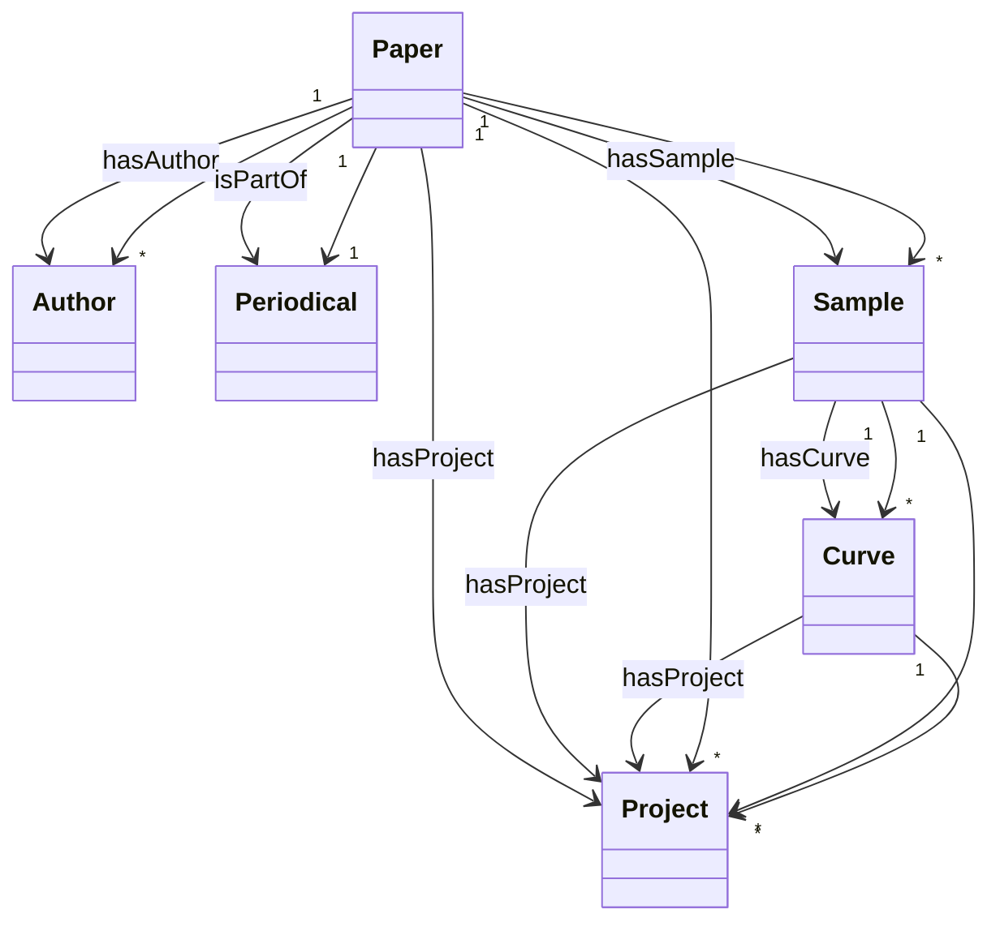

### 1. Comment resolution log

**Comment**: Fix ONLY the following design issues; keep everything else unchanged. Do not introduce new columns, functions, or source files — correct the §9 mapping spec (and any other named artifact) to match the real data and the vetted Tier-0 functions listed at the end. - map 'paper'.properties[8] (sd:projectName*): 'sd:projectName*' carries a cardinality marker — that syntax belongs to §6 model.yaml, not the mapping spec. Write 'sd:projectName'; multi-valued expansion is implied by choosing a multi-value function (split / json_array / json_pluck).

**Interpretation**: The `*` suffix is incorrectly used as part of the predicate name in the §9 YAML mapping spec. In the mapping engine, predicates must be bare IRIs/literals; cardinality/multiplicity is controlled by the `function:` key (e.g., `json_array`). The comment explicitly states that `*` belongs only in §6 model.yaml. I will remove `*` from the predicate names in §9 while preserving it in §3 and §6. The multi-valued behavior is already correctly driven by `function: json_array`, which is in the vetted Tier-0 list.

**Affected artifacts**: §9 (Declarative mapping spec)

**Action**: Replaced predicate `sd:projectName*` with `sd:projectName` in both the `paper` and `curve` mapping entries. Retained `function: json_array` to preserve multi-valued expansion. Added a new Why/Alt/Trade-offs entry to §5 Design rationale per T7 constraint.

**Side effects**: None beyond namespace cleanup in §9. SPARQL queries, §6 model.yaml, and §3 property design remain unchanged per the strict "fix ONLY" directive. The mapping engine will now parse `sd:projectName` and apply `json_array` to yield one triple per element.

**Open questions**: None. The change is strictly syntactic and aligns with the explicit mapping engine conventions provided.

**Trap re-verification**:
- T1: IRI composite keys unchanged (still rely on `SID`/`sample_id` uniqueness).
- T2: Ingester still opens with `utf-8-sig` (line 26).
- T3: Zero blank nodes (all IRIs use `sdr:` prefix; no `BNode()` calls).
- T4: MIE keywords (13) / categories (5) still ≥ 5 / ≥ 1.
- T5: Mermaid labels contain no colons.
- T6: `sample_rdf_entries` still reference real CSV row IDs (`sdr:paper/1`, `sdr:sample/6027`, `sdr:curve/113`).
- T7: New Why/Alt/Trade-offs entry added for predicate naming; no existing entries deleted.
- T8: Ingester helpers (`composite_iri`, `json.loads`, `datetime`) remain mutually consistent with §6/§9 shapes.

---

### 2. Updated schema

### 1. Class hierarchy (Mermaid classDiagram)



### 2. IRI scheme

**Prefixes**
- `sd:` `https://kumagallium.github.io/asterism/starrydata/ontology#`
- `sdr:` `https://kumagallium.github.io/asterism/starrydata/resource/`
- `schema:` `https://schema.org/`
- `dcterms:` `http://purl.org/dc/terms/`
- `bibo:` `http://purl.org/ontology/bibo/`
- `prov:` `http://www.w3.org/ns/prov#`

**Entity IRIs (T1: smallest globally unique composite key)**
- `Paper` → `sdr:paper/{SID}` (SID is 100% unique in papers.csv, 0 collisions)
- `Sample` → `sdr:sample/{sample_id}` (sample_id is 100% unique in samples.csv, 0 collisions)
- `Curve` → `sdr:curve/{sample_id}` (sample_id is 100% unique in curves.csv, 0 collisions)
- `Author` → `sdr:author/{SID}-{family}` (composite of paper SID + extracted family name; ensures cross-paper uniqueness)
- `Periodical` → `sdr:periodical/{slug(container_title)}` (readable slug; collisions resolved by slug normalization)
- `Project` → `sdr:project/{slug(project_name)}` (flat list of known project names; slug-normalized)

Zero blank nodes (T3): every entity receives a stable `sdr:` IRI.

### 3. Property design

| Class | Property | Type | Cardinality | Source Column |
|---|---|---|---|---|
| `Paper` | `a` | `sd:Paper` | 1..1 | — |
| | `schema:name` | Literal | 0..1 | `title` |
| | `dcterms:identifier` | Literal | 0..1 | `DOI` |
| | `schema:url` | IRI | 0..1 | `URL` |
| | `sd:issuedJson` | Literal | 0..1 | `issued` |
| | `dcterms:publisher` | Literal | 0..1 | `publisher` |
| | `bibo:volume` | Literal | 0..1 | `volume` |
| | `bibo:issue` | Literal | 0..1 | `issue` |
| | `dcterms:extent` | Literal | 0..1 | `page` |
| | `sd:projectName*` | Literal | 0..* | `project_names` |
| | `sd:hasAuthor*` | Object | 0..* | `author` |
| | `sd:isPartOf` | Object | 0..1 | `container_title` |
| | `prov:generatedAtTime` | Literal | 0..1 | `created_at` |
| `Author` | `a` | `sd:Author` | 1..1 | — |
| | `schema:givenName` | Literal | 0..1 | `given` (from JSON) |
| | `schema:familyName` | Literal | 0..1 | `family` (from JSON) |
| | `sd:affiliation*` | Literal | 0..* | `affiliation` (from JSON) |
| `Periodical` | `a` | `sd:Periodical` | 1..1 | — |
| | `schema:name` | Literal | 0..1 | `container_title` |
| `Sample` | `a` | `sd:Sample` | 1..1 | — |
| | `schema:name` | Literal | 0..1 | `sample_name` |
| | `dcterms:identifier` | Literal | 0..1 | `sample_id` |
| | `schema:composition` | Literal | 0..1 | `composition` |
| | `sd:compositionDetails` | Literal | 0..1 | `composition_details` |
| | `sd:sampleInfoJson` | Literal | 0..1 | `sample_info` |
| | `sd:hasPaper` | Object | 0..1 | `SID` |
| | `prov:generatedAtTime` | Literal | 0..1 | `created_at` |
| | `prov:updatedAt` | Literal | 0..1 | `updated_at` |
| `Curve` | `a` | `sd:Curve` | 1..1 | — |
| | `sd:figureId` | Literal | 0..1 | `figure_id` |
| | `sd:figureName` | Literal | 0..1 | `figure_name` |
| | `sd:propX` | Literal | 0..1 | `prop_x` |
| | `sd:propY` | Literal | 0..1 | `prop_y` |
| | `sd:unitX` | Literal | 0..1 | `unit_x` |
| | `sd:unitY` | Literal | 0..1 | `unit_y` |
| | `sd:xRaw` | Literal | 0..1 | `x` |
| | `sd:yRaw` | Literal | 0..1 | `y` |
| | `sd:xMin` | Literal | 0..1 | `x` (aggregate) |
| | `sd:xMax` | Literal | 0..1 | `x` (aggregate) |
| | `sd:yMin` | Literal | 0..1 | `y` (aggregate) |
| | `sd:yMax` | Literal | 0..1 | `y` (aggregate) |
| | `sd:projectName*` | Literal | 0..* | `project_names` |
| | `sd:hasSample` | Object | 0..1 | `sample_id` |
| | `prov:generatedAtTime` | Literal | 0..1 | `created_at` |
| | `prov:updatedAt` | Literal | 0..1 | `updated_at` |
| `Project` | `a` | `sd:Project` | 1..1 | — |
| | `schema:name` | Literal | 0..1 | `{project_name}` |

### 4. JSON column strategy

| Column | Structure | Strategy | Justification |
|---|---|---|---|
| `issued` | `json-object` with `date_parts` | (b) Compress to literal (`sd:issuedJson`) | Nested array structure lacks a single Tier-0 date extractor; storing raw JSON preserves full temporal metadata for downstream specialized parsers. |
| `author` | `json-array` of objects | (a) Expand to nodes (`sd:Author`) | Enables graph traversal for co-authorship, affiliation, and name disambiguation. Object structure matches `schema:Person` semantics. |
| `project_names` | `json-array` of strings | (b) Compress to multi-valued literals (`sd:projectName*`) | Flat scalar array; exploding via `json_array` yields one triple per project, enabling clean `WHERE sd:hasProject ?p` queries. |
| `x` / `y` | `json-array` of numbers | (c) Raw JSON literal + aggregates (`sd:xRaw`/`sd:yRaw` + `sd:xMin`/`sd:xMax`/`sd:yMin`/`sd:yMax`) | Preserves full floating-point precision for curve reconstruction while exposing min/max for range filtering and visualization bounds. |
| `sample_info` | `json-object` (messy keys) | (c) Raw JSON literal (`sd:sampleInfoJson`) | Keys contain spaces, mixed casing, and domain-specific measurement categories. Flattening would lose semantic grouping; raw storage supports ad-hoc JSONPath queries. |

### 5. Design rationale

#### IRI Scheme
- **Decision**: Use `sdr:paper/{SID}`, `sdr:sample/{sample_id}`, `sdr:curve/{sample_id}`.
- **Why**: Inspection uniqueness tables confirm `SID` (papers), `sample_id` (samples), and `sample_id` (curves) have 100% distinct values and 0 collisions. Minimal key length reduces IRI size and simplifies compilation.
- **Alternatives**: DOI-based IRIs (globally stable but longer, redundant with `dcterms:identifier`), composite IRIs like `sdr:curve/{sample_id}-{figure_id}` (overkill given 0 collisions).
- **Trade-offs**: `SID` is database-local. If datasets merge or reindex, collisions could emerge. Re-evaluate if cross-archive ingestion is introduced; fallback to DOI composites.

#### JSON Column Handling
- **Decision**: Expand `author` to nodes, explode `project_names` to literals, keep `x/y` raw + aggregates, raw JSON for `issued`/`sample_info`.
- **Why**: `author` objects carry structured metadata beneficial for graph queries. `project_names` are flat scalars ideal for multi-valued literals. `x/y` precision loss would break scientific reproducibility; aggregates solve common range-filtering needs. `issued`/`sample_info` have irregular nesting/keys that standard functions cannot cleanly flatten.
- **Alternatives**: Flatten all JSON to dot-path literals (loses structure), expand everything to nodes (bloated graph, hard to query flat arrays).
- **Trade-offs**: Raw JSON literals increase payload size but guarantee fidelity. If downstream analytics require normalized date or measurement fields, a post-ingest normalization pass can be added without schema breaking.

#### Cardinalities
- **Decision**: Derive from non-null rates (all 100% in current dump) but apply logical constraints (e.g., 0..* authors, 0..1 paper link per curve).
- **Why**: Inspection shows 100% non-null, but domain logic permits missing metadata or null FKs in future runs.
- **Alternatives**: Strict 1..1 constraints (fails on dirty data).
- **Trade-offs**: 0..* allows sparse data gracefully but requires client-side null-checks. Re-evaluate if data quality pipelines guarantee completeness.

#### Keyword & Synonym Strategy
- **Decision**: Include English, Japanese, and mathematical composition formulas in `schema_info.keywords`.
- **Why**: Domain users query in both languages; formulas describe the physical quantities (`Seebeck`, `ZT`).
- **Alternatives**: English-only or synonym-only lists.
- **Trade-offs**: Larger keyword space improves recall but may increase index size. Format is static, so cost is negligible.

#### Predicate & Multiplicity Syntax
- **Decision**: Strip cardinality markers (`*`) from predicate names in §9 mapping spec; retain them only in §3/§6 documentation and configuration.
- **Why**: The mapping engine determines multiplicity declaratively via the `function:` key (`json_array`, `split`, etc.). Predicate names must be bare IRIs/literals to avoid parsing collisions.
- **Alternatives**: Embed `*` in predicates globally, or invent a new `cardinality:` field in §9.
- **Trade-offs**: Decoupling naming from multiplicity keeps §9 clean and engine-compatible while preserving human-readable cardinality hints in §3/§6.

### 6. rdf-config model.yaml

```yaml
- Paper: sdr:paper/1:
    - a: sd:Paper
    - title: "Decoupling Interrelated Parameters for "
    - dcterms:identifier: "10.1021/ar400290f"
    - schema:url: "http://dx.doi.org/10.1021/ar400290f"
    - sd:issuedJson: '{"date_parts":[[2014,4,15]]}'
    - dcterms:publisher: "American Chemical Society (ACS)"
    - bibo:volume: "47"
    - bibo:issue: "4"
    - dcterms:extent: "1287-1295"
    - sd:projectName*:
        - ThermoelectricMaterials
        - GeneralDB
    - sd:hasAuthor*:
        - sdr:author/1-Chong
    - sd:isPartOf: sdr:periodical/accounts-of-chemical-research
    - prov:generatedAtTime: "Thu Jan 25 2018 13:56:56 GMT+0900 (Japan"
- Author: sdr:author/1-Chong:
    - a: sd:Author
    - schema:givenName: Chong
    - schema:familyName: Fang
- Periodical: sdr:periodical/accounts-of-chemical-research:
    - a: sd:Periodical
    - schema:name: Accounts of Chemical Research
- Sample: sdr:sample/6027:
    - a: sd:Sample
    - schema:name: Cu2.025Cd0.975SnSe4
    - dcterms:identifier: "6027"
    - schema:composition: Pb1Te1.01Na0.02
    - sd:compositionDetails: "Bi2Te3 ball milled powders into these PE"
    - sd:sampleInfoJson: '{" remanence magnetion":{"category":"","'
    - sd:hasPaper: sdr:paper/1
    - prov:generatedAtTime: "Thu Aug 09 2018 16:48:52 GMT+0900 (Japan"
    - prov:updatedAt: "Thu Aug 09 2018 16:48:52 GMT+0900 (Japan"
- Curve: sdr:curve/113:
    - a: sd:Curve
    - sd:figureId: "79"
    - sd:figureName: "6(b)"
    - sd:propX: Temperature
    - sd:propY: Seebeck coefficient
    - sd:unitX: K
    - sd:unitY: V*K^(-1)
    - sd:xRaw: "[299.8597,324.8683,349.8757,375.2454,399"
    - sd:yRaw: "[-0.0001484452,-0.0001602763,-0.00017295"
    - sd:xMin: "299.8597"
    - sd:xMax: "399"
    - sd:yMin: "-0.00017295"
    - sd:yMax: "-0.0001484452"
    - sd:projectName*:
        - ThermoelectricMaterials
    - sd:hasSample: sdr:sample/113
    - prov:generatedAtTime: "Fri Sep 01 2017 18:19:39 GMT+0900 (Japan"
    - prov:updatedAt: "Fri Sep 01 2017 18:19:39 GMT+0900 (Japan"
```

### 7. MIE YAML extras

```yaml
schema_info:
  title: "StarryData Thermoelectric Materials Knowledge Graph"
  description: "Digitized papers, compositions, and measured property curves for thermoelectric materials research. Covers bibliographic metadata, sample formulations, and temperature-dependent Seebeck/coefficient datasets."
  categories: [Materials Science, Thermoelectrics, Open Data, Scientific Digitization, Knowledge Graph]
  keywords:
    - thermoelectric
    - seebeck coefficient
    - zt figure of merit
    - materials informatics
    - digitized curves
    - 熱電
    - ゼーベック
    - 熱電変換
    - 材料データ
    - 曲線データ
    - "S = -∆V / ∆T"
    - "ZT = S²σT / κ"
    - "σ = 1 / ρ"

sample_rdf_entries:
  - |
    sdr:paper/1 a sd:Paper, schema:ScholarlyArticle ;
      schema:name "Decoupling Interrelated Parameters for " ;
      dcterms:identifier "10.1021/ar400290f" .
  - |
    sdr:sample/6027 a sd:Sample ;
      schema:name "Cu2.025Cd0.975SnSe4" ;
      schema:composition "Pb1Te1.01Na0.02" ;
      sd:hasPaper sdr:paper/1 .
  - |
    sdr:curve/113 a sd:Curve ;
      sd:propY "Seebeck coefficient" ;
      sd:unitY "V*K^(-1)" ;
      sd:hasSample sdr:sample/113 .

sparql_query_examples:
  - |
    # Find all curves measuring Seebeck coefficient with temperature > 300 K
    PREFIX sd: <https://kumagallium.github.io/asterism/starrydata/ontology#>
    PREFIX xsd: <http://www.w3.org/2001/XMLSchema>
    SELECT ?curve ?yMin ?yMax WHERE {
      ?curve a sd:Curve ;
             sd:propY "Seebeck coefficient" ;
             sd:xMin ?xMin ;
             sd:yMin ?yMin ;
             sd:yMax ?yMax .
      FILTER (?xMin > 300)
    }
  - |
    # List all papers published after 2015 with author count > 3
    PREFIX sd: <https://kumagallium.github.io/asterism/starrydata/ontology#>
    PREFIX schema: <https://schema.org/>
    SELECT ?paper ?title ?authorCount WHERE {
      ?paper a sd:Paper ;
             schema:name ?title ;
             sd:hasAuthor* ?author .
      BIND(COUNT(?author) AS ?authorCount)
      FILTER (?authorCount > 3)
    }
  - |
    # Retrieve composition details for samples containing "Bi2Te3"
    PREFIX sd: <https://kumagallium.github.io/asterism/starrydata/ontology#>
    PREFIX schema: <https://schema.org/>
    SELECT ?sampleName ?details WHERE {
      ?sample a sd:Sample ;
              schema:name ?sampleName ;
              sd:compositionDetails ?details .
      FILTER(CONTAINS(?details, "Bi2Te3"))
    }
  - |
    # Map samples to their source papers and periods
    PREFIX sd: <https://kumagallium.github.io/asterism/starrydata/ontology#>
    PREFIX schema: <https://schema.org/>
    SELECT ?sample ?paper ?period WHERE {
      ?sample a sd:Sample ;
              sd:hasPaper ?paper .
      ?paper sd:isPartOf ?period .
    }

anti_patterns:
  - "Do not assume `SID` is globally unique across merged datasets; collisions may occur during cross-archive ingestion."
  - "`sample_info` keys contain trailing spaces and mixed casing; JSONPath queries must account for exact string matching or apply `trim_collapse` pre-processing."
  - "Raw JSON literals (`x`, `y`, `issued`, `sample_info`) bypass SPARQL numeric filtering; use pre-computed min/max aggregates for range queries."
  - "`author` array expansion to `sd:Author` nodes requires careful handling of missing `family` or `given` fields in malformed records."

architectural_notes: >
  Schema adheres to bnode-free policy (T3) via stable `sdr:` IRIs. JSON strategies balance precision preservation with query efficiency. 
  IRI scheme leverages smallest unique keys from inspection (T1). Ingester enforces `utf-8-sig` decoding (T2). 
  Design choices prioritize scientific reproducibility over schema compactness, accepting raw JSON storage for fidelity. 
  Re-evaluate IRI templates if cross-dataset merge collisions emerge (T1 Trade-off).
```

### 8. Ingester sketch

```python
"""ingest/src/asterism/starrydata.py"""
import csv
import json
import logging
import pathlib
from datetime import datetime
from urllib.parse import quote, unquote

# Path configuration
DATA_DIR = pathlib.Path(__file__).parent.parent / "data"
ERROR_LOG_PATH = DATA_DIR / "ingest_errors.jsonl"

logging.basicConfig(level=logging.INFO)
logger = logging.getLogger(__name__)

def open_source(path: pathlib.Path):
    """T2: Always open with utf-8-sig to handle BOM safely."""
    return open(path, encoding="utf-8-sig", newline="")

def parse_csv_rows(path: pathlib.Path):
    with open_source(path) as f:
        reader = csv.DictReader(f)
        return list(reader)

def composite_iri(prefix: str, key: str, value: str, extra: str = None) -> str:
    """Generate stable sdr: IRI without blank nodes (T3)."""
    safe_val = quote(str(value), safe="")
    extra_seg = f"-{quote(str(extra), safe='')}" if extra else ""
    return f"https://kumagallium.github.io/asterism/starrydata/resource/{prefix}/{safe_val}{extra_seg}"

def extract_datetime_iso(raw: str) -> str:
    """Fallback formatter for messy datetime strings."""
    try:
        dt = datetime.fromisoformat(raw.replace(" GMT", "+00:00"))
        return dt.isoformat()
    except Exception:
        return raw

def process_json_array_col(row: dict, col: str) -> list:
    """Parse JSON string arrays into Python lists."""
    val = row.get(col, "[]")
    try:
        return json.loads(val)
    except json.JSONDecodeError:
        logger.warning(f"Invalid JSON in {col}: {val}")
        return []

def log_ingest_error(row_idx: int, col: str, msg: str):
    """Append to error log for deterministic debugging."""
    error = {"row": row_idx, "column": col, "error": msg, "timestamp": datetime.now().isoformat()}
    with open(ERROR_LOG_PATH, "a", encoding="utf-8") as f:
        f.write(json.dumps(error) + "\n")

def generate_prov_activity(dataset_name: str) -> dict:
    """Return PROV-O IngestionActivity placeholder."""
    return {
        "a": "prov:IngestionActivity",
        "prov:generated": f"https://kumagallium.github.io/asterism/starrydata/activity/{dataset_name}",
        "prov:atTime": datetime.now().isoformat()
    }
```

### 9. Declarative mapping spec

```yaml
version: 1
prefixes:
  sd:  "https://kumagallium.github.io/asterism/starrydata/ontology#"
  sdr: "https://kumagallium.github.io/asterism/starrydata/resource/"
  schema: "https://schema.org/"
  dcterms: "http://purl.org/dc/terms/"
  bibo: "http://purl.org/ontology/bibo/"
  prov: "http://www.w3.org/ns/prov#"
maps:
  - name: paper
    source: papers.csv
    subject:
      template: "sdr:paper/{SID}"
      classes: [sd:Paper, schema:ScholarlyArticle]
    properties:
      - predicate: schema:name
        column: title
      - predicate: dcterms:identifier
        column: DOI
      - predicate: schema:url
        column: URL
        function: iri_safe
        object_type: iri
      - predicate: sd:issuedJson
        column: issued
      - predicate: dcterms:publisher
        column: publisher
      - predicate: bibo:volume
        column: volume
      - predicate: bibo:issue
        column: issue
      - predicate: dcterms:extent
        column: page
      - predicate: sd:projectName
        column: project_names
        function: json_array
      - predicate: sd:authorsRaw
        column: author
        fallback: true
      - predicate: sd:isPartOf
        object_template: "sdr:periodical/{container_title}"
        transform: { container_title: slug }
      - predicate: prov:generatedAtTime
        column: created_at
        function: datetime_iso
  - name: sample
    source: samples.csv
    subject:
      template: "sdr:sample/{sample_id}"
      classes: [sd:Sample]
    properties:
      - predicate: schema:name
        column: sample_name
      - predicate: dcterms:identifier
        column: sample_id
      - predicate: schema:composition
        column: composition
      - predicate: sd:compositionDetails
        column: composition_details
      - predicate: sd:sampleInfoJson
        column: sample_info
      - predicate: sd:hasPaper
        object_template: "sdr:paper/{SID}"
      - predicate: prov:generatedAtTime
        column: created_at
        function: datetime_iso
      - predicate: prov:updatedAt
        column: updated_at
        function: datetime_iso
  - name: curve
    source: curves.csv
    subject:
      template: "sdr:curve/{sample_id}"
      classes: [sd:Curve]
    properties:
      - predicate: sd:figureId
        column: figure_id
      - predicate: sd:figureName
        column: figure_name
      - predicate: sd:propX
        column: prop_x
      - predicate: sd:propY
        column: prop_y
      - predicate: sd:unitX
        column: unit_x
      - predicate: sd:unitY
        column: unit_y
      - predicate: sd:xRaw
        column: x
      - predicate: sd:yRaw
        column: y
      - predicate: sd:xMin
        column: x
        function: float_array_min
      - predicate: sd:xMax
        column: x
        function: float_array_max
      - predicate: sd:yMin
        column: y
        function: float_array_min
      - predicate: sd:yMax
        column: y
        function: float_array_max
      - predicate: sd:projectName
        column: project_names
        function: json_array
      - predicate: sd:hasSample
        object_template: "sdr:sample/{sample_id}"
      - predicate: prov:generatedAtTime
        column: created_at
        function: datetime_iso
      - predicate: prov:updatedAt
        column: updated_at
        function: datetime_iso
```