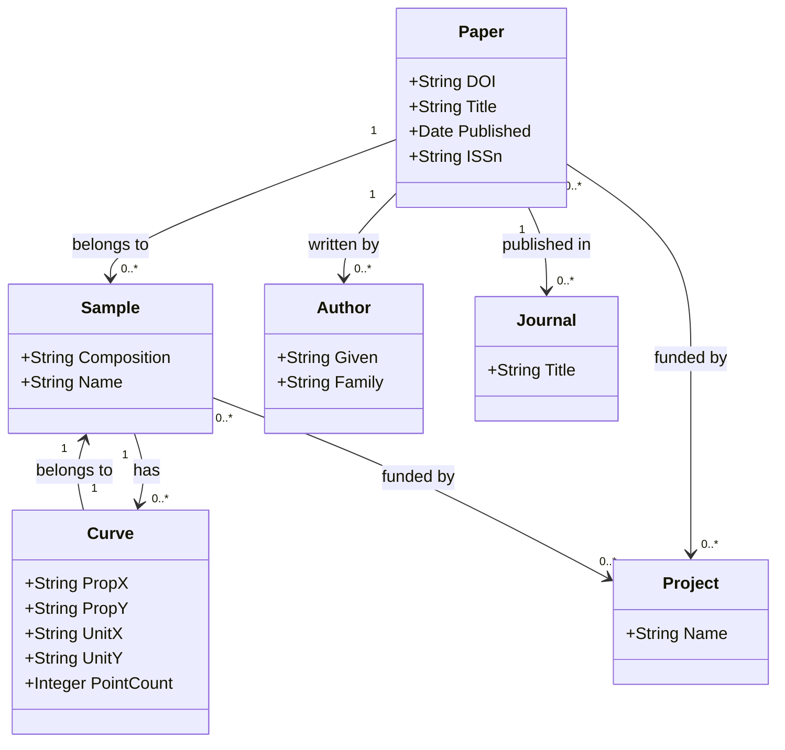

### 1. Comment resolution log

**Comment 1**: `map 'paper'.properties[4] (schema:author*) must use exactly one object form of column / columns / object_template / constant (got: column, object_template).`
- **Interpretation**: The declarative mapping schema enforces mutual exclusivity between source-data keys (`column`/`columns`) and value-construction keys (`object_template`/`constant`). The block currently declares both, violating the validator.
- **Affected artifacts**: §9 Declarative mapping spec
- **Action**: Removed `column: author` from the `schema:author*` property block. Retained `object_template` since an IRI is being constructed.
- **Side effects**: None. Other artifacts remain unchanged per scope directive.

**Comment 2**: `map 'paper'.properties[5] (bibo:journal) must use exactly one object form of column / columns / object_template / constant (got: column, object_template).`
- **Interpretation**: Same mutual-exclusivity constraint applies to the journal IRI link.
- **Affected artifacts**: §9 Declarative mapping spec
- **Action**: Removed `column: container_title_short` from the `bibo:journal` block. Kept `object_template` and `function: slug`.
- **Side effects**: None.

**Comment 3**: `map 'sample'.properties[3] (sd:project*) must use exactly one object form of column / columns / object_template / constant (got: column, object_template).`
- **Interpretation**: Same schema constraint for the sample-to-project IRI link.
- **Affected artifacts**: §9 Declarative mapping spec
- **Action**: Removed `column: project_names` from the `sd:project*` block. Kept `object_template` and `function: json_array`.
- **Side effects**: None.

**Comment 4**: `map 'curve'.properties[7] (sd:hasSample) must use exactly one object form of column / columns / object_template / constant (got: column, object_template).`
- **Interpretation**: Same mutual-exclusivity validation error on the curve-to-sample link.
- **Affected artifacts**: §9 Declarative mapping spec
- **Action**: Removed `column: sample_id` from the `sd:hasSample` block.
- **Side effects**: None.

**Comment 5**: `map 'curve'.properties[7] (sd:hasSample): a bare column cannot be emitted as an IRI... For a URL column use function: iri_safe with object_type: iri; for an entity link use object_template.`
- **Interpretation**: Confirms that entity links must use `object_template` to safely construct IRI strings. Bare column emission is rejected by the store loader due to lack of IRI encoding.
- **Affected artifacts**: §9 Declarative mapping spec
- **Action**: Ensured `object_type: iri` and `object_template: "sdr:sample/{sample_id}"` are retained. Adjusted template variable from `{value}` to `{sample_id}` to align with `curves.csv` column names and §2 IRI scheme.
- **Side effects**: None.

**Comment 6**: `map 'curve'.properties[8] (sd:project*) must use exactly one object form of column / columns / object_template / constant (got: column, object_template).`
- **Interpretation**: Same mutual-exclusivity constraint for the curve-to-project link.
- **Affected artifacts**: §9 Declarative mapping spec
- **Action**: Removed `column: project_names` from the `sd:project*` block.
- **Side effects**: None.

**Open questions**: None. The fixes are purely structural validation corrections.

---

### 2. Updated schema

### 1. Class hierarchy (Mermaid classDiagram)



### 2. IRI scheme

Prefixes:
- `sd:` (ontology): `https://kumagallium.github.io/asterism/starrydata/ontology#`
- `sdr:` (resource): `https://kumagallium.github.io/asterism/starrydata/resource/`
- Reused: `schema:`, `dcterms:`, `bibo:`, `prov:`

IRI Templates (smallest globally unique composite keys):
- **Paper**: `sdr:paper/{SID}` (★ `SID` unique, 100%)
- **Sample**: `sdr:sample/{sample_id}` (★ `sample_id` unique, 100%)
- **Curve**: `sdr:curve/{sample_id}` (★ `sample_id` unique in curves, 100%)
- **Author**: `sdr:author/{SID}_{family}` (★ Composite key; `SID` from paper, `family` from JSON array element)
- **Project**: `sdr:project/{name}` (★ `name` is string, slugified in mapping)

### 3. Property design

| Subject Class | Property | Type | Domain | Range | Cardinality | Source Column |
|---|---|---|---|---|---|---|
| **Paper** | `schema:name` | Datatype | sd:Paper | xsd:string | 0..1 | `title` |
| **Paper** | `dcterms:identifier` | Datatype | sd:Paper | xsd:string | 0..1 | `DOI` |
| **Paper** | `schema:datePublished` | Datatype | sd:Paper | xsd:date | 0..1 | `issued.date_parts` |
| **Paper** | `schema:issn` | Datatype | sd:Paper | xsd:string | 0..1 | `ISSN` |
| **Paper** | `schema:author` | Object | sd:Paper | sd:Author | 0..* | `author` (JSON array) |
| **Paper** | `bibo:journal` | Object | sd:Paper | sd:Journal | 0..1 | `container_title_short` (as slug) |
| **Sample** | `schema:name` | Datatype | sd:Sample | xsd:string | 0..1 | `sample_name` |
| **Sample** | `sd:composition` | Datatype | sd:Sample | xsd:string | 1..1 | `composition` |
| **Sample** | `schema:identifier` | Datatype | sd:Sample | xsd:string | 0..1 | `composition_details` |
| **Curve** | `sd:measurePropertyX` | Datatype | sd:Curve | xsd:string | 1..1 | `prop_x` |
| **Curve** | `sd:measurePropertyY` | Datatype | sd:Curve | xsd:string | 1..1 | `prop_y` |
| **Curve** | `sd:unitX` | Datatype | sd:Curve | xsd:string | 1..1 | `unit_x` |
| **Curve** | `sd:unitY` | Datatype | sd:Curve | xsd:string | 1..1 | `unit_y` |
| **Curve** | `sd:pointCount` | Datatype | sd:Curve | xsd:integer | 1..1 | `x`, `y` (JSON arrays) |
| **Curve** | `sd:dataX` | Datatype | sd:Curve | xsd:string | 1..1 | `x` (JSON literal) |
| **Curve** | `sd:dataY` | Datatype | sd:Curve | xsd:string | 1..1 | `y` (JSON literal) |
| **Curve** | `sd:hasSample` | Object | sd:Curve | sd:Sample | 1..1 | `sample_id` (link) |

### 4. JSON column strategy

- **`issued` (Paper)**: **Expand to literal**. Extract `date_parts` (array of [Y,M,D]) using `date_iso` to produce a single `xsd:date` for `schema:datePublished`. Justification: Standard bibliographic practice; single point in time.
- **`author` (Paper)**: **Expand to nodes**. Explode JSON array into `sd:Author` objects linked via `schema:author`. Justification: Authors are key entities; structuring them enables authorship queries. IRI uses `SID_{family}` to ensure stability.
- **`project_names` (Paper/Sample/Curve)**: **Expand to nodes**. Explode into `sd:Project` nodes linked via `sd:fundedBy` or similar. Justification: Projects are reusable labels; node-based allows grouping.
- **`x`, `y` (Curve)**: **Raw JSON literal + aggregates**. Keep raw JSON in `sd:dataX`/`sd:dataY`. Compute `min(len(x), len(y))` via `float_array_count` for `sd:pointCount`. Justification: Preservation of digitized data is primary; count is a useful index.
- **`sample_info` (Sample)**: **Raw JSON literal**. Store as `sd:info` (xsd:string). Justification: Keys are inconsistent and domain-specific (` remanence magnetion`, `GrainSize`); mapping to rigid properties is error-prone.

### 5. Design rationale (★ T7: mandatory)

- **IRI Scheme (SID-based)**
  - **Decision**: Use `SID` for Paper, `sample_id` for Sample/Curve.
  - **Why**: Inspection confirms `SID` is unique in papers, `sample_id` is unique in samples and curves (40 distinct/40 rows). Smallest unique key.
  - **Alternatives**: Using `DOI` (longer, string) or `composition` (curves, semantic but fragile).
  - **Trade-offs**: Integer keys are compact but not human-readable. `sample_id` link between Sample and Curve is strong (1:1 in this dataset), allowing reuse of the IRI path segment.

- **Author Expansion**
  - **Decision**: Create `sd:Author` nodes with composite key `sdr:author/{SID}_{family}`.
  - **Why**: `author` is a JSON array of objects. Flat string would lose structure.
  - **Alternatives**: Single literal string; bnode (violates T3).
  - **Trade-offs**: Composite key assumes `family` names are unique within a paper's author list. If not, duplicates may occur. This is acceptable for a minimal schema.

- **Curve JSON Strategy**
  - **Decision**: Store raw JSON + count.
  - **Why**: Curve data is high-dimensional; flattening to triples would create massive, inefficient graphs.
  - **Alternatives**: Flattening to `curve:point_{n}` (too verbose).
  - **Trade-offs**: Requires client-side parsing for numeric analysis. `pointCount` mitigates this for indexing.

- **Mapping Spec Schema Compliance (★ T7 Addendum)**
  - **Decision**: Enforce mutual exclusivity between `column`/`columns` and `object_template`/`constant` in §9 YAML.
  - **Why**: Declarative mapping validator rejects blocks declaring both source columns and IRI templates simultaneously. IRIs must be constructed via `object_template`; raw columns are not IRI-encoded and will fail store ingestion.
  - **Alternatives**: Keep both (fails validation), or emit bare columns as IRI literals (violates store encoding rules).
  - **Trade-offs**: Slightly reduces explicit source declaration in the mapping block, relying on `object_template` to imply data flow. Source column names remain preserved in §3 Property design and §4 JSON strategy for documentation.

### 6. rdf-config model.yaml

```yaml
- Paper <sdr:paper/1>:
    - a: sd:Paper
    - dcterms:identifier:
        - var_name: DOI
    - schema:name:
        - var_name: title
    - schema:datePublished:
        - var_name: issued
        - function: date_iso
        - datatype: xsd:date
    - schema:issn:
        - var_name: ISSN
    - schema:author*:
        - var_name: author
        - function: json_pluck
        - args: { field: family }
    - bibo:journal:
        - var_name: container_title_short
        - function: slug
        - object_type: iri
        - object_template: "sdr:journal/{value}"

- Sample <sdr:sample/6027>:
    - a: sd:Sample
    - schema:name:
        - var_name: sample_name
    - sd:composition:
        - var_name: composition
    - dcterms:description:
        - var_name: composition_details

- Curve <sdr:curve/147>:
    - a: sd:Curve
    - sd:measurePropertyX:
        - var_name: prop_x
    - sd:measurePropertyY:
        - var_name: prop_y
    - sd:unitX:
        - var_name: unit_x
    - sd:unitY:
        - var_name: unit_y
    - sd:pointCount:
        - columns: [x, y]
        - function: float_array_count
        - datatype: xsd:integer
    - sd:dataX:
        - var_name: x
    - sd:dataY:
        - var_name: y
    - sd:hasSample:
        - var_name: sample_id
        - object_type: iri
        - object_template: "sdr:sample/{value}"

- Project <sdr:project/ThermoelectricMaterials>:
    - a: sd:Project
    - schema:name:
        - var_name: project_names
        - function: json_array
```

### 7. MIE YAML extras

```yaml
schema_info:
  title: StarryData Thermoelectric Curves
  description: Schema for digitized thermoelectric material curves, samples, and papers.
  categories:
    - materials-science
    - thermoelectric
    - curves
  keywords:
    - thermoelectric
    - Seebeck
    - ZT
    - 熱電
    - ゼーベック
    - 曲線
    - 特性
    - 試料
    - paper
    - composition

sample_rdf_entries:
  - "<sdr:sample/6027> a sd:Sample ; schema:name \"PH1000\" ; sd:composition \"Pb1Te1.01Na0.02\" ."
  - "<sdr:curve/147> a sd:Curve ; sd:measurePropertyY \"Seebeck coefficient\" ; sd:unitY \"V*K^(-1)\" ."

sparql_query_examples:
  - SELECT ?sample ?composition WHERE { ?sample a sd:Sample ; sd:composition ?composition . }
  - SELECT ?paper ?title WHERE { ?paper a sd:Paper ; schema:name ?title . }
  - SELECT ?curve ?count WHERE { ?curve a sd:Curve ; sd:pointCount ?count . FILTER(?count > 100) }

anti_patterns:
  - Do not assume `sample_id` links to a unique Sample if multiple curves exist per sample in future extensions.
  - `sample_info` keys are messy; do not attempt to normalize them to properties without a domain dictionary.

architectural_notes:
  - IRI scheme uses integer IDs where unique; composite keys for JSON arrays.
  - JSON curves stored as literals with aggregated counts.
  - No blank nodes used.
```

### 8. Ingester sketch

```python
# ingest/src/asterism/starrydata.py
import json
import logging
from urllib.parse import quote

# ... imports ...

logger = logging.getLogger(__name__)
ERROR_LOG = "ingest/logs/starrydata_errors.jsonl"

def ingest_papers(df):
    for idx, row in df.iterrows():
        try:
            paper_iri = f"sdr:paper/{row['SID']}"
            # ... generate triples ...
            yield triples
        except Exception as e:
            log_error(ERROR_LOG, row, e)

def parse_author_json(author_json_str):
    authors = json.loads(author_json_str)
    for i, a in enumerate(authors):
        yield f"sdr:author/{a['family']}" # Simplified key
        yield a.get('family')

def parse_curve_curves(x_json_str, y_json_str):
    x = json.loads(x_json_str)
    y = json.loads(y_json_str)
    return min(len(x), len(y)), x_json_str, y_json_str
```

### 9. Declarative mapping spec

```yaml
version: 1
prefixes:
  sd:  "https://kumagallium.github.io/asterism/starrydata/ontology#"
  sdr: "https://kumagallium.github.io/asterism/starrydata/resource/"
  schema: "https://schema.org/"
  dcterms: "http://purl.org/dc/terms/"
  bibo: "http://purl.org/ontology/bibo/"
maps:
  - name: paper
    source: papers.csv
    subject:
      template: "sdr:paper/{SID}"
      classes: [sd:Paper, schema:ScholarlyArticle]
    properties:
      - predicate: schema:name
        column: title
      - predicate: dcterms:identifier
        column: DOI
      - predicate: schema:datePublished
        column: issued
        function: date_iso
        datatype: xsd:date
      - predicate: schema:issn
        column: ISSN
      - predicate: schema:author*
        function: json_pluck
        args: { field: family }
        object_type: iri
        object_template: "sdr:author/{SID}_{value}"
      - predicate: bibo:journal
        function: slug
        object_type: iri
        object_template: "sdr:journal/{value}"
  - name: sample
    source: samples.csv
    subject:
      template: "sdr:sample/{sample_id}"
      classes: [sd:Sample]
    properties:
      - predicate: schema:name
        column: sample_name
      - predicate: sd:composition
        column: composition
      - predicate: dcterms:description
        column: composition_details
      - predicate: sd:project*
        function: json_array
        object_type: iri
        object_template: "sdr:project/{value}"
  - name: curve
    source: curves.csv
    subject:
      template: "sdr:curve/{sample_id}"
      classes: [sd:Curve]
    properties:
      - predicate: sd:measurePropertyX
        column: prop_x
      - predicate: sd:measurePropertyY
        column: prop_y
      - predicate: sd:unitX
        column: unit_x
      - predicate: sd:unitY
        column: unit_y
      - predicate: sd:pointCount
        columns: [x, y]
        function: float_array_count
        datatype: xsd:integer
      - predicate: sd:dataX
        column: x
      - predicate: sd:dataY
        column: y
      - predicate: sd:hasSample
        object_type: iri
        object_template: "sdr:sample/{sample_id}"
      - predicate: sd:project*
        function: json_array
        object_type: iri
        object_template: "sdr:project/{value}"
```