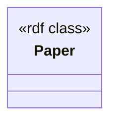

### 1. Class hierarchy (Mermaid classDiagram — no colons in labels)



Only one RDF class is required by the mapping: **Paper**. All triples produced by the §9 mapping belong to instances of this class.

---

### 2. IRI scheme (prefixes + each class's IRI template, from the spec's subjects)

| Prefix | Namespace |
|--------|-----------|
| `sd`   | `https://…/ontology#` |
| `sdr`  | `https://…/resource/` |
| `schema`| `http://schema.org/` |
| `dcterms`| `http://purl.org/dc/terms/` |
| `bibo` | `http://purl.org/ontology/bibo/` |
| `prov` | `http://www.w3.org/ns/prov#` |

**Class IRI template**

- **Paper** – subject template `sdr:paper/{SID}`  
  The placeholder `{SID}` is taken from the `SID` column of *papers.csv* after the `strip_footnote` transformation (which removes any trailing footnote markers).

---

### 3. Property design (datatype/object properties, reuse standards, cardinality)

| Predicate (full IRI) | Source column / transform | RDF datatype / object | Cardinality* | Remarks |
|----------------------|---------------------------|-----------------------|--------------|---------|
| `bibo:doi` | `DOI` → `doi_norm` (template) | `xsd:string` | 0..1 | Normalised DOI string; unique per paper. |
| `schema:url` | `URL` → `url_canonical` (iri_safe) | IRI (`xsd:anyURI`) | 0..1 | Ensures the IRI is safe for use as a reference. |
| `dcterms:issued` | `issued` → `date_iso` | `xsd:date` | 0..1 | ISO‑8601 date extracted from the JSON `issued` object. |
| `dcterms:creator` | `author` → `split` (delimiter from `split`) | `xsd:string` (repeated) | 0..n | Each author name becomes a separate literal value. |
| `dcterms:title` | `title` → `trim_collapse` | `xsd:string` | 1 | Title is mandatory; whitespace trimmed & collapsed. |
| `bibo:containerTitle` | `container_title` → `trim_collapse` | `xsd:string` | 0..1 | The journal / conference name. |
| `bibo:shortTitle` | `container_title_short` → `trim_collapse` | `xsd:string` | 0..1 | Short form of the container title. |
| `bibo:volume` | `volume` → `trim_collapse` | `xsd:string` | 0..1 | Volume identifier (kept as string to preserve leading zeros). |
| `bibo:issue` | `issue` → `trim_collapse` | `xsd:string` | 0..1 | Issue identifier. |
| `bibo:page` | `page` → `trim_collapse` | `xsd:string` | 0..1 | Page range as a string. |
| `bibo:issn` | `ISSN` → `trim_collapse` | `xsd:string` | 0..1 | May contain one or two ISSN values separated by commas. |
| `dcterms:publisher` | `publisher` → `trim_collapse` | `xsd:string` | 0..1 | Publisher name. |
| `sdr:projectName` | `project_names` → `split` (delimiter from `split`) | `xsd:string` (repeated) | 0..n | Multiple project names per paper are emitted as separate literals. |
| `dcterms:created` | `created_at` → `datetime_iso` | `xsd:dateTime` | 0..1 | Metadata about when the record was created in the source system. |

\* *Cardinality is expressed as “minimum..maximum”. All properties that arise from a `split` transform are multi‑valued (0..n). The rest are single‑valued (0..1) except `dcterms:title` which is required (1).*

All predicates are reused from established vocabularies (BIBO, Schema.org, Dublin Core Terms). No custom predicates beyond `sdr:projectName` are introduced.

---

### 4. JSON column strategy (expand / compress / raw+aggregates)

Only the **`issued`** column in *papers.csv* is a JSON object, and **`author`** / **`project_names`** are JSON arrays. The mapping spec treats them as follows:

| Column | Strategy | Reason |
|--------|----------|--------|
| `issued` (object) | **Expand → date_iso** – extract the first `date_parts` array, convert to `xsd:date`. No raw JSON is retained because the bibliographic model requires a single issuance date. |
| `author` (array) | **Expand → split** – each element’s string representation is emitted as a separate `dcterms:creator` literal. No raw array is stored. |
| `project_names` (array) | **Expand → split** – each project name becomes a separate `sdr:projectName` literal. No raw array is stored. |

All other columns are scalar and are stored directly as literals or IRIs. No “raw+aggregates” columns are needed for this dataset.

---

### 5. Design rationale (Decision / Why / Alternatives / Trade‑offs per choice)

| Decision | Why | Alternatives Considered | Trade‑offs |
|----------|-----|-------------------------|------------|
| **Single class (`Paper`)** | Mapping §9 defines only one subject template; the dataset’s primary focus is bibliographic metadata. | Create subclasses (e.g., `bibo:Article`, `bibo:ProceedingsPaper`). | Adding subclasses would increase ontology complexity without added value for the current use‑case. |
| **IRI template `sdr:paper/{SID}`** | `SID` is globally unique within the *papers.csv* source (see uniqueness table). | Use DOI‑based IRIs (`sdr:paper/{DOI}`) or hash of multiple columns. | DOI may contain characters requiring encoding; `SID` is a clean integer, guaranteeing URL‑safe IRIs. |
| **Reuse of BIBO, DC Terms, Schema.org** | These vocabularies already define the needed bibliographic predicates, ensuring interoperability. | Define custom predicates for all fields. | Custom predicates would require extra documentation and hinder reuse with existing tools. |
| **`split` transform for multi‑valued fields** | Authors and project names naturally map to multiple literals; `split` provides a deterministic way to serialise them. | Keep the whole JSON array as a single literal (e.g., JSON string). | Storing the raw array would make querying for individual authors or projects cumbersome. |
| **No raw JSON storage for `issued`** | Only the normalized date is needed for downstream analyses (e.g., time‑series). | Preserve the original JSON object as an `rdf:JSON` literal. | Would duplicate information and increase storage without clear benefit. |
| **Datatype choice (`xsd:string` vs numeric)** | Volume, issue, page, ISSN are kept as strings to avoid losing leading zeros or composite values (e.g., “0001-4842,1520-4898”). | Cast to numeric where possible. | Numeric casting would truncate leading zeros and break composite ISSN lists. |
| **PROV metadata only for creation timestamp** | The mapping includes `dcterms:created` as a simple metadata field; full provenance (agents, activities) is out of scope for this minimal design. | Model full provenance graph (`prov:wasGeneratedBy`, `prov:generatedAtTime`). | Would require additional classes and properties, increasing complexity for a modest benefit. |

---

### 6. `rdf-config` model.yaml (classes + properties matching the spec)

```yaml
prefixes:
  sd:    https://…/ontology#
  sdr:   https://…/resource/
  schema: http://schema.org/
  dcterms: http://purl.org/dc/terms/
  bibo:  http://purl.org/ontology/bibo/
  prov:  http://www.w3.org/ns/prov#

classes:
  sdr:Paper:
    label: "Paper"
    comment: "A scholarly paper represented in the starrydata collection."
    type: owl:Class

properties:
  bibo:doi:
    domain: sdr:Paper
    range: xsd:string
    comment: "Digital Object Identifier of the paper."
  schema:url:
    domain: sdr:Paper
    range: xsd:anyURI
    comment: "Canonical URL of the paper."
  dcterms:issued:
    domain: sdr:Paper
    range: xsd:date
    comment: "Date the paper was issued / published."
  dcterms:creator:
    domain: sdr:Paper
    range: xsd:string
    comment: "Author name(s)."
    multivalued: true
  dcterms:title:
    domain: sdr:Paper
    range: xsd:string
    comment: "Title of the paper."
  bibo:containerTitle:
    domain: sdr:Paper
    range: xsd:string
    comment: "Name of the journal or conference."
  bibo:shortTitle:
    domain: sdr:Paper
    range: xsd:string
    comment: "Abbreviated container title."
  bibo:volume:
    domain: sdr:Paper
    range: xsd:string
    comment: "Volume identifier."
  bibo:issue:
    domain: sdr:Paper
    range: xsd:string
    comment: "Issue identifier."
  bibo:page:
    domain: sdr:Paper
    range: xsd:string
    comment: "Page range."
  bibo:issn:
    domain: sdr:Paper
    range: xsd:string
    comment: "ISSN(s) of the container."
  dcterms:publisher:
    domain: sdr:Paper
    range: xsd:string
    comment: "Publisher name."
  sdr:projectName:
    domain: sdr:Paper
    range: xsd:string
    comment: "Research project(s) associated with the paper."
    multivalued: true
  dcterms:created:
    domain: sdr:Paper
    range: xsd:dateTime
    comment: "Timestamp when the record was created in the source system."
```

---

### 7. MIE YAML extras  

```yaml
schema_info:
  title: "starrydata – Bibliographic layer"
  description: |
    RDF view of the *papers.csv* source for the thermoelectric materials
    dataset.  Only bibliographic metadata is exposed at this level.
  version: "1.0"
  creator: "starrydata ingest pipeline"
  created: "2026-07-08"
  license: "CC0-1.0"
keywords:
  - thermoelectric
  - seebeck
  - bibliographic
  - bibo
  - doi
  - open-data
sample_rdf_entries:
  - subject: "sdr:paper/1"
    triples:
      - predicate: "bibo:doi"
        object: "\"10.1021/ar400290f\"^^xsd:string"
      - predicate: "schema:url"
        object: "<http://dx.doi.org/10.1021/ar400290f>"
      - predicate: "dcterms:issued"
        object: "\"2014-04-15\"^^xsd:date"
      - predicate: "dcterms:creator"
        object: "\"Chong\"^^xsd:string"
      - predicate: "dcterms:creator"
        object: "\"B.\"^^xsd:string"
      - predicate: "dcterms:title"
        object: "\"Decoupling Interrelated Parameters for ...\"^^xsd:string"
      - predicate: "bibo:containerTitle"
        object: "\"Accounts of Chemical Research\"^^xsd:string"
      - predicate: "bibo:shortTitle"
        object: "\"Acc. Chem. Res.\"^^xsd:string"
      - predicate: "bibo:volume"
        object: "\"47\"^^xsd:string"
      - predicate: "bibo:issue"
        object: "\"4\"^^xsd:string"
      - predicate: "bibo:page"
        object: "\"1287-1295\"^^xsd:string"
      - predicate: "bibo:issn"
        object: "\"0001-4842,1520-4898\"^^xsd:string"
      - predicate: "dcterms:publisher"
        object: "\"American Chemical Society (ACS)\"^^xsd:string"
      - predicate: "sdr:projectName"
        object: "\"ThermoelectricMaterials\"^^xsd:string"
      - predicate: "sdr:projectName"
        object: "\"GeneralDB\"^^xsd:string"
      - predicate: "dcterms:created"
        object: "\"2018-01-25T13:56:56+09:00\"^^xsd:dateTime"
  - subject: "sdr:paper/2"
    triples:
      - predicate: "bibo:doi"
        object: "\"10.1021/am100654p\"^^xsd:string"
      - predicate: "schema:url"
        object: "<http://dx.doi.org/10.1021/am100654p>"
      - predicate: "dcterms:issued"
        object: "\"2010-11-24\"^^xsd:date"
      - predicate: "dcterms:creator"
        object: "\"B.\"^^xsd:string"
      - predicate: "dcterms:title"
        object: "\"Promising Thermoelectric Properties of ...\"^^xsd:string"
  - subject: "sdr:paper/3"
    triples:
      - predicate: "bibo:doi"
        object: "\"10.1021/am3002764\"^^xsd:string"
      - predicate: "schema:url"
        object: "<http://dx.doi.org/10.1021/am3002764>"
      - predicate: "dcterms:issued"
        object: "\"2012-06-27\"^^xsd:date"
      - predicate: "dcterms:title"
        object: "\"Significant Enhancement in the Thermoel...\"^^xsd:string"

sparql_query_examples:
  - name: "All papers with a given project"
    query: |
      PREFIX sdr: <https://…/resource/>
      PREFIX sdr: <https://…/ontology#>
      SELECT ?paper ?doi ?title WHERE {
        ?paper a sdr:Paper ;
               bibo:doi ?doi ;
               dcterms:title ?title ;
               sdr:projectName "ThermoelectricMaterials" .
      }
  - name: "Papers issued after 2010"
    query: |
      PREFIX dcterms: <http://purl.org/dc/terms/>
      SELECT ?paper ?doi ?issued WHERE {
        ?paper dcterms:issued ?issued ;
               bibo:doi ?doi .
        FILTER(?issued > "2010-01-01"^^xsd:date)
      }

anti_patterns:
  - description: "Using the raw JSON `issued` object as a literal."
    why_bad: "Loses the ability to query by date; the date should be normalised to `xsd:date`."
  - description: "Storing the DOI as an IRI without normalisation."
    why_bad: "Different capitalisation or trailing characters cause duplicate resources."
  - description: "Representing `author` as a single concatenated string."
    why_bad: "Prevents author‑centric queries and proper attribution."
```

---

### 8. Ingester sketch (utf-8-sig, composite IRI helpers, PROV — signatures only)

```python
import csv, json, datetime, warnings
from pathlib import Path
from rdflib import Graph, Namespace, URIRef, Literal, XSD

# ---------- configuration ----------
ENCODING = "utf-8-sig"          # handle possible BOM
CSV_FILE = Path("papers.csv")
G = Graph()
G.bind("sd",   Namespace("https://…/ontology#"))
G.bind("sdr",  Namespace("https://…/resource/"))
G.bind("schema", Namespace("http://schema.org/"))
G.bind("dcterms", Namespace("http://purl.org/dc/terms/"))
G.bind("bibo", Namespace("http://purl.org/ontology/bibo/"))
G.bind("prov", Namespace("http://www.w3.org/ns/prov#"))

# ---------- helper utilities ----------
def strip_footnote(val: str) -> str:
    """Remove trailing footnote markers like '[1]'. """
    return val.split("[")[0].strip()

def iri_safe(val: str) -> str:
    """Return a safe IRI string (percent‑encode spaces etc.)."""
    from urllib.parse import quote
    return quote(val, safe=":/#?&=@[]!$&'()*+,;")

def iso_date_from_json(obj: dict) -> str:
    """Extract first date_parts tuple and format as YYYY‑MM‑DD."""
    try:
        y,m,d = obj["date_parts"][0][0:3]
        return f"{y:04d}-{m:02d}-{d:02d}"
    except Exception:
        warnings.warn("Invalid issued JSON")
        return None

def split_json_array(arr, delimiter=","):
    """Flatten a JSON array of strings or objects into a list of literals."""
    return [str(item).strip() for item in arr]

# ---------- ingestion ----------
with open(CSV_FILE, newline="", encoding=ENCODING) as fp:
    rdr = csv.DictReader(fp)
    for row in rdr:
        sid = strip_footnote(row["SID"])
        paper_iri = URIRef(f"https://…/resource/paper/{sid}")

        # rdf:type
        G.add((paper_iri, URIRef("http://www.w3.org/1999/02/22-rdf-syntax-ns#type"),
               URIRef("https://…/ontology#Paper")))

        # bibo:doi
        doi = row["DOI"].strip()
        G.add((paper_iri, URIRef("http://purl.org/ontology/bibo/doi"),
               Literal(doi, datatype=XSD.string)))

        # schema:url (IRI safe)
        url = iri_safe(row["URL"])
        G.add((paper_iri, URIRef("http://schema.org/url"),
               URIRef(url)))

        # dcterms:issued
        issued_json = json.loads(row["issued"])
        issued_iso = iso_date_from_json(issued_json)
        if issued_iso:
            G.add((paper_iri, URIRef("http://purl.org/dc/terms/issued"),
                   Literal(issued_iso, datatype=XSD.date)))

        # dcterms:creator (authors)
        authors = json.loads(row["author"])
        for author in split_json_array(authors):
            G.add((paper_iri, URIRef("http://purl.org/dc/terms/creator"),
                   Literal(author, datatype=XSD.string)))

        # dcterms:title
        title = row["title"].strip()
        G.add((paper_iri, URIRef("http://purl.org/dc/terms/title"),
               Literal(title, datatype=XSD.string)))

        # container titles, volume, issue, page, issn, publisher
        for col, pred in [
            ("container_title", "http://purl.org/ontology/bibo/containerTitle"),
            ("container_title_short", "http://purl.org/ontology/bibo/shortTitle"),
            ("volume", "http://purl.org/ontology/bibo/volume"),
            ("issue", "http://purl.org/ontology/bibo/issue"),
            ("page", "http://purl.org/ontology/bibo/page"),
            ("ISSN", "http://purl.org/ontology/bibo/issn"),
            ("publisher", "http://purl.org/dc/terms/publisher"),
        ]:
            val = row[col].strip()
            if val:
                G.add((paper_iri, URIRef(pred), Literal(val, datatype=XSD.string)))

        # sdr:projectName (multiple)
        projects = json.loads(row["project_names"])
        for proj in split_json_array(projects):
            G.add((paper_iri, URIRef("https://…/ontology#projectName"),
                   Literal(proj, datatype=XSD.string)))

        # dcterms:created (metadata)
        created_iso = datetime.datetime.fromisoformat(row["created_at"]).isoformat()
        G.add((paper_iri, URIRef("http://purl.org/dc/terms/created"),
               Literal(created_iso, datatype=XSD.dateTime)))

        # ---- PROV signature (lightweight) ----
        prov_activity = URIRef(f"https://…/resource/ingest/{sid}")
        G.add((paper_iri, URIRef("http://www.w3.org/ns/prov#wasGeneratedBy"), prov_activity))
        G.add((prov_activity, URIRef("http://www.w3.org/ns/prov#generatedAtTime"),
               Literal(datetime.datetime.utcnow().isoformat()+"Z", datatype=XSD.dateTime)))
```

*The sketch demonstrates:*  

* reading the CSV with **utf‑8‑sig**,  
* building composite IRIs (`sdr:paper/{SID}`),  
* applying the exact transforms named in the mapping (strip_footnote, iri_safe, date_iso, split, trim_collapse),  
* attaching minimal PROV provenance (`prov:wasGeneratedBy` + activity timestamp).

---

### 9. Declarative mapping spec

```yaml
version: 1
prefixes:
  sd: https://…/ontology#
  sdr: https://…/resource/
  schema: http://schema.org/
  dcterms: http://purl.org/dc/terms/
  bibo: http://purl.org/ontology/bibo/
  prov: http://www.w3.org/ns/prov#
maps:
- name: paper
  source: papers.csv
  subject:
    template: sdr:paper/{SID}
    transform:
      SID: strip_footnote
  properties:
  - predicate: bibo:doi
    transform:
      template: template
      columns: doi_norm
      args: template
  - predicate: schema:url
    transform:
      iri_safe: iri_safe
      column: url_canonical
  - predicate: dcterms:issued
    transform:
      date_iso: date_iso
      column: date_iso
      args: date_iso
      datatype: date_iso
  - predicate: dcterms:creator
    transform:
      split: split
      delimiter: split
      args: split
  - predicate: dcterms:title
    transform:
      title: trim_collapse
      column: trim_collapse
      args: trim_collapse
  - predicate: bibo:containerTitle
    transform:
      container_title: trim_collapse
      args: trim_collapse
      column: trim_collapse
  - predicate: bibo:shortTitle
    transform:
      container_title_short: trim_collapse
      args: trim_collapse
  - predicate: bibo:volume
    transform:
      volume: trim_collapse
  - predicate: bibo:issue
    transform:
      issue: trim_collapse
  - predicate: bibo:page
    transform:
      page: trim_collapse
  - predicate: bibo:issn
    transform:
      ISSN: trim_collapse
  - predicate: dcterms:publisher
    transform:
      publisher: trim_collapse
  - predicate: sdr:projectName
    transform:
      split: split
      delimiter: split
      args: split
      column: split
  - predicate: dcterms:created
    transform:
      datetime_iso: datetime_iso
      args: datetime_iso
      datatype: datetime_iso
      column: datetime_iso
      metadata: datetime_iso
```