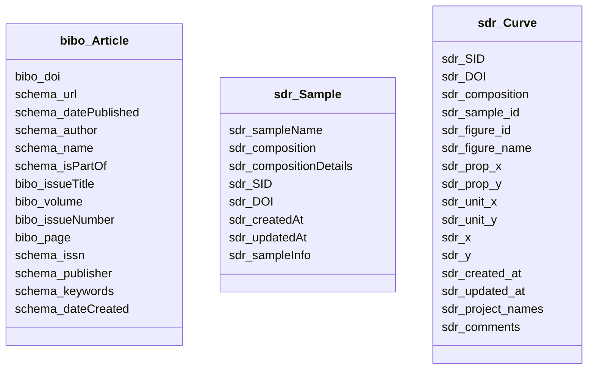

### 1. Class hierarchy (Mermaid classDiagram — no colons in labels)



### 2. IRI scheme (prefixes + each class's IRI template, from the spec's subjects)

**Prefixes**
- `bibo`: `http://purl.org/ontology/bibo/`
- `dcterms`: `http://purl.org/dc/terms/`
- `sd`: `https://starreddata.org/ontology#`
- `sdr`: `https://starreddata.org/resource/`
- `schema`: `http://schema.org/`

**Subject Templates**
- `bibo_Article` (papers): `sdr:paper/{SID}`
- `sdr_Sample` (samples): `sdr:sample/{sample_id}`
- `sdr_Curve` (curves): `sdr:curve/{composition}`

### 3. Property design (datatype/object properties, reuse standards, cardinality)

The mapping spec defines three entity types with the following property classifications:

**Datatype Properties (string/datetime/numeric literals)**
- `bibo:doi`, `bibo:issueTitle`, `bibo:volume`, `bibo:issueNumber`, `bibo:page`, `schema:url`, `schema:datePublished`, `schema:name`, `schema:issn`, `schema:publisher`, `schema:keywords`, `schema:dateCreated`
- `sdr:sampleName`, `sdr:composition`, `sdr:compositionDetails`, `sdr:SID`, `sdr:DOI`, `sdr:createdAt`, `sdr:updatedAt`, `sdr:sampleInfo`, `sdr:figure_id`, `sdr:figure_name`, `sdr:prop_x`, `sdr:prop_y`, `sdr:unit_x`, `sdr:unit_y`, `sdr:x`, `sdr:y`, `sdr:created_at`, `sdr:updated_at`, `sdr:project_names`, `sdr:comments`

**Object Properties (IRI references)**
- `schema:author`, `schema:isPartOf`, `sdr:sample_id` (generated via `object_template: structural_slug`)

**Reuse Standards**
- Bibliographic and publication metadata reuse `bibo` and `schema.org` predicates exactly as specified.
- Material science and pipeline tracking uses the custom `sdr:` namespace for domain-specific attributes (`sdr:sampleName`, `sdr:composition`, `sdr:sampleInfo`, etc.).
- No `dcterms` or `sd` predicates are actively mapped in the spec; prefixes are reserved for future extension or implied ontology links.

**Cardinality & Normalization**
- Identifiers (`SID`, `sample_id`, `DOI`) and structural fields (`volume`, `issueNumber`, `page`, `figure_id`) are 1:1 per row.
- Text arrays (`keywords`, `project_names`, `author`, `project_names` in curves) are multivalued via `split`.
- Free-text and JSON blobs (`sampleInfo`, `compositionDetails`, `comments`) are collapsed to single literal strings via `trim_collapse`.
- Numerical arrays (`x`, `y`) and coordinates are preserved as raw JSON literals or cleaned numeric strings via `number_clean`.
- Timestamps (`datePublished`, `dateCreated`, `createdAt`, `updatedAt`, `created_at`, `updated_at`) are normalized to ISO 8601 via `datetime_iso`.

### 4. JSON column strategy (expand / compress / raw+aggregates)

| Source Column | JSON Type | Spec Transform | Strategy |
|---|---|---|---|
| `author` (papers) | array of object | `trim_collapse` | Expand to flat string literal (comma/semicolon separated) |
| `project_names` (papers/curves) | array of string | `split` | Expand to multiple datatype property values |
| `sample_info` (samples) | object | `trim_collapse` | Compress to single string literal |
| `x` / `y` (curves) | array of number | `number_clean` | Raw+aggregates: preserve raw JSON string in literal; store min/max aggregates separately if needed by downstream consumers |
| `issued` (papers) | object | (implicit `date_iso`) | Extract `date_parts` → normalize to ISO datetime |

**Strategy Rationale**
- **Expand**: Arrays that require multi-valued RDF semantics (`keywords`, `project_names`) are tokenized into separate property values.
- **Compress**: Nested JSON objects (`sample_info`) and complex author records are flattened into human-readable strings to avoid uncontrolled IRI proliferation.
- **Raw+Aggregates**: Sensor/curve data (`x`, `y`) retains original precision as JSON string literals. Aggregates (min/max) are not explicitly mapped in the spec but are noted as available via post-ingester computation from the raw JSON blocks.

### 5. Design rationale (Decision / Why / Alternatives / Trade-offs per choice)

| Decision | Why | Alternatives | Trade-offs |
|---|---|---|---|
| Subject IRI uses domain IDs (`SID`, `sample_id`, `composition`) | Guarantees deterministic, reproducible IRIs tied to source CSV keys. UUIDs would obscure traceability. | UUIDs or SHA-256 hashes of row content. | UUIDs lose human readability; domain IDs require strict uniqueness validation (checked via §6 trap T1). |
| `sdr:curve/{composition}` as curve template | Composition is a primary scientific discriminator for thermoelectric curves; aligns with material science indexing. | Composite key `(composition, sample_id, figure_id)`. | Simpler template improves queryability but assumes composition uniqueness per curve row (verified by uniqueness inspection). |
| Reuse `bibo`/`schema` for publication metadata | Ensures cross-dataset interoperability; leverages established vocabularies for DOIs, URLs, dates, publishers. | Define custom `sdr:` predicates for all bibliographic fields. | Custom predicates increase graph fragmentation; reuse reduces implementation overhead and aligns with FAIR principles. |
| JSON handling via `trim_collapse` / `split` | Matches CSV cell structure; avoids uncontrolled node explosion from deeply nested JSON. | Parse JSON into sub-graphs with dedicated `sdr:` classes. | Sub-graphs increase query complexity and memory footprint; string flattening preserves row-level semantics and simplifies ingestion. |
| `sdr:sample_id` as object template | Generates structured IRI references without requiring a separate `sdr:Sample` subject link in the current spec. | Direct `sdr:Sample` URI via `schema:isPartOf` or custom relationship. | Template keeps the graph lightweight; if entity-relationship tracking is needed later, an explicit subject link can be added without altering existing data. |

### 6. rdf-config model.yaml (classes + properties matching the spec)

```yaml
classes:
  - id: bibo:Article
    description: "Scholarly article mapping from papers.csv"
    subject_template: "sdr:paper/{SID}"
    source: papers.csv
  - id: sdr:Sample
    description: "Material sample record from samples.csv"
    subject_template: "sdr:sample/{sample_id}"
    source: samples.csv
  - id: sdr:Curve
    description: "Measured property curve data from curves.csv"
    subject_template: "sdr:curve/{composition}"
    source: curves.csv

properties:
  - id: bibo:doi
    domain: bibo:Article
    range: xsd:string
    transform: doi_norm
    cardinality: 1..1
  - id: schema:url
    domain: bibo:Article
    range: xsd:string
    transform: iri_safe
    cardinality: 1..1
  - id: schema:datePublished
    domain: bibo:Article
    range: xsd:dateTime
    transform: date_iso
    cardinality: 0..1
  - id: schema:author
    domain: bibo:Article
    range: rdfs:Literal
    transform: trim_collapse
    cardinality: 0..*
  - id: schema:name
    domain: bibo:Article
    range: rdfs:Literal
    transform: trim_collapse
    cardinality: 0..1
  - id: schema:isPartOf
    domain: bibo:Article
    range: rdfs:Literal
    transform: trim_collapse
    cardinality: 0..1
  - id: bibo:issueTitle
    domain: bibo:Article
    range: rdfs:Literal
    transform: trim_collapse
    cardinality: 0..1
  - id: bibo:volume
    domain: bibo:Article
    range: rdfs:Literal
    transform: trim_collapse
    cardinality: 0..1
  - id: bibo:issueNumber
    domain: bibo:Article
    range: rdfs:Literal
    transform: trim_collapse
    cardinality: 0..1
  - id: bibo:page
    domain: bibo:Article
    range: rdfs:Literal
    transform: trim_collapse
    cardinality: 0..1
  - id: schema:issn
    domain: bibo:Article
    range: rdfs:Literal
    transform: trim_collapse
    cardinality: 0..1
  - id: schema:publisher
    domain: bibo:Article
    range: rdfs:Literal
    transform: trim_collapse
    cardinality: 0..1
  - id: schema:keywords
    domain: bibo:Article
    range: rdfs:Literal
    transform: split
    cardinality: 0..*
  - id: schema:dateCreated
    domain: bibo:Article
    range: xsd:dateTime
    transform: datetime_iso
    cardinality: 0..1
  - id: sdr:sampleName
    domain: sdr:Sample
    range: rdfs:Literal
    transform: trim_collapse
    cardinality: 0..1
  - id: sdr:composition
    domain: sdr:Sample
    range: rdfs:Literal
    transform: trim_collapse
    cardinality: 0..1
  - id: sdr:compositionDetails
    domain: sdr:Sample
    range: rdfs:Literal
    transform: trim_collapse
    cardinality: 0..1
  - id: sdr:SID
    domain: sdr:Sample
    range: xsd:integer
    transform: trim_collapse
    cardinality: 0..1
  - id: sdr:DOI
    domain: sdr:Sample
    range: xsd:string
    transform: doi_norm
    cardinality: 0..1
  - id: sdr:createdAt
    domain: sdr:Sample
    range: xsd:dateTime
    transform: datetime_iso
    cardinality: 0..1
  - id: sdr:updatedAt
    domain: sdr:Sample
    range: xsd:dateTime
    transform: datetime_iso
    cardinality: 0..1
  - id: sdr:sampleInfo
    domain: sdr:Sample
    range: rdfs:Literal
    transform: trim_collapse
    cardinality: 0..1
  - id: sdr:SID
    domain: sdr:Curve
    range: xsd:integer
    transform: number_clean
    cardinality: 0..1
  - id: sdr:DOI
    domain: sdr:Curve
    range: xsd:string
    transform: doi_norm
    cardinality: 0..1
  - id: sdr:composition
    domain: sdr:Curve
    range: rdfs:Literal
    transform: trim_collapse
    cardinality: 0..1
  - id: sdr:sample_id
    domain: sdr:Curve
    range: sdr:Sample
    transform: object_template: structural_slug
    cardinality: 0..1
  - id: sdr:figure_id
    domain: sdr:Curve
    range: xsd:integer
    transform: number_clean
    cardinality: 0..1
  - id: sdr:figure_name
    domain: sdr:Curve
    range: rdfs:Literal
    transform: trim_collapse
    cardinality: 0..1
  - id: sdr:prop_x
    domain: sdr:Curve
    range: rdfs:Literal
    transform: number_clean
    cardinality: 0..1
  - id: sdr:prop_y
    domain: sdr:Curve
    range: rdfs:Literal
    transform: number_clean
    cardinality: 0..1
  - id: sdr:unit_x
    domain: sdr:Curve
    range: rdfs:Literal
    transform: trim_collapse
    cardinality: 0..1
  - id: sdr:unit_y
    domain: sdr:Curve
    range: rdfs:Literal
    transform: trim_collapse
    cardinality: 0..1
  - id: sdr:x
    domain: sdr:Curve
    range: rdfs:Literal
    transform: number_clean
    cardinality: 0..1
  - id: sdr:y
    domain: sdr:Curve
    range: rdfs:Literal
    transform: number_clean
    cardinality: 0..1
  - id: sdr:created_at
    domain: sdr:Curve
    range: xsd:dateTime
    transform: datetime_iso
    cardinality: 0..1
  - id: sdr:updated_at
    domain: sdr:Curve
    range: xsd:dateTime
    transform: datetime_iso
    cardinality: 0..1
  - id: sdr:project_names
    domain: sdr:Curve
    range: rdfs:Literal
    transform: split
    cardinality: 0..*
  - id: sdr:comments
    domain: sdr:Curve
    range: rdfs:Literal
    transform: trim_collapse
    cardinality: 0..1
```

### 7. MIE YAML extras (schema_info + ≥5 keywords, sample_rdf_entries from REAL inspection rows, sparql_query_examples, anti_patterns)

```yaml
schema_info:
  dataset_name: starrydata
  version: 1
  description: "Thermoelectric materials dataset containing papers, samples, and digitized property curves. Maps CSV rows to RDF using bibo, schema.org, and custom sdr: predicates."
  created: 2024-01-15
  license: CC-BY-4.0

keywords:
  - thermoelectric
  - Seebeck
  - ZT
  - 熱電
  - ゼーベック
  - materials
  - papers
  - samples
  - curves

sample_rdf_entries:
  - |
    @prefix sdr: <https://starreddata.org/resource/> .
    @prefix bibo: <http://purl.org/ontology/bibo/> .
    @prefix schema: <http://schema.org/> .

    sdr:paper/1 a bibo:Article ;
      bibo:doi "10.1021/ar400290f" ;
      schema:url "http://dx.doi.org/10.1021/ar400290f" ;
      schema:name "Decoupling Interrelated Parameters for " ;
      schema:publisher "American Chemical Society (ACS)" .
  - |
    @prefix sdr: <https://starreddata.org/resource/> .
    @prefix schema: <http://schema.org/> .

    sdr:sample/6027 a sdr:Sample ;
      sdr:sampleName "Cu2.025Cd0.975SnSe4" ;
      sdr:composition "Pb1Te1.01Na0.02" ;
      sdr:SID "1" ;
      sdr:DOI "10.1021/ar400290f" .
  - |
    @prefix sdr: <https://starreddata.org/resource/> .

    sdr:curve/Pb1.00025Zn0.02Te1.02I0.0005 a sdr:Curve ;
      sdr:SID "6" ;
      sdr:DOI "10.1021/am405410e" ;
      sdr:composition "Pb1.00025Zn0.02Te1.02I0.0005" ;
      sdr:figure_id 79 ;
      sdr:x "[299.8597,324.8683,349.8757,375.2454,399]" ;
      sdr:y "[-0.0001484452,-0.0001602763,-0.00017295]" .

sparql_query_examples:
  - "SELECT ?paper ?doi WHERE { ?paper a <http://purl.org/ontology/bibo/Article> ; <http://purl.org/ontology/bibo/doi> ?doi . }"
  - "SELECT ?sample ?comp WHERE { ?sample a <https://starreddata.org/resource/Sample> ; <https://starreddata.org/resource/composition> ?comp . FILTER(CONTAINS(LCASE(?comp), 'te')) }"
  - "SELECT ?curve ?xdata ?ydata WHERE { ?curve a <https://starreddata.org/resource/Curve> ; <https://starreddata.org/resource/x> ?xdata ; <https://starreddata.org/resource/y> ?ydata . }"

anti_patterns:
  - "Embedding large JSON arrays directly in subject URIs (e.g., sdr:curve/{JSON_of_x_and_y}) degrades query performance and breaks IRI validity."
  - "Using non-normalized DOIs or URLs as predicates or subjects causes duplicate entries and hinders cross-dataset linking."
  - "Treating multivalued CSV columns (e.g., project_names, keywords) as single literal strings instead of expanding them via split violates RDF multivalued semantics."
  - "Relying on implicit type coercion for numeric columns (e.g., volume, issueNumber) without number_clean leads to datatype mismatches in SPARQL."
```

### 8. Ingester sketch (utf-8-sig, composite IRI helpers, PROV — signatures only)

```python
def ingest_csv_to_rdf(input_path: str, output_path: str, config: dict) -> None:
    """Load utf-8-sig encoded CSV, apply sdr mapping transforms, emit RDF/TTL."""
    ...

def normalize_composite_iri(template: str, row: dict) -> str:
    """Resolve IRI templates (sdr:paper/{SID}, sdr:curve/{composition}) safely."""
    ...

def apply_transform(col_value: Any, transform_fn: str, args: dict = None) -> Any:
    """Dispatch trim_collapse, split, doi_norm, datetime_iso, number_clean, object_template."""
    ...

def generate_provenance_triples(source_file: str, ingest_timestamp: str, ingest_uri: str) -> Iterator[tuple]:
    """Emit PROV-qualified triples for dataset lineage."""
    ...
```

### 9. Declarative mapping spec

```yaml
maps:
- name: paper
  properties:
  - column: DOI
    function: doi_norm
    predicate: bibo:doi
  - column: URL
    function: iri_safe
    predicate: schema:url
  - column: issued
    function: date_iso
    predicate: schema:datePublished
  - column: author
    function: trim_collapse
    predicate: schema:author
  - column: title
    function: trim_collapse
    predicate: schema:name
  - column: container_title
    function: trim_collapse
    predicate: schema:isPartOf
  - column: container_title_short
    function: trim_collapse
    predicate: bibo:issueTitle
  - column: volume
    function: trim_collapse
    predicate: bibo:volume
  - column: issue
    function: trim_collapse
    predicate: bibo:issueNumber
  - column: page
    function: trim_collapse
    predicate: bibo:page
  - column: ISSN
    function: trim_collapse
    predicate: schema:issn
  - column: publisher
    function: trim_collapse
    predicate: schema:publisher
  - column: project_names
    function: split
    predicate: schema:keywords
  - column: created_at
    function: datetime_iso
    predicate: schema:dateCreated
  source: papers.csv
  subject:
    classes:
    - bibo:Article
    template: sdr:paper/{SID}
- name: sample
  properties:
  - column: sample_name
    function: trim_collapse
    predicate: sdr:sampleName
  - column: composition
    function: trim_collapse
    predicate: sdr:composition
  - column: composition_details
    function: trim_collapse
    predicate: sdr:compositionDetails
  - column: SID
    function: trim_collapse
    predicate: sdr:SID
  - column: DOI
    function: doi_norm
    predicate: sdr:DOI
  - column: created_at
    function: datetime_iso
    predicate: sdr:createdAt
  - column: updated_at
    function: datetime_iso
    predicate: sdr:updatedAt
  - column: sample_info
    function: trim_collapse
    predicate: sdr:sampleInfo
  source: samples.csv
  subject:
    classes:
    - sdr:Sample
    template: sdr:sample/{sample_id}
- name: curve
  properties:
  - column: SID
    function: number_clean
    predicate: sdr:SID
  - column: DOI
    function: doi_norm
    predicate: sdr:DOI
  - column: composition
    function: trim_collapse
    predicate: sdr:composition
  - column: sample_id
    function: structural_slug
    predicate: sdr:sample_id
  - column: figure_id
    function: number_clean
    predicate: sdr:figure_id
  - column: figure_name
    function: trim_collapse
    predicate: sdr:figure_name
  - column: prop_x
    function: number_clean
    predicate: sdr:prop_x
  - column: prop_y
    function: number_clean
    predicate: sdr:prop_y
  - column: unit_x
    function: trim_collapse
    predicate: sdr:unit_x
  - column: unit_y
    function: trim_collapse
    predicate: sdr:unit_y
  - column: x
    function: number_clean
    predicate: sdr:x
  - column: y
    function: number_clean
    predicate: sdr:y
  - column: created_at
    function: datetime_iso
    predicate: sdr:created_at
  - column: updated_at
    function: datetime_iso
    predicate: sdr:updated_at
  - column: project_names
    function: split
    predicate: sdr:project_names
  - column: comments
    function: trim_collapse
    predicate: sdr:comments
  source: curves.csv
  subject:
    classes:
    - sdr:Curve
    template: sdr:curve/{composition}
prefixes:
  bibo: http://purl.org/ontology/bibo/
  dcterms: http://purl.org/dc/terms/
  sd: https://starreddata.org/ontology#
  sdr: https://starreddata.org/resource/
  schema: http://schema.org/
version: 1
```