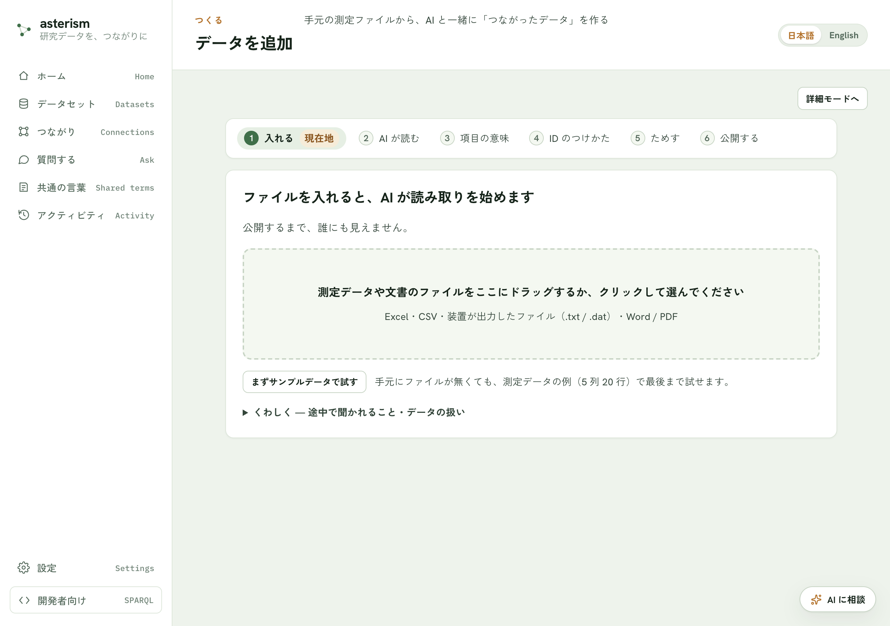
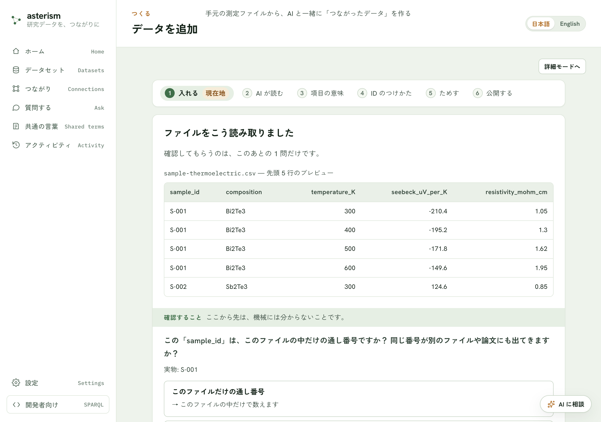

<!--
  Asterism マニュアル（人間向けヘルプ = AI 相談チャットの知識、単一の真実源）。
  getting-started.md の冒頭コメントに書いた表記規約（ボタンは「文言」ボタン、
  タブは「文言」タブ、サイドバーのメニュー項目はメニューの「文言」の形で書く
  こと）は本ファイルにも適用される。
-->

# データの追加 — 対応ファイルと読み取りの確認

「入れる」ステップで置けるファイルの種類と、そのあとの「読み取りの確認」
画面でできることをまとめます。手順そのものは
[getting-started.md](./getting-started.md) を参照してください。

## 対応しているファイル形式

- Excel・CSV・装置が出力したファイル（.txt / .dat）
- Word / PDF
- JSON

種類のちがうファイルが混ざっているときは、表（Excel / CSV / 装置ファイル）・
JSON・文書（Word / PDF）を分けて置いてください。置いたら読み取りが
始まりますが、公開するまで内容は誰にも見えません。

## サンプルデータで試す

手元にファイルが無いときは「まずサンプルデータで試す」ボタンで最後まで
試せます。測定データの例（5 列 20 行）が用意され、あとでデータセットの
ページから消せます。

## 読み取りの確認でできること

ファイルを置くと、先頭 5 行のプレビューが表示され、正しく読み取れているか
確かめられます。表がずれているときは「表が正しく読めていない？」を開くと、
次の内容をその場で変えられ、プレビューが即座に描き直されます。

- 列の分けかた（カンマ／タブ／セミコロン／スペース）
- 表が始まる前の行数
- 文字化けの直しかた（Excel（日本語）／UTF-8）

## AI からの質問に答える

読み取った内容を AI が確認し、あなたしか知らないことだけを聞いてきます。
たとえば次のような質問です。

- 表の前にあった条件らしい行を、表の各行と一緒に記録するかどうか
- 複数のファイルをつなぐ共通の列はどれか

表の前にあった値に項目名が付いていないときは、名前を付ける欄が出ることも
あります。分からなければ空欄のまま進め、あとから直せます。

## Excel の複数シート

Excel ファイルに表が複数あるときは、使うものを選びます。グラフ用・メモ用の
シートは外しておくと、このあとの確認が楽になります。

## 表の形をととのえる

AI の質問に答えて「この内容で進む」を押したとき、1 つのセルに複数の値が
並んでいる列や、値の種類そのものが列の値になっている列（たとえば「物性名」
と「値」が別々の列に分かれた表）が見つかると、「表の形をととのえます」画面が
表示されます。何も見つからなければこの画面は出ず、そのまま次に進みます。

見つかった形ごとに 1 つのタブが並びます。タブの左端には、まだ決めていない
ことがあるときは ⚠、確認が済んでいるときは ✓ が付きます。画面の上には
「入力 ○○ 行 → 派生表 ○○ 行・捨てた要素 ○ 個・切った要素 ○ 個」という帯が
常に表示され、判断表を変えるたびにこの数字も更新されます。

- **使う／使わない** — 同じ種類の値の、綴りのゆれをまとめた表です。使う表には
  チェックが入っています。外すと、その表は作られません（元の表にはそのまま
  残ります）。
- **同じ単位とみなす** — 「別の単位で書かれた行」の欄に、同じ種類の値だけれど
  単位の書きかたが違う行の候補が出ることがあります。これは機械が「同じだ」と
  決めるのではなく、**あなたが確かめて選ぶ**判断です。押すと、その行も表に
  含まれるようになります。
- **別の表に合流** — よく似た表を 1 つにまとめたいときに使います。合流させた
  側の表は使われなくなります。
- **追加で持ち回る列** — 派生表にも残しておきたい、元の表の列を選べます。

準備ができたら、次のどちらかを選びます。

- **ととのえて進む** — 選んだ内容で表を作ってから、次の画面（AI が読み取る
  意味づけ）に進みます。
- **このまま進む** — 表の形はととのえず、元の表のまま次に進みます。あとから
  やり直したいときは、「入れる」からもう一度やり直してください。

## Word / PDF などの文書

Word・PDF は AI を使わずそのまま取り込めます。文書名を付けて取り込み、
読み取りが終わったら公開すると、文ごとに検索・引用できるようになります。
PDF はレイアウトも読むため、数分かかることがあります。文字が画像になって
いるスキャン画像の PDF は読み取れません。

## 前回の続き

前に置いたファイルがブラウザに残っているときは、「このファイルの続きから
使う」か「新しいファイルを置く」かを選べます。同じファイルをもう一度置くと、
前回の確認の続きから再開できます。

## 書き込みに利用許可コードが必要な環境

このサーバへの書き込みに利用許可コードが必要な環境では、設定に入力すると
先に進めます。詳しい手順は [settings.md](./settings.md) を参照してください。

## 関連

- 「入れる」からあとの手順全体は [getting-started.md](./getting-started.md)
- 取り込んだあとの管理・公開は [datasets.md](./datasets.md)
