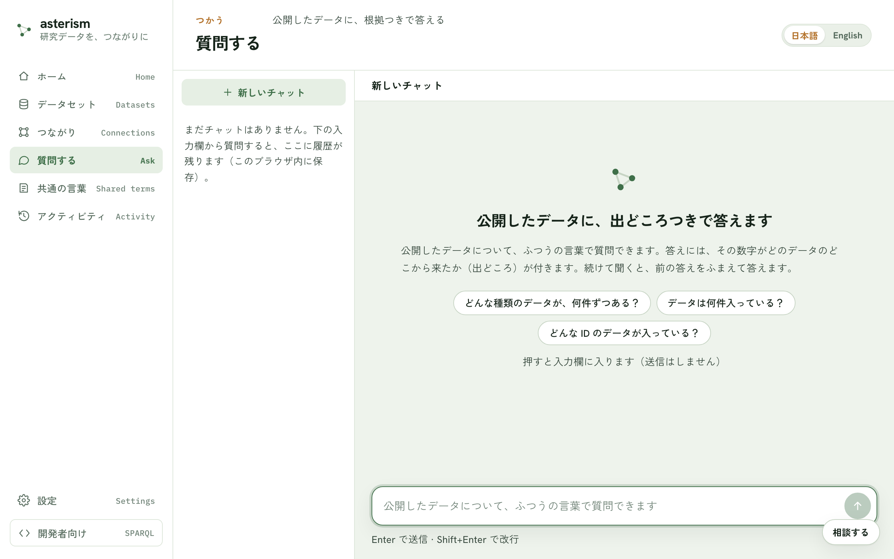

<!--
  Asterism マニュアル（人間向けヘルプ = AI 相談チャットの知識、単一の真実源）。
  getting-started.md の冒頭コメントに書いた表記規約（ボタンは「文言」ボタン、
  タブは「文言」タブ、サイドバーのメニュー項目はメニューの「文言」の形で書く
  こと）は本ファイルにも適用される。
-->

# 質問する — 公開したデータに、出どころつきで聞く

## 何ができるか

公開したデータについて、ふつうの言葉で質問できます。答えには、その数字が
どのデータのどこから来たか（出どころ）が付きます。続けて聞くと、前の答えを
ふまえて答えます。

## 前提

公開済みのデータがあることと、AI の設定が済んでいることが必要です。まだ
公開したデータが無いときは「まだ公開したデータがありません」と案内が出るので、
メニューの「データを追加」からデータを入れて公開します。AI の設定がまだの
ときは「AI の設定がまだのようです」と案内が出るので、「設定を開く」ボタン
から設定できます（サーバ側ですでに AI が設定済みなら、この画面はそのまま
使えます）。

## 入口

メニューの「質問する」から開きます。入力欄に質問を書いて Enter で送信、
Shift+Enter で改行できます。

## 答えの見方

答えには、調べ方の確からしさを示すバッジが付きます。

- 「確かめられる答え」— 人が確認ずみの決まった調べ方で、同じ質問ならいつも
  同じ結果になります。
- 「根拠つきの回答」— 公開したデータに基づく回答です。
- 「AI が組み立てた調べ方（未検証）」— AI がその場でクエリを組み立てて
  調べています。人の確認前なので、数字を使う前に出どころで確かめてください。
- 「AI の一般知識による回答（データの裏付けなし）」— 公開データからは確認
  できず、AI が自分の知識だけで答えています。数字として使わないでください。
  言い方を変えて聞き直すと、公開データに基づく根拠つきの答えになることが
  あります。

公開データと関係のない質問や、該当データが見つからない質問には、AI が自分の
知識で答えることがあります（答えの中でその旨が明記されます）。

## 出どころをたどる

答えに付く引用カードをクリックすると、出どころのパネルが開きます。その値が
どのデータ・どのファイル・どの取り込みから来たかをたどって確認できます。
ID の部分はクリックでコピーでき、「このデータセットを開く」ボタンから元の
データセットの画面にも進めます。

## チャットの履歴

画面の履歴一覧から、これまでのチャットを開き直せます。「新しいチャット」
ボタンで新しく始められ、各チャットは「名前を変更」ボタンで名前を付け直せ、
不要になったものは削除できます。保存先は、ブラウザ版ではこのブラウザ内、
デスクトップ版ではこの PC です。

## 数値の比べ方の注意

答えが、数字ではなく文字として保存されている列の大小を比べていることが
あります。この場合、最大・最小・順位が正しくないことがあるという注意が
表示されます。データセットの画面にある「設計を見直す」ボタンに進み、その
列が数値であることを AI に伝えて作り直すと、正しく比べられるようになります。

## 開発者向け

メニューの「開発者向け」は、クエリを直接書く画面です。SPARQL に馴染みが
なければ使う必要はありません。ふつうの質問はメニューの「質問する」から
どうぞ。

## 関連

データを公開するまでの流れは [getting-started.md](./getting-started.md)、
複数のデータセットをまたいで聞きたいときは [crosswalk.md](./crosswalk.md)
を参照してください。
