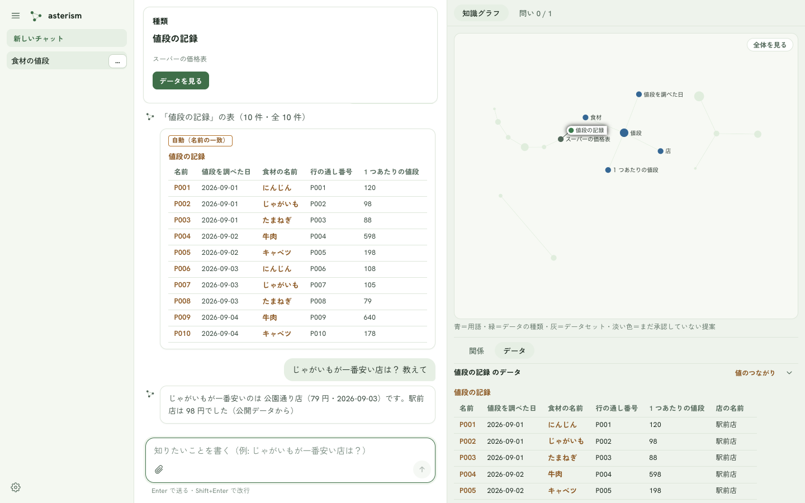

<!--
  Asterism マニュアル（人間向けヘルプ = AI 相談チャットの知識、単一の真実源）。
  getting-started.md の冒頭コメントに書いた表記規約（ボタンは「文言」ボタン、
  タブは「文言」タブ、サイドバーのメニュー項目はメニューの「文言」の形で書く
  こと）は本ファイルにも適用される。
-->

# 質問する — 同じチャットで、出どころつきで聞く

## 何ができるか

公開したデータについて、ふつうの言葉で質問できます。答えには、その数字が
どのデータのどこから来たか（出どころ）が付きます。専用の画面はなく、話をしているチャットにそのまま書きます。

## 前提

承認済みの知識かデータがあることが必要です。まだ公開したデータが無いときは、答えが出ずに案内が出ます。
表を クリップで添えて公開してください（[データの追加](./add-data.md)）。
Ask が使う答えの道具（demo-agent）の接続は、サーバに設定されている必要があります。設定されていないと、
注記だけが返ります。

## 聞き方

チャットに、質問の最後を「回答して」「教えて」で終えて書きます。

- 例: 「スーパーの価格表には何件ある？ 回答して」
- 例: 「じゃがいもが一番安い店は？ 教えて」

文が「？」だけで終わるときは、公開済みの**種類**の名前に当たるときだけ質問になります。用語の名前だけのときは、知識グラフを育てる文として扱います。
確実に聞くときは「回答して」を付けてください。「知識グラフに」「追加して」「足して」「削除して」「外して」「修正して」「直して」「広げて」を含む文は、必ず知識グラフの編集として扱います。

## 答えの見方

答えの下に、調べ方を示す札が付きます。

- 「決定論の道具で答えました」— 人が承認ずみの決まった調べ方で、同じ質問ならいつも同じ結果になります。
- 「検証していない問い合わせで答えました」— 人の承認前の調べ方です。数字を使う前に、出典で確かめてください。
- 「答えが出ませんでした」— 該当するデータが見つかりませんでした。

答えの下の「出典」には、データの名前とデータセット名が並びます（押すと知識グラフの点に移ります）。

### 知識で答えた問い

「値段を変える要素になり得るのは？」のように、承認済みの関係（下げる・上げる・変える・一部・一種）で答える問いは、
「知識 5 件・データ 0 件」のように、知識の件数とデータの件数を分けて答えます。関係ごとに、誰が・いつ・なぜ決めたか
（「AI が追加し、人が承認」など）が付きます。データが添えられて列の名前が一致すると、データの件数が足されます
（[話・用語・標準用語](./vocab-and-grounding.md)）。

## 出どころをたどる <Badge type="tip" text="v0.1.0 (2026-06-02) で追加" />

答えの「出典」から、その値がどのデータ・どのデータセットから来たかをたどって確認できます。
出典の名前は、公開済みのグラフから引ける範囲で出ます（引けなければ ID の末尾が出ます）。

## チャットの履歴 <Badge type="tip" text="v0.15.0 (2026-08-17) で追加" />

質問と答えは、そのチャットの一部として左のチャットの一覧に残ります。「新しいチャット」で新しく始められ、各チャットの「…」で名前を修正・消すことができます。
保存先は、ブラウザ版ではこのサーバ、デスクトップ版ではこの PC です。

## 数値の比べ方の注意 <Badge type="tip" text="v0.16.0 (2026-08-17) で追加" />

答えが、数字ではなく文字として保存されている列の大小を比べていることが
あります。この場合、最大・最小・順位が正しくないことがあるという注意が
表示されます。その表を クリップで添え直し、その列が数値であることを書いて直すと、正しく比べられるようになります。

## 関連

データを公開するまでの流れは [getting-started.md](./getting-started.md)、
複数のデータセットをまたいで聞きたいときは [crosswalk.md](./crosswalk.md)
を参照してください。

「…を見せて」と書くと、質問ではなく表が返ります（[見る](./workspace.md)）。
質問は出どころつきの答えを返し、「見せて」は閉じた型の表を返します。
