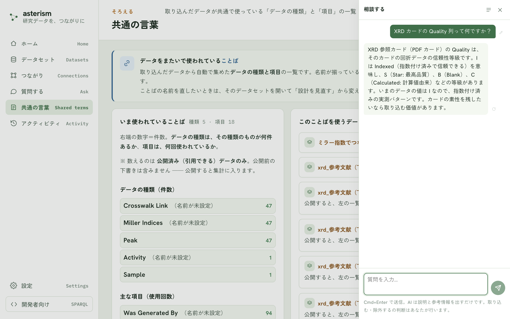

<!--
  Asterism マニュアル（人間向けヘルプ）。
  getting-started.md の冒頭コメントに書いた表記規約（ボタンは「文言」ボタン、
  タブは「文言」タブ、サイドバーのメニュー項目はメニューの「文言」の形で書く
  こと）は本ファイルにも適用される。
-->

# 相談チャット — 設計中の疑問を、画面を離れずに聞く

どの画面にもある右下の「AI に相談」ボタンを押すと、右側にチャットが開きます。
「この列って何？」「この画面はどう使う？」のような、データを取り込んでいる
最中の疑問を、Google 検索や同僚への質問で画面を離れることなく、その場で
聞けます。

## 判断はあなたが行います

相談チャットの AI は、説明と参考情報を出すだけです。列を取り込むか・除外
するか、意味や単位をどう書くかの最終判断は、常にあなたが行います（入力欄の
下にも、この約束が常に表示されています）。AI の答えをそのまま信じるのでは
なく、実データと突き合わせて確かめる材料として使ってください。

## いま見ている画面のことは、伝えなくても伝わる

かんたんモードのウィザードの途中で開くと、いまのステップ・データセット名・
データの数えかたの要約が自動で AI に伝わります。「項目の意味」の画面では、
画面に表示されている表——まだ取り込んでいない項目（列名と実データの例）や、
意味が入っている項目（列名・意味・単位）——も自動で伝わるので、「まだ意味が
入っていない列を教えて」のような、表全体を見わたす相談もそのままできます。
さらに列の意味の欄にカーソルを置いてから相談すると、その列に注目している
ことが伝わり、「この列はどういう意味？」とだけ書いても、いま見ている列の
こととして答えてくれます。

## 送信のしかた

質問を書いて Cmd+Enter（Windows では Ctrl+Enter）で送信します。素の Enter は
改行です。回答を待っている間に「止める」ボタンで打ち切れます。

## チャットの履歴

チャットは自動で保存されます。ヘッダの履歴アイコンから一覧を開き、
「+ 新しいチャット」ボタンで新しく始める・過去のチャットを選んで続きを話す・
チャットを検索する・削除する、ができます。次に開いたときは、最後に使った
チャットから再開します。

## 聞き直す・作り直す

- 自分の発言にマウスを重ねると出る編集ボタンで、その発言を書き直して
  「編集して再送信」ボタンを押せます。それ以降のやり取りは消えて、
  書き直した内容で答え直します。
- AI の回答にマウスを重ねると出る「この回答を作り直す」ボタンで、同じ質問に
  もう一度答えさせられます。

## AI の候補を表に反映する

「項目の意味」や「データの数えかた」の画面で相談していて、AI が列の意味・
単位・種類の名前の候補を出したときは、回答の下に「この候補を表に反映」
ボタンが出ることがあります。押すと、**まだ空欄になっている項目だけ**に
候補が書き込まれます。すでにあなたが入力した内容は上書きされず、
取り込む・取り込まないの判断も変わりません。反映したあとも、表の上で
いつでも直せます。

## 「質問する」との違い

- メニューの「質問する」は、**公開したデータの中身**への質問です。答えには
  出どころが付き、数字の根拠をたどれます（[ask.md](./ask.md)）。
- 相談チャットは、**設計中の疑問や使い方**の相談窓口です。データの中身は
  検索しません。

## 使う AI

相談チャットは、左下の「設定」の「AI」タブで選んだ AI を使います。サーバに
AI が設定されている場合は、自分で設定しなくてもそのまま使えます
（[settings.md](./settings.md)）。

## 関連

- 使い方全般の流れ: [getting-started.md](./getting-started.md)
- 公開したデータへの質問: [ask.md](./ask.md)
