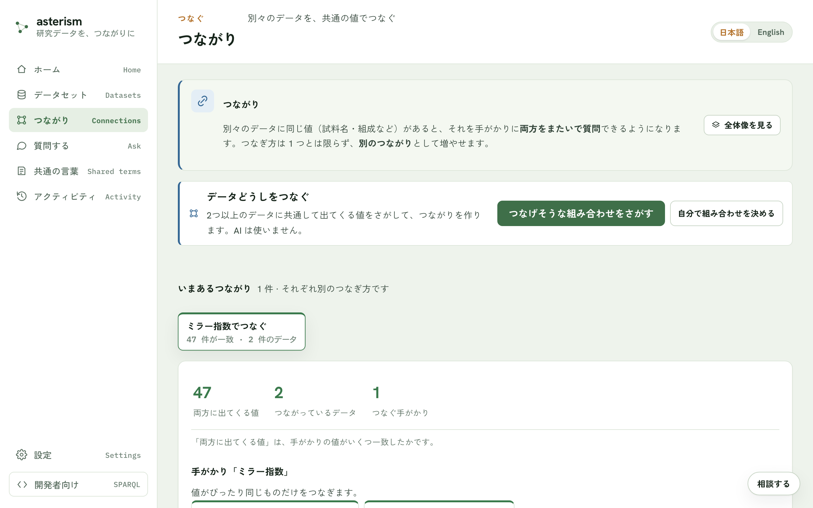
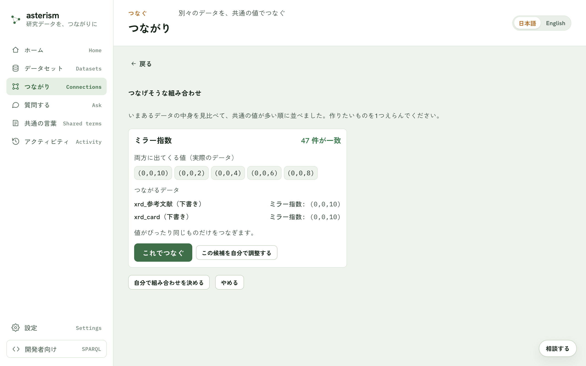
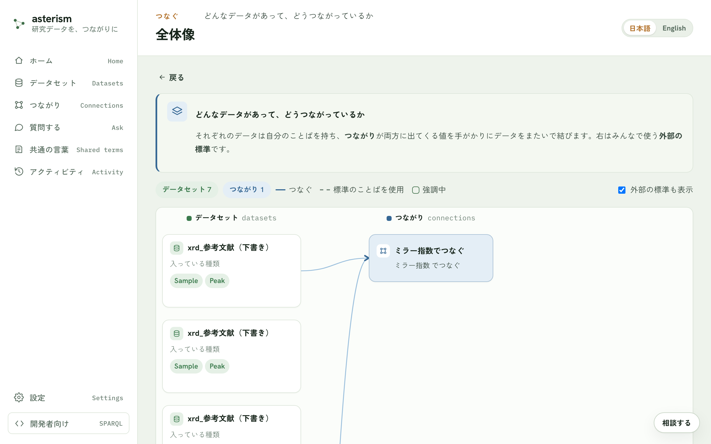

<!--
  Asterism マニュアル（人間向けヘルプ = AI 相談チャットの知識、単一の真実源）。
  getting-started.md の冒頭コメントに書いた表記規約（ボタンは「文言」ボタン、
  タブは「文言」タブ、サイドバーのメニュー項目はメニューの「文言」の形で書く
  こと）は本ファイルにも適用される。
-->

# つながり — 別々のデータを共通の値でつなぐ

## つながりとは

別々のデータに同じ値（試料名・組成など）があると、それを手がかりに両方を
またいで質問できるようになります。これが「つながり」です。作るときに AI は
使いません。実際の値どうしを機械的に突き合わせて、共通の値を見つけます。

つなぎ方は 1 つに限りません。同じデータどうしでも、別の手がかり（組成でつ
なぐ、著者でつなぐ、など）で新しいつながりを増やせます。

## 前提

つながりを作るには、公開済みのデータが 2 つ以上必要です。まだ 1 つしか公開
していない場合は、先にもう 1 つ公開してください。

## 入口

メニューの「つながり」から、いまあるつながりの一覧を見たり、新しく作った
りできます。データセットの詳細画面の「つながり」タブからも、そのデータセッ
トに関わるつながりを確認できます。

## つなげそうな組み合わせをさがす

「つなげそうな組み合わせをさがす」ボタンを押すと、いまあるデータの中身を
自動で見比べ、共通の値が多い順に候補を提示します。

候補カードには次の情報が付きます。

- 一致した値の実例（実際のデータの値）
- つながるデータセットと、その項目
- 注意（一致した値が 1 種類だけでたまたまかもしれない、データの大きさが大
  きく違う、など）

作りたい候補が見つかったら「これでつなぐ」ボタンで確認画面に進み、つなが
りに名前を付けて作ります。

## 自分で組み合わせを決める

候補まかせにせず、自分でつなぎ方を決めることもできます。
「自分で組み合わせを決める」ボタンから、次の順で指定します。

1. つなぐデータセットを 2 つ以上選ぶ
2. つなぐ概念（英数字のキー。例: composition, crystal_system）を決める
3. 各データセットで、その概念を表す項目を指定する
   （「AI に提案させる」ボタンで候補を出させることもできます）
4. 同じ値とみなす基準（次節）を選ぶ
5. この視点（つなぎ方）の名前を付ける

## 同じ値とみなす基準（正規化）

表記のゆれをどこまで同じ値として扱うかを選べます。

| 基準 | 内容 |
|---|---|
| そのまま一致 | 表記が完全に同じものだけをつなぐ |
| 大文字・小文字を無視 | FeO と feo を同じとみなす |
| 空白の違いを無視 | 前後・連続する空白の違いを無視する |
| 全角・半角を揃える | 全角・半角や互換文字の違いを無視する |
| ゆるく一致 | 大文字小文字・空白・全角半角をまとめて無視する |
| 組成式として揃える | 添字や空白の違いを吸収する（元素の並び順は区別） |
| 組成式＋元素順も揃える | 元素の並び順が違っても同じ組成として扱う |
| カスタム | 手順（プリミティブ）を自分で組み合わせて基準を作る |

組成には大文字・小文字を無視する基準は使えません（Co と CO は別の元素なの
で、同じ値とみなすと間違った一致になります）。

## 追加の一致条件

つなぐ概念だけでなく、複数の条件がすべて一致したときだけつなぐ、という指
定もできます。たとえば「組成」かつ「結晶系」が両方一致したときだけつなぐ、
といった使い方です。

## できたつながりの画面

作ったつながりの画面では、次のことが確認できます。

- 両方に出てくる値の一致数と、つながっているデータの件数
- またいで使える道具（この値は何データセットが報告しているか、をその場で
  調べられます。ここでも AI は使いません）
- 「最新のデータで作り直す」ボタン（つないだあとにデータを追記したときに
  押します。公開されていないデータは、作り直しても入りません）

## つながりどうしを対応づける

別々に作ったつながりが使っていることばが、実は同じものを指しているとき、
その対応を残せます。あとから取り消すこともできます。

## 全体像

「つながり」の画面のいちばん下に、どんなデータがあって、どうつながって
いるかを 1 枚の図で俯瞰できる「全体像」が常に表示されます。外部の標準
（よく使われる標準のことば）も、表示に含めて見ることができます。図の中の
つながりを押すと、この画面の上のほうでそのつながりが選ばれます。

## 関連

- データに質問する流れは [ask.md](./ask.md) を参照してください。
- 項目名やことばを揃える話は [vocab-and-grounding.md](./vocab-and-grounding.md)
  を参照してください。
