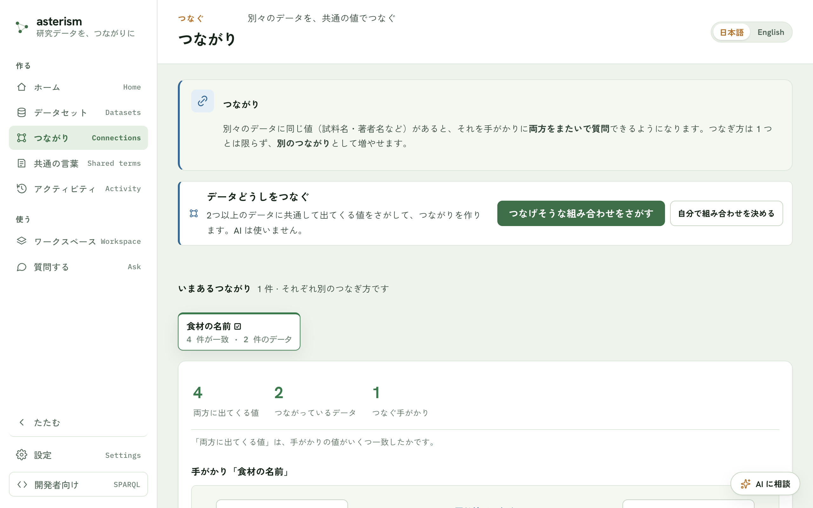
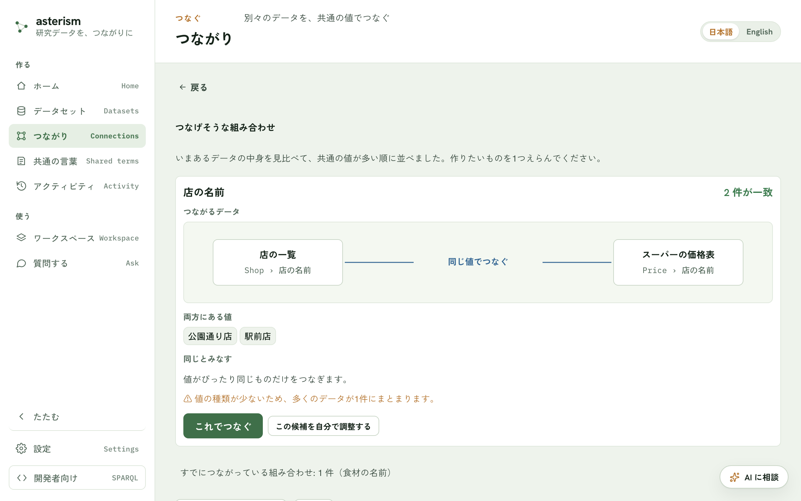
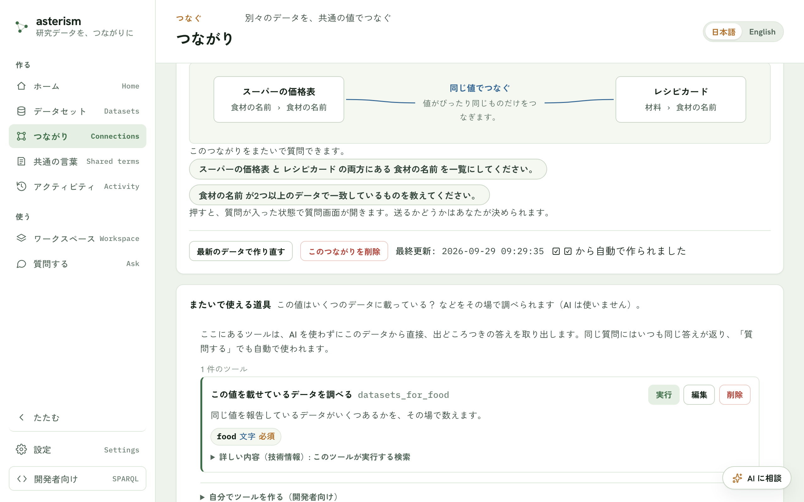
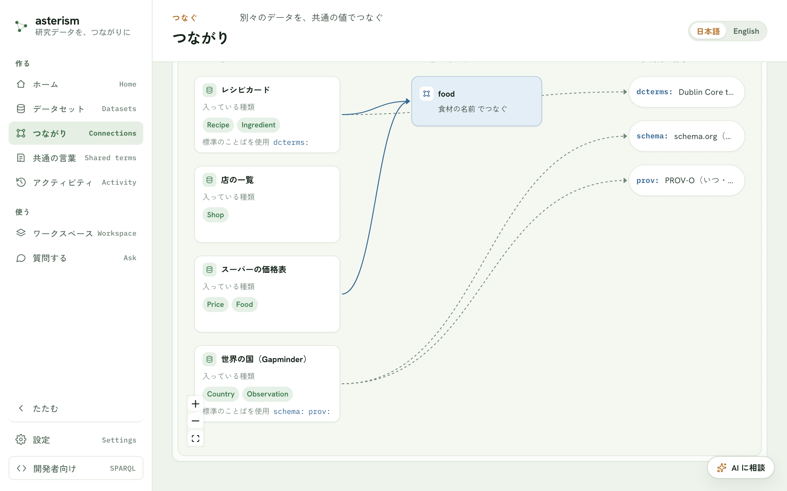
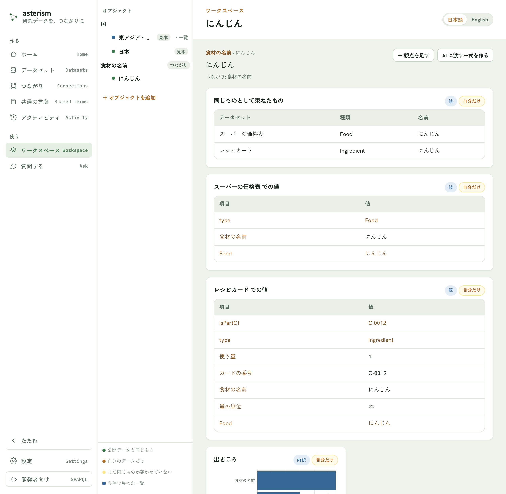

<!--
  Asterism マニュアル（人間向けヘルプ = AI 相談チャットの知識、単一の真実源）。
  getting-started.md の冒頭コメントに書いた表記規約（ボタンは「文言」ボタン、
  タブは「文言」タブ、サイドバーのメニュー項目はメニューの「文言」の形で書く
  こと）は本ファイルにも適用される。
-->

# つながり — 別々のデータを共通の値でつなぐ <Badge type="tip" text="v0.3.0 (2026-06-13) で追加" />

## つながりとは

別々のデータに同じ値（試料名・組成など）があると、それを手がかりに両方を
またいで質問できるようになります。これが「つながり」です。作るときに AI は
使いません。実際の値どうしを機械的に突き合わせて、共通の値を見つけます。

つなぎ方は 1 つに限りません。同じデータどうしでも、別の手がかり（組成でつ
なぐ、著者でつなぐ、など）で新しいつながりを増やせます。

データを取り込むときの「意味をつける」画面で ☑ を付けた列どうしは、値が
重なっていれば公開したときに自動で結ばれます。ここで手作業は不要です —
結果はこの画面の一覧に「☑ から自動で作られました」と表示され、確かめたり
外したりできます。

## 前提

つながりを作るには、公開済みのデータが 2 つ以上必要です。まだ 1 つしか公開
していない場合は、先にもう 1 つ公開してください。

## 入口

メニューの「つながり」から、いまあるつながりの一覧を見たり、新しく作った
りできます。データセットの詳細画面の「つながり」タブからも、そのデータセッ
トに関わるつながりを確認できます。

## つなげそうな組み合わせをさがす <Badge type="tip" text="v0.11.0 (2026-07-24) で追加" />

「つなげそうな組み合わせをさがす」ボタンを押すと、いまあるデータの中身を
自動で見比べ、共通の値が多い順に候補を提示します。

候補カードには次の情報が付きます。

- 一致した値の実例（実際のデータの値）
- つながるデータセットと、その項目 <Badge type="tip" text="v0.41.0 (2026-09-02) で追加" />（「種類 › 項目名」の形。例:
  `Composition › 試料化学組成`。同じ名前の項目を複数の種類が持っていても、
  どの種類の値でつなぐかが分かります）
- 注意（一致した値が 1 種類だけでたまたまかもしれない、データの大きさが大
  きく違う、など）
- <Badge type="tip" text="v0.47.0 (2026-09-29) で追加" />
  すでにあるつながりに足せるときは、その印と「A・B はすでにつながっていま
  す。C を足せます。」の 1 文が付きます。この場合の主ボタンは
  「このつながりに足す」ボタンで、確認画面を挟まずそのまま既存のつながりに
  足します（新しいつながりは作られません）。

すでに全員がつながっていて、これ以上足せる相手がいない組み合わせは、候補
の一覧には出ません。一覧の下に「すでにつながっている組み合わせ: N 件」と
して、名前だけがまとめて表示されます。

作りたい候補が見つかったら「これでつなぐ」ボタンで確認画面に進み、つなが
りに名前を付けて作ります。

## 自分で組み合わせを決める

候補まかせにせず、自分でつなぎ方を決めることもできます。
「自分で組み合わせを決める」ボタンから、次の順で指定します。

1. つなぐデータセットを 2 つ以上選ぶ
2. つなぐ概念（英数字のキー。例: composition, crystal_system）を決める
3. 各データセットで、その概念を表す項目を指定する
   （項目は「種類 › 項目名（例: 実際の値）」の形で並びます。
   「AI に提案させる」ボタンで候補を出させることもできます）
4. 同じ値とみなす基準（次節）を選ぶ
5. この視点（つなぎ方）の名前を付ける

## 同じ値とみなす基準（正規化）

表記のゆれをどこまで同じ値として扱うかを選べます。

| 基準 | 内容 |
|---|---|
| そのまま一致 | 表記が完全に同じものだけをつなぐ |
| 大文字・小文字を無視 | FeO と feo を同じとみなす |
| 空白の違いを無視 | 前後・連続する空白の違いを無視する |
| 全角・半角を揃える | 全角・半角や互換文字の違いを無視する |
| ゆるく一致 | 大文字小文字・空白・全角半角をまとめて無視する |
| 組成式として揃える | 添字や空白の違いを吸収する（元素の並び順は区別） |
| 組成式＋元素順も揃える | 元素の並び順が違っても同じ組成として扱う |
| カスタム | 手順（プリミティブ）を自分で組み合わせて基準を作る |

組成には大文字・小文字を無視する基準は使えません（Co と CO は別の元素なの
で、同じ値とみなすと間違った一致になります）。

## 追加の一致条件 <Badge type="tip" text="v0.5.0 (2026-06-15) で追加" />

つなぐ概念だけでなく、複数の条件がすべて一致したときだけつなぐ、という指
定もできます。たとえば「組成」かつ「結晶系」が両方一致したときだけつなぐ、
といった使い方です。

## できたつながりの画面

作ったつながりの画面では、次のことが確認できます。

- 両方に出てくる値の一致数と、つながっているデータの件数
- またいで使える道具（この値は何データセットが報告しているか、をその場で
  調べられます。一致した値どうしの照合そのものは AI を使いません。道具パ
  ネルから新しい道具を作るときは AI に下書きさせることもできます）
- 「最新のデータで作り直す」ボタン（つないだあとにデータを追記したときに
  押します。公開されていないデータは、作り直しても入りません）
- 「このつながりを削除」ボタン <Badge type="tip" text="v0.36.0 (2026-09-02) で追加" />（確認のうえで、つながりそのもの＝結合のグラ
  フと設定を消します。元のデータセットには触れないので、同じ設定でいつでも
  作り直せます）

## つながりどうしを対応づける

別々に作ったつながりが使っていることばが、実は同じものを指しているときの対応づけは、
メニューの「ことば」の「線」（範囲「つながり同士」）に移りました。
ここでは引かず、[ことば](./vocab-and-grounding.md#線)で引いて、一覧で確かめ、
あとから取り消します。

## 全体像

「つながり」の画面のいちばん下に、どんなデータがあって、どうつながって
いるかを 1 枚の図で俯瞰できる「全体像」が常に表示されます。外部の標準
（よく使われる標準のことば）も、表示に含めて見ることができます。図の中の
つながりを押すと、この画面の上のほうでそのつながりが選ばれます。

## 同じものは 1 つのページ <Badge type="tip" text="v0.46.0 (2026-09-29) で追加" />

☑ を付けた列どうしが自動で結ばれると（上記「つながりとは」参照）、その値
が指す対象自体を、1 つのページとして開けるようになります。同じ対象は
データセットが違っても 1 つのページにまとまり、別々のページが 2 つでき
ることはありません。

- 別々のデータセットから来た記録を開いても、それが他のデータセットの
  同じ対象と直接つながっているものであれば、自動でそのつながった対象
  そのもののページへ移ります。このページには、つながっている両方
  （またはそれ以上）のデータセットにある、そのものに関する記録がデー
  タセットごとの一覧としてまとまって出ます。足した問いや交わした会話
  も、元のデータセットのページで作ったものを含めて、ここに合わせて
  出てきます。
- 「別のデータセットにも同じものがあります → まとめて見る」という帯
  は、いま見ているページの一段上（親にあたる記録）がその同じ対象に
  つながっているときに出ます（このときは自動ではまとめられません）。
  帯が出ないときは、そのものについて他のデータセットとのつながりは
  見つかっていません。
- まとめられたページの一覧から、あえてどちらか一方のデータセット側の
  記録だけを個別に見たいときは、その記録の行を選ぶと単体のページで
  開けます。このときは「これは○○側の実体です。同じものの 1 つのページ
  → まとめて見る」という帯が出ます（上記の帯とは文言が違いますが、
  どちらも同じ 1 つのページへ移動できます）。
- このページからも、通常の 1 件のページと同じように問い（集計・並べ替え
  などの見方）を作れます。つまり、片方のデータセットだけでなく、つながっ
  た両方のデータセットの記録をまとめて使った問いを、AI と会話しながら作
  れます。

## 関連

- データに質問する流れは [ask.md](./ask.md) を参照してください。
- 項目名やことばを揃える話は [vocab-and-grounding.md](./vocab-and-grounding.md)
  を参照してください。
