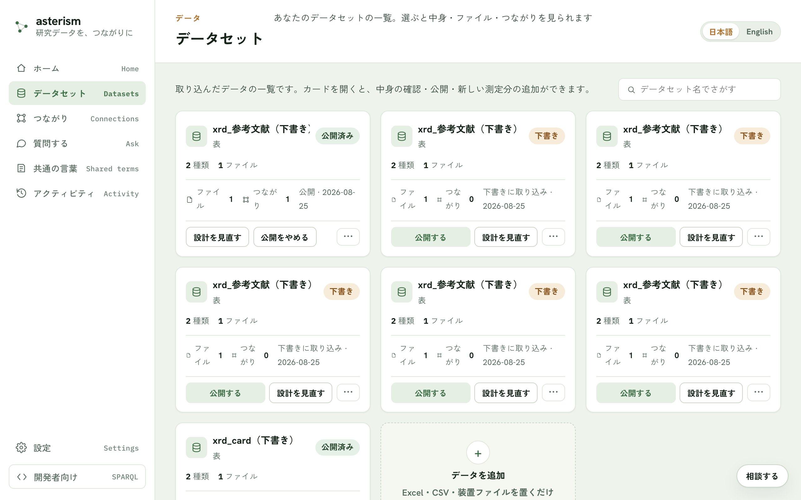
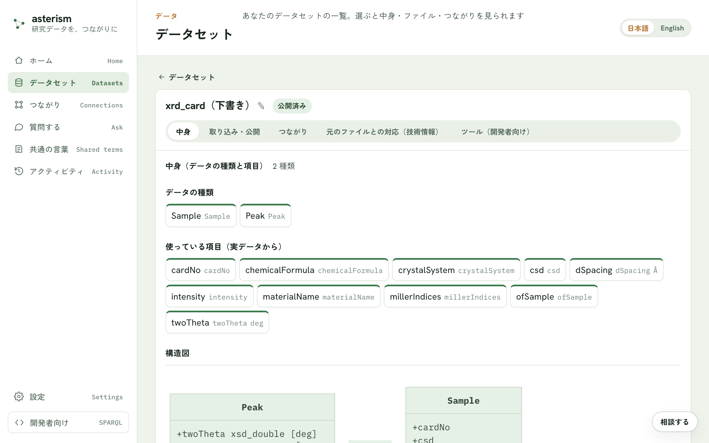

<!--
  Asterism マニュアル（人間向けヘルプ = AI 相談チャットの知識、単一の真実源）。
  getting-started.md の冒頭コメントに書いた表記規約（ボタンは「文言」ボタン、
  タブは「文言」タブ、サイドバーのメニュー項目はメニューの「文言」の形で書く
  こと）は本ファイルにも適用される。
-->

# データセットの管理 — 公開・追記・見直し

取り込んだデータの一覧や、公開後の育てかた・見直しかたをまとめます。
公開までの流れそのものは [getting-started.md](./getting-started.md) を
参照してください。

## データセットの一覧

メニューの「データセット」から、取り込んだデータの一覧を見られます。
それぞれの状態（公開済み・下書き・取り込み前）が並び、名前でさがすことも
できます。カードを開くと詳細画面に進みます。

## 詳細画面のタブ

データセットの詳細画面には、次のタブがあります。

- 「中身」タブ — データの種類と項目、構造図、気になる点
- 「取り込み・公開」タブ — ファイル一覧と、取り込み・公開の操作
- 「つながり」タブ — 他のデータセットとのつながり
- 「ツール（開発者向け）」タブ — このデータで答えられる問い合わせの一覧
- 「元のファイルとの対応（技術情報）」タブ — 変換ルールなどの技術情報

## 公開する・公開を更新する

「公開する」ボタンを押すと、このサーバを使う人が質問したときに、このデータが
出典つきで引用されるようになります（それまでは誰にも見えません）。新しい
下書きができている状態では「公開を更新する」ボタンに切り替わり、押すと
質問への回答が新しいデータを引用するようになります。切り替え中も回答は
途切れません。

## 新しい測定分を足す（追記）

同じ装置から出た新しいファイルを、そのまま置いて足せます。すでにある行は
二重になりません。ファイル名は最初に置いたファイルと同じにしてください。
足した分は公開済みデータにすぐ加わります。

## 全部を差し替える

新しいファイルでデータを作り直します。作り直している間も、今のデータへの
回答は途切れません。できあがったら、「公開を更新する」ボタンで新しいデータ
に切り替わります。

## 文書を追加

公開済みのデータセットに、Word / PDF / XML の文書をもう 1 つ足せます。
足した文書は文ごとに分けて公開済みデータにそのまま加わり、「質問する」
から検索・引用できるようになります（議事録をためていく用途に向いています）。

## 設計を見直す

「設計を見直す」ボタンから、項目の意味の確認に戻れます。直した内容は、
同じデータセットのまま新しい版として下書きに作り直され、公開すると
切り替わります。「取り込み・公開」タブでは、見直し前の版や差分を含む
変更履歴も確認できます。

## 公開をやめる・もう一度公開する・削除

「公開をやめる」ボタンを押すと、このデータは質問への回答から外れます。
データと ID は残るので、すでに引用されたリンクは壊れません。あとで
「もう一度公開する」ボタンで戻せます。

削除は、未公開のデータセットであれば安全に行えます。公開中のデータセット
を削除しようとすると、確認の案内が表示されます。

## 気になる点

「中身」タブには、つながっていないデータ・使われていない列・数値が文字
として記録されている列などの指摘が表示されます。指摘の内容をもとに、
AI に直してもらう導線もここにあります。

## 取り込みの記録

メニューの「アクティビティ」から、いつ・何が・どれだけ入ったかを確認
できます。「データを追加」での取り込みや、公開済みデータへの追記が
1 回ごとに 1 行並びます。

## 関連

- 公開までの流れは [getting-started.md](./getting-started.md)
- データセットどうしのつながりは [crosswalk.md](./crosswalk.md)
