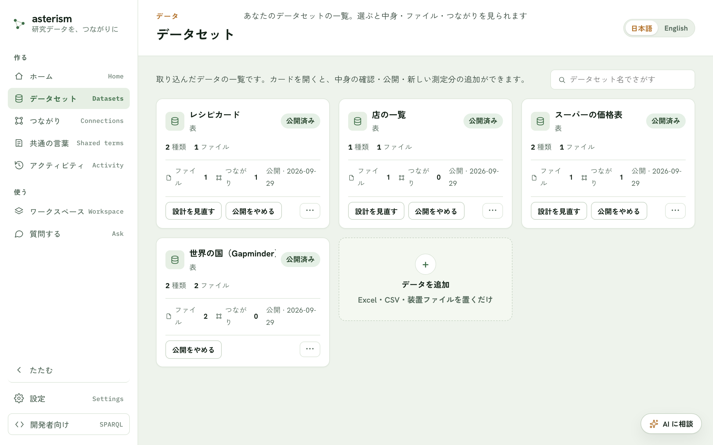
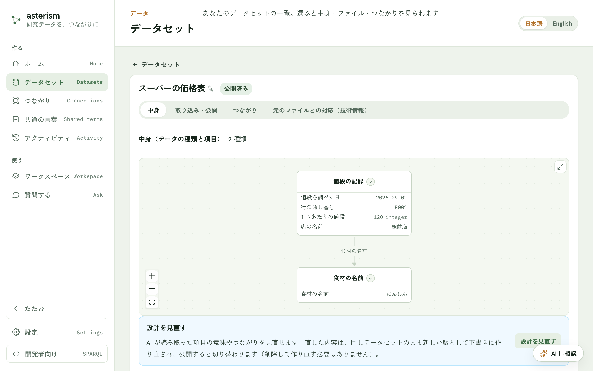

<!--
  Asterism マニュアル（人間向けヘルプ = AI 相談チャットの知識、単一の真実源）。
  getting-started.md の冒頭コメントに書いた表記規約（ボタンは「文言」ボタン、
  タブは「文言」タブ、サイドバーのメニュー項目はメニューの「文言」の形で書く
  こと）は本ファイルにも適用される。
-->

# データセットの管理 — 公開・追記・見直し

取り込んだデータの一覧や、公開後の育てかた・見直しかたをまとめます。
公開までの流れそのものは [getting-started.md](./getting-started.md) を
参照してください。

## データセットの一覧

メニューの「データセット」から、取り込んだデータの一覧を見られます。
それぞれの状態（公開済み・下書き・取り込み前）が並び、名前でさがすことも
できます。カードを開くと詳細画面に進みます。

## 詳細画面のタブ

データセットの詳細画面には、次のタブがあります。

- 「中身」タブ — データの種類と項目、構造図、気になる点。構造図の箱に並ぶ
  項目には、そのデータの**実際の値の例**が 1 つ添えられます（元のファイルから
  読んだもので、長い値は途中で省略されます）
- 「取り込み・公開」タブ — ファイル一覧と、取り込み・公開の操作
- 「つながり」タブ — 他のデータセットとのつながり
- 「元のファイルとの対応（技術情報）」タブ — 変換ルールなどの技術情報

問い合わせ（このデータで何が答えられるか）は、このタブではなく
ワークスペースの 1 件のページの「このページで聞く・作る」や、オブジェクト
のカードから行います。

同じ詳細画面には、メニューの「データセット」からだけでなく、ワークスペース
のデータセットのページからも進めます。公開済みのデータセットでは、次の 2 つの
ボタンが出ます（まだ公開していないデータセットでは「続きから」ボタンだけです）。

- 「詳しい情報」ボタン — この 4 つのタブに直接進みます
- 「定義を直す」ボタン — 「設計を見直す」ボタンと同じ見直しを開きます。
  見直せる下書きが無いデータセットでは、代わりに
  「元のファイルとの対応（技術情報）」タブが読み取り専用で開きます

## 公開する・公開を更新する

「公開する」ボタンを押すと、このサーバを使う人が質問したときに、このデータが
出典つきで引用されるようになります（それまでは誰にも見えません）。新しい
下書きができている状態では「公開を更新する」ボタンに切り替わり、押すと
質問への回答が新しいデータを引用するようになります。切り替え中も回答は
途切れません。

## 新しい測定分を足す（追記） <Badge type="tip" text="v0.3.0 (2026-06-13) で追加" />

同じ装置から出た新しいファイルを、そのまま置いて足せます。すでにある行は
二重になりません。ファイル名は最初に置いたファイルと同じにしてください。
足した分は公開済みデータにすぐ加わります。

## 全部を差し替える <Badge type="tip" text="v0.2.0 (2026-06-11) で追加" />

新しいファイルでデータを作り直します。作り直している間も、今のデータへの
回答は途切れません。できあがったら、「公開を更新する」ボタンで新しいデータ
に切り替わります。

## 文書を追加 <Badge type="tip" text="v0.5.0 (2026-06-15) で追加" />

公開済みのデータセットに、Word / PDF / XML の文書をもう 1 つ足せます。
足した文書は文ごとに分けて公開済みデータにそのまま加わり、「質問する」
から検索・引用できるようになります（議事録をためていく用途に向いています）。
デスクトップ版の PDF は、読み取る部品を 1 回入れると足せます
（[add-data.md](./add-data.md#Word-PDF-などの文書)）。取り込めない形式は、
文書を選ぶボタンの案内から外れ、ファイルを選ぶ画面でも選ぶ対象から外れます。

## 設計を見直す <Badge type="tip" text="v0.9.0 (2026-07-23) で追加" />

「設計を見直す」ボタンから、「③ 意味をつける」の確認に戻れます。何を直したかで、
そのあとの動きが変わります。

- 項目の意味・単位だけを直したとき <Badge type="tip" text="v0.51.0 (2026-10-07) で追加" /> — 「この意味を保存して戻る」ボタンで
  保存すると、データを作り直さずに書き換わります。「ためす」の画面と、
  データセットのページの「中身」タブには、保存したときから新しい意味・単位が
  出ます。公開済みのデータセットでは、ID を開いたページ（「見せるページを開く」
  ボタンで開くページ）の項目名は、保存しただけでは前のままです。「ためす」の
  画面に「公開済みの項目名が、保存した名前と違います」という知らせが出るので、
  変わる名前を確かめて「項目名の公開を更新する」ボタンを押してください。
  取り込み直さずに、項目名だけが公開側に出ます
- 種類の分け方・つながり・ID を変えたとき — 同じデータセットのまま新しい版
  として下書きに作り直され、公開すると切り替わります。「ためす」の画面の
  「項目の分け方・つながりも直したい」から AI に直してもらうか、
  「⑤ かたちをたしかめる に戻る」ボタンで戻って直します

「③ 意味をつける」からは、「この意味を保存して戻る」ボタンか、何も変えない
ときの「ためすに戻る」ボタンで、「ためす」の画面に進みます。データに自動で
質問した結果を確かめられます。冒頭の文は、どのデータの答えかを言います。
下書きがあれば公開前の下書き、無ければ公開済みのデータです。

この見直しの中で下書きを作り直していないあいだ、先へ進むボタンは
「確認できた — 見直しを終了」ボタンです。押すと見直しを終えて、データセットの
ページに戻ります（「公開する」ステップには進みません。前からある下書きは、
データセットのページの「公開する」ボタンか「公開を更新する」ボタンで
公開できます）。AI に直してもらうか、「⑤ かたちをたしかめる に戻る」ボタンで
戻って下書きを作り直したあとは、初めて作るときと同じ
「問題なさそう — 公開へ」ボタンになり、「公開する」ステップに進みます。

「取り込み・公開」タブでは、見直し前の版や差分を含む変更履歴も確認できます。

公開したあとに ID の作り方（データの数えかた）を変えると、前の ID には
新しい ID への引っ越し先が記録され、すでに配った引用から新しい内容に
たどれます
<Badge type="tip" text="v0.22.2 (2026-08-27) で追加" />。

ただし、引き継げない ID が出ることがあります。前の ID を作るのに使っていた
列がいまのファイルに無いとき、前に作っていた種類が新しい設計に無いとき、
取り込みの途中で引っ越し先を記録できなかったときです。公開の前には
「ID の引っ越し」の欄が出て、引っ越し先が記録された ID が
何件あるかと、引き継げないぶんがあるときは、どのファイルのぶんが、なぜ
引き継げないかを確かめられます。この欄は、かんたんモードの「公開する」
ステップにも、データセットのページで「公開を更新する」ボタンを押したときの
確認にも出ます。

引き継げないぶんがあっても、そのまま公開できます。前の ID を残したいときは、
公開の前に ID の作り方を元に戻してください。かんたんモードでは「ためすに戻る」
ボタン →「⑤ かたちをたしかめる に戻る」ボタンで戻れます。データセットの
ページでは「やめる」ボタンで確認を閉じ、「設計を見直す」ボタンから直します。
元に戻して取り込み直すと、「ID の引っ越し」の欄は出なくなります。

## 公開をやめる・もう一度公開する・削除 <Badge type="tip" text="v0.1.1 (2026-06-09) で追加" />

「公開をやめる」ボタンを押すと、このデータは質問への回答から外れます。
データと ID は残るので、すでに引用されたリンクは壊れません。あとで
「もう一度公開する」ボタンで戻せます。

削除は、未公開のデータセットであれば安全に行えます。公開中のデータセット
を削除しようとすると、確認の案内が表示されます。

## 気になる点 <Badge type="tip" text="v0.11.0 (2026-07-24) で追加" />

「中身」タブには、つながっていないデータ・使われていない列・数値が文字
として記録されている列などの指摘が表示されます。指摘の内容をもとに、
AI に直してもらう導線もここにあります。

## 取り込みの記録

メニューの「アクティビティ」から、いつ・何が・どれだけ入ったかを確認
できます。「データを追加」での取り込みや、公開済みデータへの追記が
1 回ごとに 1 行並びます。見本が新しくなったときや、見本を「新しい見本に置き換える」「控えから
戻す」で変えたときも、1 行ずつ残ります。

## 関連

- 公開までの流れは [getting-started.md](./getting-started.md)
- データセットどうしのつながりは [crosswalk.md](./crosswalk.md)
