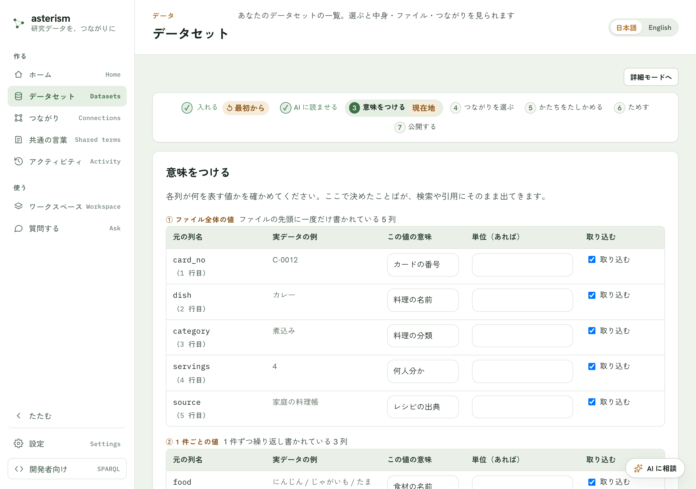
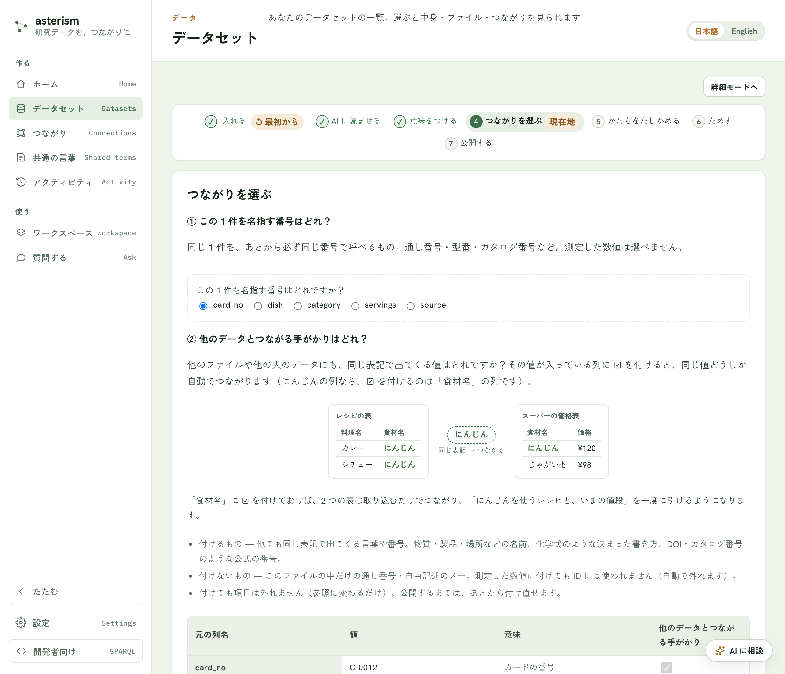
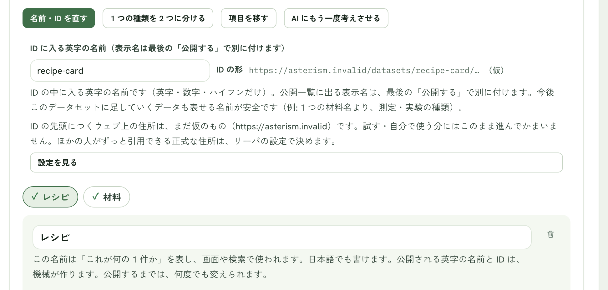
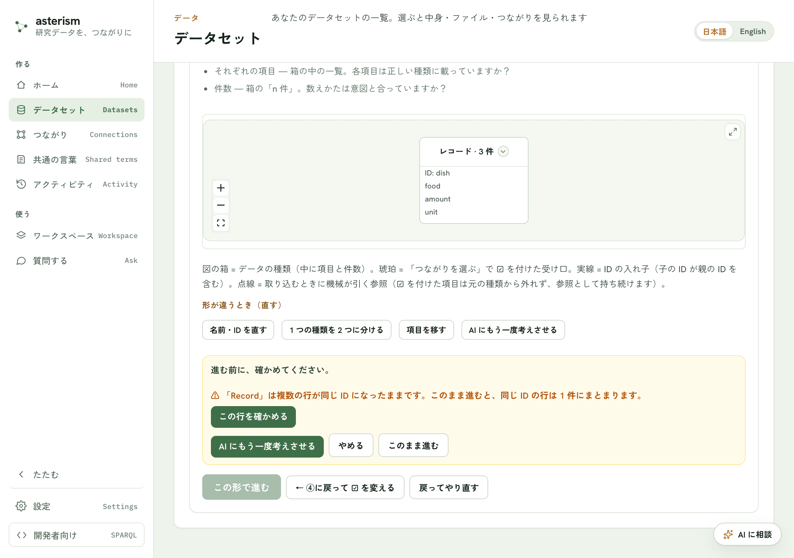
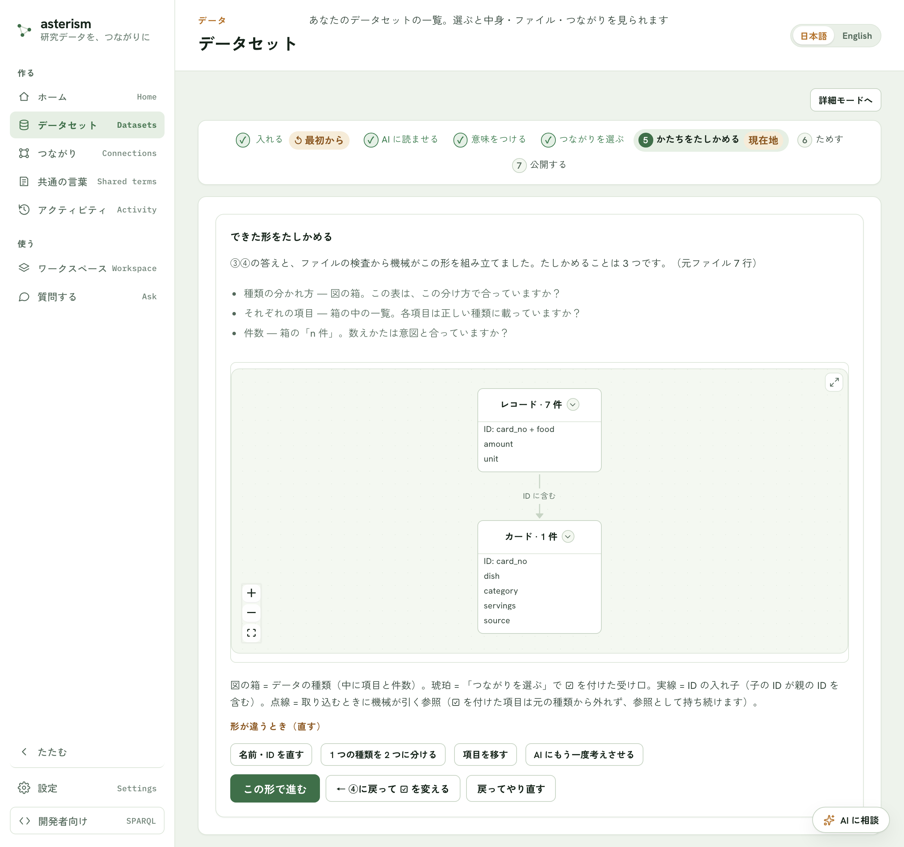
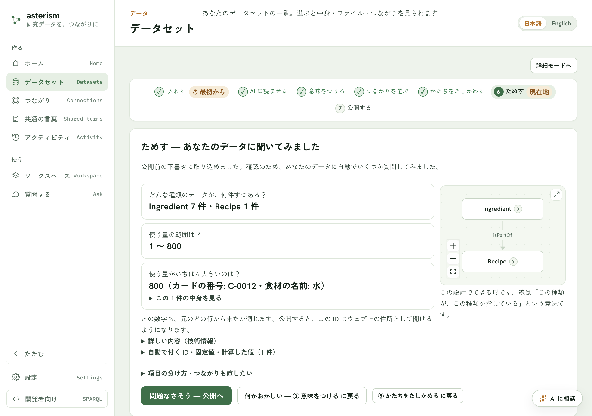
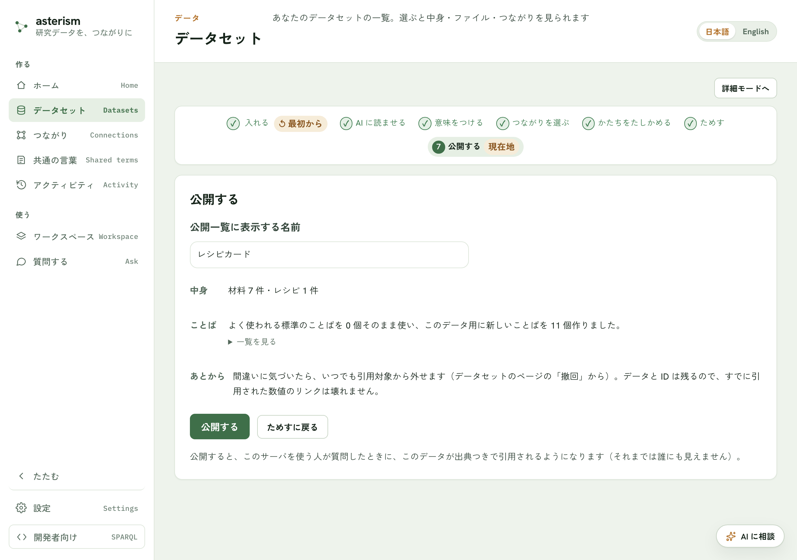

<!--
  Asterism マニュアル（人間向けヘルプ = AI 相談チャットの知識、単一の真実源）。

  位置づけは Graphium の manual/ と同じ: ここに書いた文章がそのまま画面の
  説明になり、設計相談チャット（ADR docs/architecture/design-consult-chat.md
  D8）の CONSULT_SYSTEM_PROMPT にもそのまま注入される
  （api/src/asterism_api/main.py の _load_consult_manual）。

  表記規約（この規約が UI 文言との自動照合テスト
  api/tests/test_design_consult.py の前提）:
    - ボタンの名前は必ず 「文言」ボタン の形で書く
    - タブの名前は必ず 「文言」タブ の形で書く
    - サイドバーのメニュー項目は必ず メニューの「文言」 の形で書く
    - ここに書く文言は ui/src/i18n/locales/ja/*.json に実在するものだけに
      すること（テストが自動で照合し、UI 変更にマニュアルが追従していない
      箇所を検出する）。無い文言を書くとテストが落ちる。
-->

# はじめる — かんたんモードの 7 ステップ <Badge type="tip" text="v0.9.0 (2026-07-23) で追加" />

Asterism の「かんたんモード」は、研究データを取り込んで公開するまでを
7 ステップの順番に進めるウィザードです。各ステップで確かめること・押す
ボタンをまとめます。

## 1. 入れる

測定データや文書のファイルをドラッグ＆ドロップするか、クリックして選びます。
手元にファイルが無いときは「まずサンプルデータで試す」ボタンで最後まで
試せます。置いたら読み取りが始まり、公開するまで内容は誰にも見えません。

## 2. AI に読ませる

「読み取りの確認」画面で、AI がファイルをどう読み取ったかを確認します。
表のはじまる前に条件や見出しらしい行があった場合など、あなたしか知らない
ことを聞かれることがあります。列の分けかたや文字化けの直しもここでできます。
内容を確かめたら「この内容で進む」ボタンで次へ。ファイルを変えたいときは
「ファイルを選び直す」ボタンです。

続いて AI がデータを読む処理が走ります（「AI がデータを読んでいます」の
表示）。他の画面を見に行っても続きますが、このタブは閉じないでください。
読み取りに失敗したときは「もう一度 AI に読ませる」ボタンでやり直すか、
「戻ってやり直す」ボタンで前の画面に戻れます。

## 3. 意味をつける

各列が何を表す値かを確かめます。ここで決めたことばが、検索や引用にそのまま
出てきます。下書きは AI が書きますが、表の中は直接書き換えられます（ここで
AI は使いません）。

一覧は 2 つに分かれています。

- 「① ファイル全体の値」— ファイルの先頭に一度だけ書かれている値です
  （装置ファイルの測定条件など）
- 「② 1 件ごとの値」— 1 件ずつ繰り返し書かれている値です（表の各行に並んで
  いる値）

各行で、元の列名・実データの例を見ながら、その値の意味と単位を確かめます。
使わない列は、右端の「取り込む」のチェックを外してください。外したことは
データセットに記録され、あとで見直しを開いたときも外れたままです。空欄の
まま進んでも大丈夫です（その列は元の列名のまま検索できます）。

AI が意味を読み取れなかった列も、同じ表の中に、意味が空欄のまま並びます
（別の表には分かれません）。空欄があるときは、表の上にその件数が出て、
「空欄の意味を AI に相談して埋める」ボタンで相談チャットに頼めます（文面が
入った状態で開くだけなので、送るかどうかはあなたが決めます）。

確かめたら「この意味で進む」ボタンで次へ。読み取りの設定に戻りたいときは
「読み方の設定に戻る」ボタンです。

## 4. つながりを選ぶ <Badge type="tip" text="v0.31.0 (2026-08-31) で追加" />

この画面の問いは 2 つに分かれています
<Badge type="tip" text="v0.46.0 (2026-09-29) で追加" />。

**① この 1 件を名指す番号はどれ？** — 候補が 2 つ以上あるときだけ出ます。
候補が 1 つしか無ければ機械が決めるので、この問いは表示されません。選べる
のは、ファイル全体で 1 つに決まる値（表の前に書かれた値）だけで、行ごとに
変わる測定した数値は選べません。

**② 他のデータとつながる手がかりはどれ？** — 列ごとに ☑ を付けます。①で
選んだ番号は、ここでは ☑ 済みの状態で表示され、外せません。

値の一覧は 1 枚の表で、3. で決めた意味が併記されます。行ごとに変わる値は、
実際の値の例がいくつか表示されるので、その表記を見て判断できます。

付けるかどうかの目安は画面にも出ています。

- 付けるもの — 他でも同じ表記で出てくる言葉や番号。物質・製品・場所などの
  名前、化学式のような決まった書き方、DOI・カタログ番号のような公式の番号
- 付けないもの — このファイルの中だけの通し番号・自由記述のメモ。測定した
  数値に付けても ID には使われません（自動で外れます）
- 付けても項目は外れません（参照に変わるだけ）。公開するまでは、あとから
  付け直せます

たとえばレシピの表とスーパーの価格表の両方で食材名「にんじん」の列に ☑ を
付けておけば、「にんじんを使うレシピと、いまの値段」を一度に引けるように
なります（☑ を付けるのは列で、つながるのはその中の値です。結ばれたかどうか
は「つながり」画面で確かめられ、要らなければ外せます）。自動で結ばれるのは、
人が②で自分で付けた ☑ どうしだけです（①で選んだ名指す番号は、画面では ☑
済みで表示されていても、自動で結ぶ材料にはなりません）。

迷ったら「迷ったら AI に相談」ボタンで相談チャットが開きます（文面が入った
状態で開くだけなので、送るかどうかはあなたが決めます）。☑ を決めたら
「えらび終えた — 形を組み立てる」ボタンで次へ。ここでの組み立ては機械の
計算だけで、AI は使いません（数秒で終わります）。3. に戻りたいときは
「← ③ 意味をつける に戻る」ボタンです。

## 5. かたちをたしかめる <Badge type="tip" text="v0.31.0 (2026-08-31) で追加" />

「できた形をたしかめる」画面には、3. と 4. の答えとファイルの検査から機械が
組み立てたデータの形が、図で表示されます。図の箱 = データの種類で、箱の
1 行目にその種類の ID の作り方（ID: No のように）、続いて項目が並び、ラベル
に件数が入っています。確かめることは 3 点です。

- 種類の分かれ方 — 図の箱。この表は、この分け方で合っていますか？
- それぞれの項目 — 箱の中の一覧。各項目は正しい種類に載っていますか？
- 件数 — 箱の「n 件」。数えかたは意図と合っていますか？

図の色と線の意味: 琥珀色の箱は 4. で ☑ を付けた「つながる受け口」、実線は
ID の入れ子（子の ID が親の ID を含む）、点線は取り込むときに機械が引く参照
です（☑ を付けた項目は元の種類から外れず、参照として持ち続けます）。

前書きの無い、表だけのファイルでは「カード」の箱はありません — ファイル全体
を表す値がそもそも無いためで、正常な形です。レコードと受け口だけの図になり、
受け口への参照は各レコードから引かれます。

4. で機械が仮の ID を置いたときは、箱の中に「（仮・機械の推定）」と書かれ、
図の下に ⚠ が出ます。そのままでも進めますが、違うときは ⚠ の横の
「名前・ID を直す」ボタンで、その種類の ID を選び直せます。また、同じ ID で数える種類が 2 つあり、しかも同じ
項目を持っているときも ⚠ が出ます。重複そのものが禁止なわけではありません
— 同じものの写しなら要らない方を消す、別のものなら項目を分ければ ⚠ は消え
ます。迷ったら「重複を AI に相談」ボタンで具体的に聞けます。

ファイルが 2 つ以上あり、同じ意味の列（3. で付けた意味が同じ。意味を付けて
いなければ列名が同じ）に別々のファイルで ☑ を付けたときは、その受け口は
**1 つの種類**にまとまります
<Badge type="tip" text="v0.49.0 (2026-09-30) で追加" />
— 図の箱は 1 つになり、各ファイルの種類から点線が引かれます。同じ値は、どの
ファイルから来ても同じ 1 件です（例: 測定の表と試料の表の両方にある組成）。
図の下に、まとめたことと、両方のファイルに出てくる値の数が出ます。違うもの
だったときは、その横の「別々の種類にする」ボタンで分けられます。同じファイル
の中の 2 列（出発地と到着地など）は、同じ意味でもまとめません。

3 点が合っていれば「この形で進む」ボタンで次へ。それで終わりです。4. の ☑
を変えたくなったら「← ④に戻って ☑ を変える」ボタンで戻れます（戻って ☑ を
変えると、形は組み立て直しになります）。

形が違うときは、「形が違うとき（直す）」の下の 4 つから直しかたを選びます。

- 「名前・ID を直す」ボタン — 種類ごとの名前と ID の作り方を確かめて直し
  ます。図の箱をクリックしても、その種類の直しが開きます。**種類の名前は
  日本語でも書けます**
  <Badge type="tip" text="v0.47.0 (2026-09-29) で追加" />
  — これが何の 1 件かを表す名前で、画面や検索で使われ
  ます。公開される英字の名前と ID は、この名前とは別に機械が作るので、
  公開するまでは何度でも書き直せます
- 「1 つの種類を 2 つに分ける」ボタン — 1 行に別々のもの（例: 測定の記録と、
  測定した対象）が混ざっているとき。「＋ 同じ ID で種類を足す」ボタンで、
  いまの ID をそのまま使う種類をもう 1 つ足し、名前を付けて「足す」ボタンを
  押すと種類が増えます。増やした種類に載せる項目は「項目を移す」で移します
- 「項目を移す」ボタン — どの種類が、どの項目を持つかの一覧が開きます。
  右の「載せる種類」を選び直すと、その項目を持つ種類が変わり、図の箱も同時に
  変わります。どの値を ID にするか（☑）は 4. で決めたとおりです — 変えたい
  ときは「← ④に戻って ☑ を変える」ボタンを使ってください
- 「AI にもう一度考えさせる」ボタン — いまの設計を渡して、注文を付けた
  ところだけ AI に直させます。この画面でやった編集（種類の名前・ID の作り方・
  削除・切り出し）は残ります。データセットの名前（ID に使われる英字名）は
  「名前・ID を直す」の中で変えられます

逆に、組み上がった形が行ごとの種類だけで「ファイル全体で 1 件」が無いときは、
⚠ と「＋ ファイル全体の種類を作る」ボタンが出ます。押すと、ファイルに一度
だけ書かれている値（カタログ番号や測定条件など）が、まとまった 1 件に分かれ
ます。

わからなければ、いったんそのまま進んで構いません。公開するまでは、この画面
に戻って何度でも直せます（種類を足す・消す・項目を移す）。動かせなくなるの
は、公開して ID を配ったあとだけです。相談したいときは右下の「AI に相談」
ボタンで相談チャットが開きます。前の画面に戻りたいときは「戻ってやり直す」
ボタンです。

「この形で進む」ボタンを押したとき、ID が重なっている種類があると、
「進む前に、確かめてください。」という確認が出ます。
種類ごとに「この行を確かめる」で中身を見て直すか、そのままでよければ「このまま進む」
で先に進めます（同じ ID の行は 1 件にまとまります）。

進むと、設計を組み立てて公開前の下書きに取り込みます（進み具合が表示されます）。
終わると、そのまま 6. の「ためす」に進みます。取り込んだあとの実際の件数は、
そこで確かめられます。

## 6. ためす

実際にデータを取り込んでみて、想定どおりの結果になるか AI が自動でいくつか
質問して確かめます。件数・値の範囲・いちばん大きい値などが出るので、元の
ファイルと見くらべてください。どの数字も、元のどの行から来たかを遡れます。

問題が無さそうなら「問題なさそう — 公開へ」ボタンで次へ。おかしいところが
あれば、戻って直せます。

- 項目の意味・単位を直したいとき —
  「何かおかしい — ③ 意味をつける に戻る」ボタンで 3. の画面に戻ります。
  直したら「この意味を保存して戻る」ボタンで、保存してこの画面に戻ります。
  何も変えずに戻るときは「ためすに戻る」ボタンです。このボタンは保存しないので、
  書きかけた意味や「取り込まない」のチェックは捨てられ、保存してある内容に戻ります
- 外した列を、あとから取り込みたくなったとき —
  同じく 3. の画面に戻り、その列の「取り込む」のチェックを入れ直して
  「この意味を保存して戻る」ボタンで戻ります。この画面に「まだ取り込まれて
  いない列」の案内が出るので、「⑤ かたちをたしかめる に戻る」ボタンで 5. に
  戻り、「この形で進む」ボタンで取り込み直します
- 件数が元のファイルの行数よりずっと少ないとき（複数の行が 1 件にまとまって
  います）など、種類の分け方や ID が意図と違うとき —
  「⑤ かたちをたしかめる に戻る」ボタンで 5. に戻ります

## 7. 公開する

公開一覧に表示する名前を付けて「公開する」ボタンを押すと、このサーバを
使う人が質問したときにこのデータが出典つきで引用されるようになります
（それまでは誰にも見えません）。中身の件数と、使ったことば（標準のことばを
いくつ使い、このデータ用にいくつ作ったか）もここで確かめられます。

設計に直すところが残っているときは「ためすに戻る」ボタンから前の画面へ
戻って直せます。間違いに気づいたら、あとから引用対象を外すこともできます。

公開が終わると、次の選択肢が並びます。

- 「質問する画面を開く」ボタン — 公開したデータに質問できる画面へ進みます
- 「見せるページを開く」ボタン・「リンクをコピー」ボタン — このデータを
  人に見せます。渡された相手は、この値の出どころをそのまま確認できます
- 「データセットのページを見る」ボタン — 足す・差し替えるといった、この
  データセットの育てかたに進みます
- 「別の新しいデータを追加する」ボタン — もう一度 1. からはじめます
- 「データどうしをつなぐ」ボタン — 公開済みのデータが複数件あるとき、
  共通の値でつないで両方をまたいで質問できるようにします
- 「標準のことばに合わせる」ボタン — このデータセット専用のことばを、
  QUDT・schema.org のような世界の標準のことばに合わせます
- このデータセットの育てかた — 新しい測定分を足すか、全部を差し替えるかを
  選べます。違いは [データセットの管理](./datasets.md) を参照してください

## 途中でやめて最初からやり直したいとき

画面上部の手順バーにある「最初から」ボタン（① 入れる に戻る）で、置いた
ファイルとここまでの結果をすべて消して最初からやり直せます。

## もっと詳しく操作したいとき <Badge type="tip" text="v0.8.0 (2026-07-22) で追加" />

かんたんモードのどの画面でも「詳細モードへ」ボタンで、変換ルールや検査
結果まですべての項目を表示する詳細モードに切り替えられます。かんたんな
画面に戻るときは「かんたんモードへ戻る」ボタンです。

## 関連

画面ごとの導線（左メニューの項目、設定の場所など）は
[screens.md](./screens.md) を参照してください。
