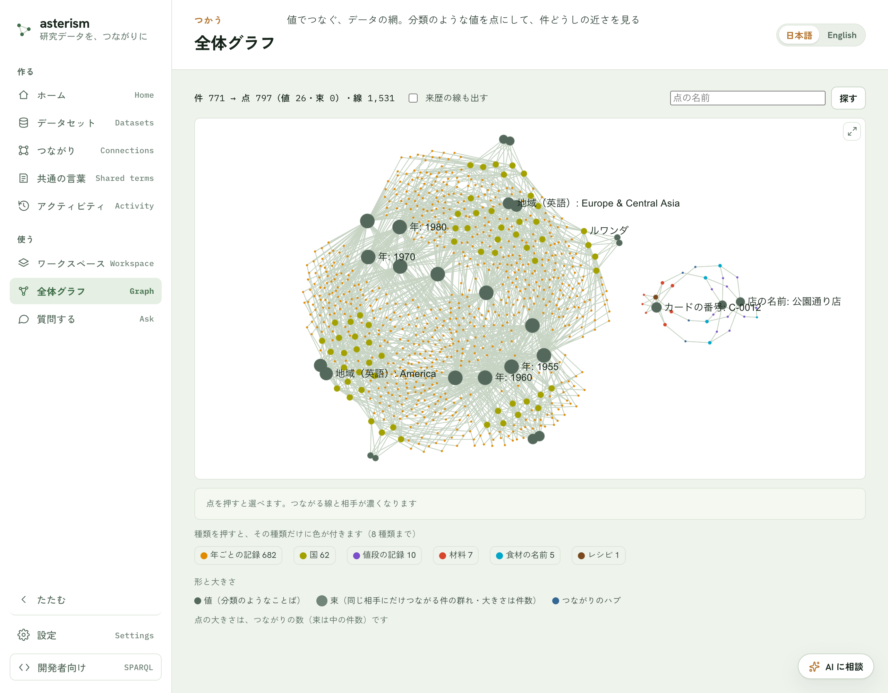
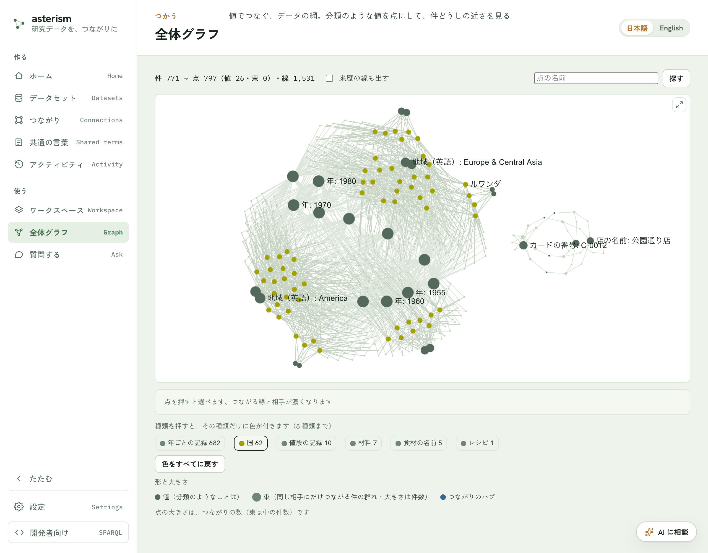

<!--
  Asterism マニュアル（人間向けヘルプ = AI 相談チャットの知識、単一の真実源）。
  getting-started.md の冒頭コメントに書いた表記規約（ボタンは「文言」ボタン、
  タブは「文言」タブ、サイドバーのメニュー項目はメニューの「文言」の形で書く
  こと）は本ファイルにも適用される。
  新しい画面のため、バッジ（どの版で追加か）はリリースの節目に合わせて付ける。
  画面の写真は本体が撮って差し込む（参照だけ）。
-->

# 全体グラフ — 値でつなぐ、データの網

## 全体グラフとは

公開したデータ全体を、1 枚の網として見る画面です。「ことば」の地図が
データの種類の設計図なのに対し、こちらは中身そのものの網です。

- 件（1 つ 1 つのデータ）と、件どうしのつながりが点と線になります。
- 地域や年のような、少ない種類の値を何度も使う項目は、その値も点になります。
  同じ値を使う件が、その点のまわりに集まります。
- 同じ相手にしかつながらない件が 20 件以上あれば、1 つの束にまとめます
  （たとえば測定点が 3,000 件あっても、束の点 1 つになります）。
- 取り込みの記録のような来歴の線は、はじめは出しません。

同じデータからは、いつも同じ絵が描かれます（点の配置は毎回同じ手順で決めます）。
つながっていないまとまり（別々のデータセットなど）は、横に分けて並べます。

## 入口

メニューの「全体グラフ」を開きます。公開したデータがまだ無いときは、案内の文が
出ます。

## 見かた

- 上の一行は、件の数から点と線がいくつになったかの集計です
  （例: 件 3,800 → 点 776（値 25・束 2）・線 1,497）。
- 点の色は種類ごとに決まっていて、データが増えてもほとんど変わりません
  （ほかの種類と色がぶつかったときは、隣の色になります）。
  色が付くのは 8 種類までで、残りは灰色です。図の下の凡例で種類を押すと、
  その種類だけに色が付き（8 種類まで）、ほかは灰色になります。
  「色をすべてに戻す」で元に戻ります。

  

  値の点は濃い灰色、つながりのハブは青、束は大きめの丸で、中の件数が
  大きさになります。大きさはつながりの数で決まります。
- 名前は、重ならないものだけが出ます。拡大すると細かい名前も出てきます。
  点にマウスを載せると、その点につながる線と相手がいったん濃くなり、名前も出ます。
- ホイールで拡大・縮小、ドラッグで動かせます。凡例は図の下にあります。

## 操作

- 点を押すと選べます。選んだ点につながる線と相手だけが濃くなり、ほかは薄くなります。
  何もないところを押すと選びを外します。
- 図の下の帯に、名前・種類・つながりの数が出ます。
  - 件とハブ: 「このページを開く」で、その 1 件のページへ移ります。
  - 値と束: 「一覧で開く」で、その値を持つ件（束なら束の中の件）の絞り込みの
    ページへ移ります。
- 「来歴の線も出す」を入れると、取り込みの記録などの線と点が加わります。
- 「名前で探す」に入力して「探す」ボタンを押すと、一致した点に寄って選びます。
- 右上のボタンで「大きく見る」ことができます。選びや拡大の状態はそのままです。
- 点が多すぎるときは「点が多いので一部だけ出しています」と出て、つながりの
  多い点から残します。

## 関連

- 種類だけの設計図は[ことば](./vocab-and-grounding.md)の「ことばの地図」。
- 1 件から広げて見るのは[ワークスペース](./workspace.md)の「つながりを図で見る」。
