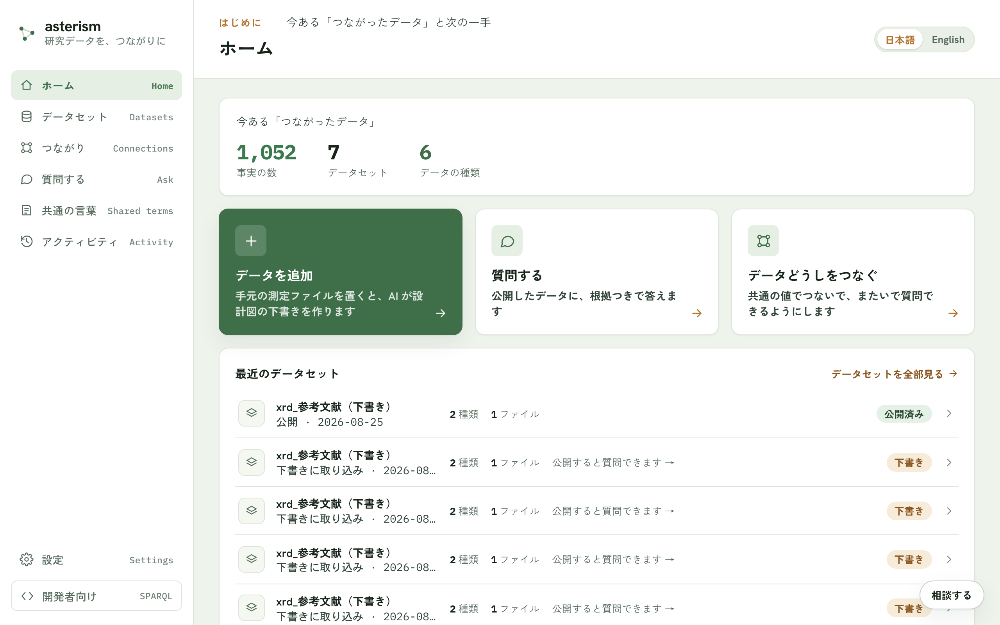

<!--
  Asterism マニュアルのトップページ（人間向けの目次）。
  getting-started.md の冒頭コメントに書いた表記規約（ボタンは「文言」ボタン、
  タブは「文言」タブ、サイドバーのメニュー項目はメニューの「文言」の形で書く
  こと）は本ファイルにも適用される。
-->

# Asterism ユーザーマニュアル

Asterism は、研究データを「つながったデータ」にする道具です。Excel・CSV・
装置のファイルを置くと AI が設計図の下書きを作り、あなたが確かめて公開します。
公開したデータには、ふつうの言葉で質問でき、答えには出どころが付きます。
公開するまで、データは誰にも見えません。

## はじめに

| 章 | 内容 |
|---|---|
| [はじめる](./getting-started.md) | かんたんモードの 7 ステップ。まずここから |

## データを育てる

| 章 | 内容 |
|---|---|
| [データの追加](./add-data.md) | 対応しているファイル・読み取りの確認・文書の取り込み |
| [データセットの管理](./datasets.md) | 公開・新しい測定分の追記・差し替え・設計の見直し |
| [つながり](./crosswalk.md) | 別々のデータを共通の値でつなぎ、またいで質問できるようにする |

## つかう

| 章 | 内容 |
|---|---|
| [質問する](./ask.md) | 公開したデータに、出どころつきで聞く |
| [共通の言葉](./vocab-and-grounding.md) | ことばを揃える・世界の標準に合わせる |

## しくみを知る

| 章 | 内容 |
|---|---|
| [つながったデータの基礎](./rdf-basics.md) | RDF・IRI・クラス・属性・オントロジー・SPARQL の関係 |
| [データセットの中のファイル](./dataset-files.md) | 変換ルール・仕様・検索タグ・設計書が何をしているか |

## そばに置く

| 章 | 内容 |
|---|---|
| [相談チャット](./consult.md) | 設計中の疑問を、画面を離れずに聞く |
| [設定](./settings.md) | AI の登録・利用許可コード・使用量・保存先 |
| [デスクトップ版](./desktop.md) | 手元の PC で完結して使う・自動更新 |

## 困ったときは

- 操作の場所がわからない: [画面別の導線リファレンス](./screens.md)
- 画面を離れず聞きたい: 右下の「AI に相談」ボタン（[相談チャット](./consult.md)）
