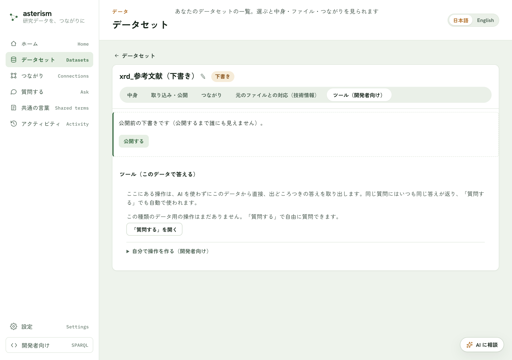

<!--
  Asterism マニュアル（人間向けヘルプ = AI 相談チャットの知識、単一の真実源）。
  getting-started.md の冒頭コメントに書いた表記規約（ボタンは「文言」ボタン、
  タブは「文言」タブ、サイドバーのメニュー項目はメニューの「文言」の形で書く
  こと）は本ファイルにも適用される。

  この章はオントロジー入門者向けの背景解説であり、操作手順は書かない
  （手順は getting-started.md / datasets.md 側）。Asterism の画面が使う
  やさしい言葉（種類・項目・事実・共通の言葉）と、標準の用語（クラス・
  プロパティ・トリプル・オントロジー）の対応表を持つのがこの章の役目。
-->

# つながったデータの基礎 — RDF・オントロジー・SPARQL

Asterism は、表を「つながったデータ」に変える道具です。この章では、その裏
側にある考え方を、はじめての人向けに説明します。操作はありません。読むだ
けの章です。

## 表のままだと何が困るか

Excel の表は、人が見れば意味がわかります。しかし機械にとっては、ただの
文字が並んだ格子です。

```
No: 03-065-2664                     ← 表の外（ファイルの先頭に条件が並ぶ）
Name: Aluminum Vanadium
Space Group: I4/mmm(139)
   …
   2theta     d        I      (hkl)  ← ここから下が表
  21.34   4.161     5.0  (0,0,2)
  25.87   3.441    11.5  (1,0,1)
```

この形だけからは、次のことがわかりません。

- `2theta` は角度なのか、それとも別のなにかなのか
- 表の各行が、先頭の `No: 03-065-2664` の材料のものだということ
- 隣の研究室の表にある `2θ` と、この `2theta` は同じものなのか

**つながったデータ**とは、この「わからないこと」を、機械が読める形で明記
したデータのことです。

## 事実は 3 つ組で書く

つながったデータでは、すべてを「**なにが** — **どんな項目で** — **どんな
値か**」という 3 つ組で書きます。この 3 つ組ひとつが、**事実 1 件**です。
標準の用語では**トリプル**（triple）と呼びます。

上の表の 1 行目は、こう書き換わります。主語の名前に材料の `No` が入って
いることに注目してください（理由は次の節）。

```
03-065-2664 の (0,0,2) ピーク  ──[ 2θ ]──▶  21.34
03-065-2664 の (0,0,2) ピーク  ──[ d 値 ]──▶  4.161
03-065-2664 の (0,0,2) ピーク  ──[ 強度 ]──▶  5.0
03-065-2664 の (0,0,2) ピーク  ──[ Miller 指数 ]──▶  (0,0,2)
```

1 行 4 列だった表が、事実 4 件になりました。Asterism の画面が「事実 188
件」のように数えているのは、この 3 つ組の数です（47 行 × 4 項目 = 188）。


*1 行 4 列の表が事実 4 件になる。主語は 1 つ、述語（項目）が 4 つ、目的語（値）が 4 つ。*

3 つ組の各部分には名前があります。

| 位置 | 標準の用語 | 意味 | 上の例 |
|---|---|---|---|
| 1 番目 | 主語（subject） | 何についての事実か | 03-065-2664 の (0,0,2) ピーク |
| 2 番目 | 述語（predicate） | どの項目の話か | 2θ |
| 3 番目 | 目的語（object） | その値 | 21.34 |

**RDF** とは、この「事実は 3 つ組で書く」という決まりごとの名前です。特別
なソフトではなく、書き方の約束です。

## IRI — 世界でひとつの名前

3 つ組の 1 番目（主語）と 2 番目（述語）は、ただの文字列ではいけません。
「ピーク 1」という名前は、世界のあちこちの表に出てきてしまうからです。

そこで、**世界でひとつに決まる名前**を使います。これが **IRI** です。見た
目は URL とそっくりです。


*IRI が同じなら同じもの、違えば違うもの。この一点だけで、別々の場所で作られた
データがあとから機械的につながる。*

ドメイン名の部分が世界で重ならないので、その先も重なりません。IRI が同じ
なら同じもの、違えば違うもの。これだけの決まりで、別々の場所で作られた
データが、あとから機械的につながります。

IRI は 2 種類あります。

| 種類 | 何につける名前 | 例 |
|---|---|---|
| 実体（データ）の IRI | 実際のもの 1 件ずつ | `.../resource/peak/03-065-2664/(0,0,2)` |
| 語彙（項目）の IRI | 項目や種類そのもの | `.../ontology#twoTheta` |

Asterism が「できた形をたしかめる」で ID の形を必ず人に確認するのは、この実体の IRI をどの
列から組み立てるかを決めるためです。ここを間違えると、別々のピークが同じ
名前になってしまい、あとから直すのが大変になります。

長い IRI を毎回書くのは大変なので、先頭部分に短い別名（**接頭辞**、prefix）
を付けて `xrd:twoTheta` のように略記します。`xrd:` が
`https://例.org/.../ontology#` の代わりです。

## ID が衝突しないとはどういうことか

ここが設計でいちばん間違えやすいところなので、実例で説明します。上のピークの
ID は、こう組み立てられています。

```
xrdr:peak/{No}/{(hkl)}
           │      └─ 表の中の列。ピークごとに変わる
           └──────── 表の外の値。材料ごとに変わる（PDF カード番号）
```

`No` は表の列ではありません。**ファイルの先頭に `No: 03-065-2664` と書かれて
いた行**です。取り込みのとき、この先頭の条件は表の全行に配られます（「読み取り
の確認」で見出し行の扱いを聞かれるのは、これを決めるためです）。結果、名前は
こうなります。

| 材料 | (hkl) | できる ID |
|---|---|---|
| Al3 V | (0,0,2) | `peak/03-065-2664/(0,0,2)` |
| 別の材料 | (0,0,2) | `peak/03-065-5860/(0,0,2)` |

**同じ (0,0,2) でも、材料が違えば別の ID になります。**もし `(hkl)` だけで
名前を作っていたら、どの材料の (0,0,2) も `peak/(0,0,2)` という 1 つの名前に
なり、あとから取り込んだ材料の強度が前の材料を上書きしてしまいます。


*ID の一意性は「どの範囲で一意か」で決まる。`(hkl)` は 1 つのファイルの中でしか
一意ではないので、それだけでは名前にならない。*

これを人が確かめる場所が、かんたんモードの「できた形をたしかめる」の画面にある
②「ID がひとつずつを指しているか確かめる」です。ID が重ならないか（✓ / ⚠）
が表示され、⚠ が出たら組み合わせを選び直せます。

**ID が重ならないことと、つながっていることは別です。** 上の ID には材料の
番号が文字として入っていますが、これは「材料という別のもの」への参照では
ありません。「この材料のピークを全部」のような質問に答えられるようにするには、
材料そのものをデータの種類として設計に足し、ピークからそこへの参照を持たせる
必要があります（次の節）。

## クラスと属性

事実をたくさん集めると、同じ形のものが繰り返し現れます。

- ピークは、どれも 2θ・d 値・強度・Miller 指数を持つ
- 試料は、どれも試料番号・組成・空間群を持つ

この「ピーク」「試料」という**種類**が**クラス**（class）です。そして、その
種類が持つ**項目**が**属性**（プロパティ、property）です。3 つ組の 2 番目
（述語）に来るのが属性だと考えてください。

```
クラス「XRD ピーク値」
 ├ 属性 2θ            （値は数値）
 ├ 属性 d 値          （値は数値）
 ├ 属性 強度          （値は数値）
 └ 属性 Miller 指数   （値は文字）

クラス「XRD 測定の測定結果」
 ├ 属性 試料番号
 └ 属性 組成 …
```

属性の値には 2 種類あります。この違いが「つながる／つながらない」を決めます。

| 値の種類 | 中身 | 例 |
|---|---|---|
| 値そのもの | 数値・文字・日付 | 2θ = `21.34` |
| 別のものへの参照 | 相手の IRI | このピークは → あの試料のもの |

後者があるから、データは網目状につながります。「この試料のピークを全部」
のような質問に答えられるのは、参照でつながっているときだけです。Asterism が
「つながっていません」と指摘するのは、この参照が無い状態のことです。


*この例では「XRD測定の測定結果」と「XRDピーク値」の 2 種類があり、「気になる点」に
「使われていない列があります（17 列）」と出ています。*

## オントロジー — 共通の言葉

クラスと属性を決めて、名前（IRI）を与え、「このクラスはこの属性を持つ」
「この属性の値は数値」といった決まりを書いたもの。それが**オントロジー**
です。データそのものではなく、**データを書くための語彙集**だと考えるのが
いちばん近いです。

Asterism の画面では、これを**共通の言葉**と呼んでいます。メニューの
「共通の言葉」に並んでいるのが、いま使われているクラスと属性の一覧です。

語彙を他の人と揃えるほど、データはつながります。だから Asterism には、自分
のデータ専用の言葉を、世界で使われている標準の語彙（QUDT・schema.org など）
に結びつける機能があります（[vocab-and-grounding.md](./vocab-and-grounding.md)）。

## SPARQL — つながったデータへの問い方

Excel に対する検索やフィルタにあたるものが、つながったデータにもあります。
それが **SPARQL** です。3 つ組の「わからないところ」を `?名前` にして書く
と、あてはまる組み合わせを全部返してくれます。

```sparql
SELECT ?peak ?angle WHERE {
  ?peak  a          xrd:XRDピーク値 .   # 種類がピークであるものを ?peak と呼ぶ
  ?peak  xrd:twoTheta  ?angle .        # その 2θ の値を ?angle と呼ぶ
}
ORDER BY DESC(?angle) LIMIT 10
```

Asterism では、SPARQL を自分で書く必要はありません。メニューの「質問する」
でふつうの言葉で聞けば、内部でこの問い合わせが組み立てられ、答えと一緒に
出どころが返ります。SPARQL を直接書きたい場合の入口も、データセットの
「ツール（開発者向け）」タブに用意されています。



## 用語の関係

ここまでの言葉は、次の関係にあります。


読み下すとこうなります。

- **RDF** は書き方の決まり、**IRI** はそこで使う名前のつけかた
- **オントロジー**はどんな**クラス**と**属性**を使ってよいかの語彙
- 決まりに従って語彙で書いた**事実**の集まりが、実際のデータ
- そのデータに問うための言葉が **SPARQL**

## 画面の言葉との対応

Asterism はこれらの用語を、なるべくやさしい言葉に置き換えて表示しています。
文献や他のツールを読むときのために、対応を挙げておきます。

| Asterism の画面 | 標準の用語 | ひとことで言うと |
|---|---|---|
| 事実 | トリプル（triple） | 3 つ組ひとつ = 事実 1 件 |
| データの種類 | クラス（class） | ピーク・試料などの区分 |
| 項目 | 属性 / プロパティ | 種類が持つ列にあたるもの |
| ID・ID のつけかた | IRI・IRI テンプレート | 世界でひとつの名前 |
| 共通の言葉 | オントロジー / 語彙 | 使ってよいクラスと属性の一覧 |
| つながり | 参照（オブジェクト属性） | 別のものを IRI で指すこと |
| 高度な検索（SPARQL） | SPARQL クエリ | つながったデータへの問い合わせ |
| 変換ルール | RML マッピング | 表を 3 つ組に変える規則 |
| 公開する | 昇格（promote） | 引用できる状態にすること |

## 関連

- 各ファイルが何をしているかは [dataset-files.md](./dataset-files.md) を
  参照してください。
- 語彙を標準に合わせる話は
  [vocab-and-grounding.md](./vocab-and-grounding.md) を参照してください。
- データどうしをつなぐ話は [crosswalk.md](./crosswalk.md) を参照してくだ
  さい。
