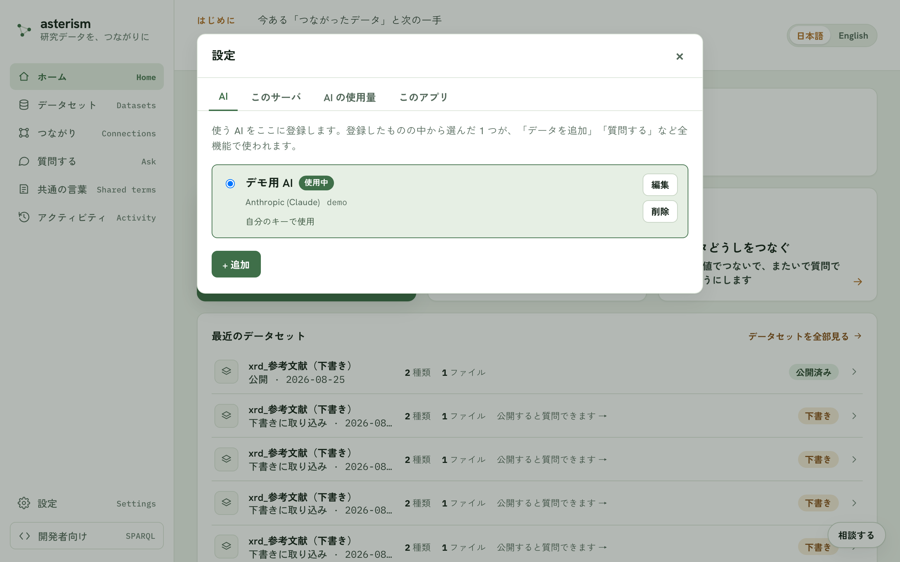
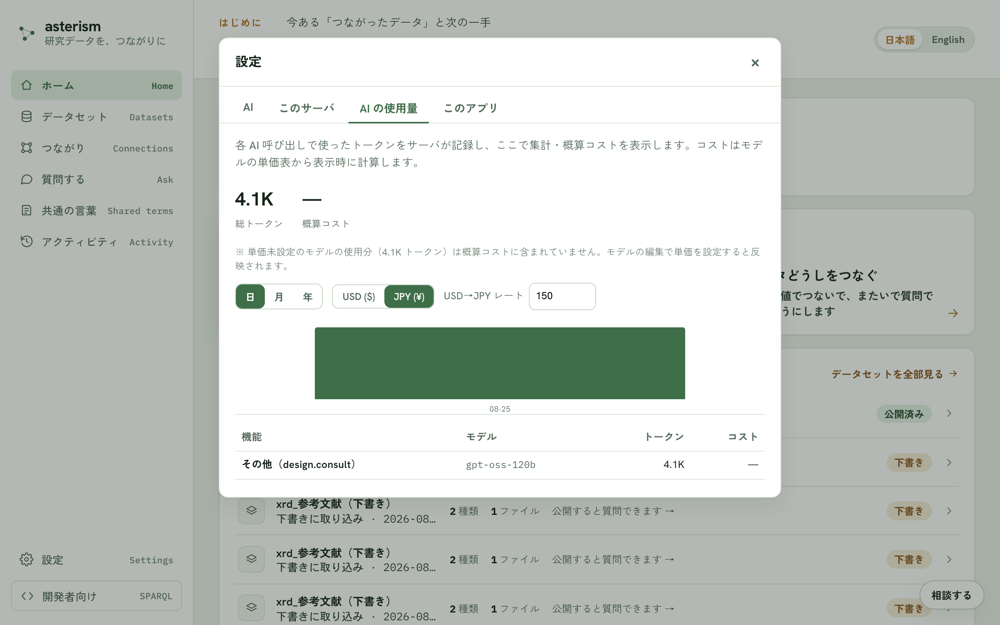

<!--
  Asterism マニュアル（人間向けヘルプ = AI 相談チャットの知識、単一の真実源）。
  getting-started.md の冒頭コメントに書いた表記規約（ボタンは「文言」ボタン、
  タブは「文言」タブ、サイドバーのメニュー項目はメニューの「文言」の形で書く
  こと）は本ファイルにも適用される。
-->

# 設定 — AI・利用許可コード・保存先

## 設定の開き方

左下の「設定」を開くと、タブに分かれた設定画面になります。

## 「AI」タブ

使う AI をここに登録します。プロバイダは Anthropic (Claude) / OpenAI /
OpenAI 互換（さくらの AI Engine / Groq / Ollama など）から選べます。登録した
中から選んだ 1 つが、「データを追加」「質問する」など全機能で使われます。

「モデル一覧を取得」ボタンで、接続先から使えるモデルの一覧を取り寄せられ
ます。サーバに既定のキーが設定済みのプロバイダは、キーを入力しなくても
そのまま使えます。「このブラウザに記憶する」をオンにするとキーは
localStorage に保存されて再読み込み後も残り、オフだとタブを閉じるまでの
sessionStorage のみになります。「このサーバのみんなで使う」を選ぶと、
キーはサーバに保存され、使う人が自分でキーを用意しなくても AI が使えるよう
になります（キーの中身は誰の画面にも表示されません）。トークン単価を
設定すると、使った分のコストを概算できるようになります。

## 「このサーバ」タブ

データの取り込み・公開などの書き込み操作には、このサーバの利用許可コードが
必要です。欄に貼り付けると、このタブを閉じるまで有効になります。貼り付けた
コードが正しいかは「もう一度確かめる」ボタンで検証できます。

同じタブの「ID の発行元」では、新しいデータセットの ID が作られるアドレス
を確認できます。お試しに使うだけなら仮のアドレスのままで十分ですが、公開した
あともずっと引用できる ID にするには、サーバ側でこのアドレスを設定します。

## 「AI の使用量」タブ

各 AI 呼び出しで使ったトークン数の集計と、概算コストを確認できます。日・月・
年の粒度で切り替えられ、機能（質問する・設計の提案など）× モデルの内訳も
見られます。トークン単価を設定していないモデルの使用分は、概算コストには
含まれません。

## 「保存先」タブ

データセット・グラフ・チャット・設定を保存するフォルダを確認・変更できます
（変更はデスクトップアプリのみ）。「変更…」ボタンから別の場所を選べます。
選んだ場所が同期フォルダ（Dropbox など）だと、複数端末から同時に開いた
ときに壊れることがあるため推奨されません。既存のデータは自動では移動され
ないので、引き継ぎたいときはアプリを終了してから旧フォルダの中身を新しい
フォルダへ手動でコピーします。

## 「ほかの AI から使う」タブ

Asterism に取り込んだデータを、Claude Code・Claude Desktop・Cursor・VS Code
などの AI から直接聞けるようにするタブです。データをコピーして渡すのでは
なく、AI に**接続先**（`http://127.0.0.1:8765/mcp` のようなアドレス）を教える
だけで、その AI が Asterism に問い合わせて答えます。

使っている AI を選ぶと、その AI に必要な手順と、貼り付ける内容が出ます。
「コピー」ボタンで写して、AI 側に貼り付けてください。接続先は起動のたびに
この画面で確認します（別のプログラムが同じ番号を使っていると、Asterism は
別の番号で起動するため）。

Asterism を起動している間だけ使えます。アプリを終了すると、AI からは
繋がらなくなります。

## 「このアプリ」タブ

インストールされているバージョンの確認と、更新の確認ができます。詳しくは
[desktop.md](./desktop.md) を参照してください。

## 関連

設計について AI に相談したいときは [consult.md](./consult.md)、公開した
データへの質問は [ask.md](./ask.md) を参照してください。
