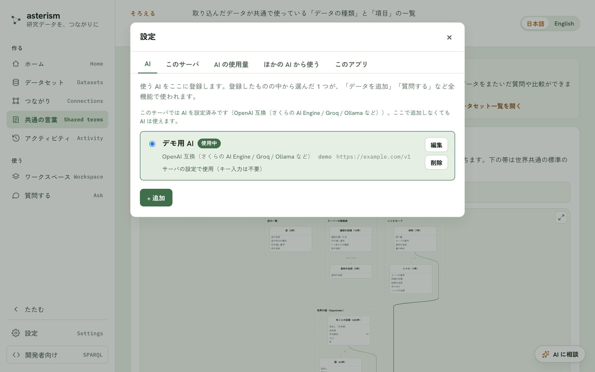
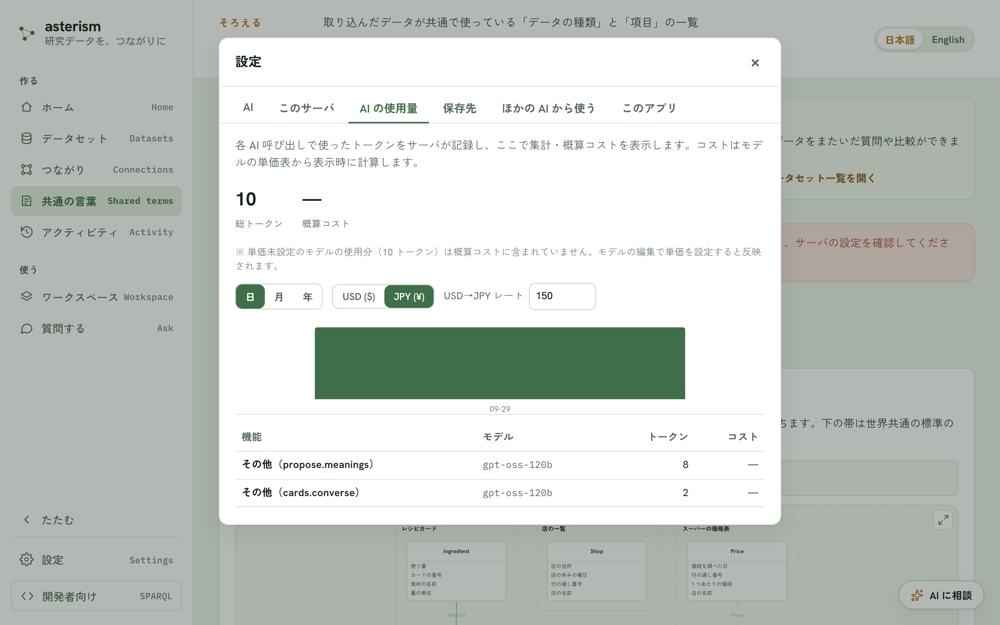

<!--
  Asterism マニュアル（人間向けヘルプ = AI 相談チャットの知識、単一の真実源）。
  getting-started.md の冒頭コメントに書いた表記規約（ボタンは「文言」ボタン、
  タブは「文言」タブ、サイドバーのメニュー項目はメニューの「文言」の形で書く
  こと）は本ファイルにも適用される。
-->

# 設定 — AI・利用許可コード・保存先

## 設定の開き方

左下の「設定」を開くと、タブに分かれた設定画面になります。

## 「AI」タブ <Badge type="tip" text="v0.7.0 (2026-07-14) で追加" />

使う AI をここに登録します。プロバイダは Anthropic (Claude) / OpenAI /
OpenAI 互換（さくらの AI Engine / Groq / Ollama など）から選べます。登録した
中から選んだ 1 つが、「データを追加」「質問する」など全機能で使われます。

「モデル一覧を取得」ボタンで、接続先から使えるモデルの一覧を取り寄せられ
ます。サーバに既定のキーが設定済みのプロバイダは、キーを入力しなくても
そのまま使えます。「このブラウザに記憶する」をオンにするとキーは
localStorage に保存されて再読み込み後も残り、オフだとタブを閉じるまでの
sessionStorage のみになります。「このサーバのみんなで使う」を選ぶと、
キーはサーバに保存され、使う人が自分でキーを用意しなくても AI が使えるよう
になります（キーの中身は誰の画面にも表示されません）。トークン単価を
設定すると、使った分のコストを概算できるようになります。

## 「このサーバ」タブ <Badge type="tip" text="v0.7.0 (2026-07-14) で追加" />

データの取り込み・公開などの書き込み操作には、このサーバの利用許可コードが
必要です。欄に貼り付けると、このタブを閉じるまで有効になります。貼り付けた
コードが正しいかは「もう一度確かめる」ボタンで検証できます。

同じタブの「ID の発行元」では、新しいデータセットの ID が作られるアドレス
を確認できます。お試しに使うだけなら仮のアドレスのままで十分ですが、公開した
あともずっと引用できる ID にするには、サーバ側でこのアドレスを設定します。

## 「AI の使用量」タブ <Badge type="tip" text="v0.7.0 (2026-07-14) で追加" />

各 AI 呼び出しで使ったトークン数の集計と、概算コストを確認できます。日・月・
年の粒度で切り替えられ、機能（質問する・設計の提案など）× モデルの内訳も
見られます。トークン単価を設定していないモデルの使用分は、概算コストには
含まれません。

## 「ほかの AI から使う」タブ <Badge type="tip" text="v0.23.0 (2026-08-28) で追加" />

Asterism に取り込んだデータを、Claude Code・Claude Desktop・Cursor・VS Code
などの AI から直接聞けるようにするタブです。データをコピーして渡すのでは
なく、AI に**接続先**（`http://127.0.0.1:8765/mcp` のようなアドレス）を教える
だけで、その AI が Asterism に問い合わせて答えます。

使っている AI を選ぶと、その AI に必要な手順と、貼り付ける内容が出ます。
「コピー」ボタンで写して、AI 側に貼り付けてください。接続先は起動のたびに
この画面で確認します（別のプログラムが同じ番号を使っていると、Asterism は
別の番号で起動するため）。

Asterism を起動している間だけ使えます。アプリを終了すると、AI からは
繋がらなくなります。

## 「このアプリ」タブ <Badge type="tip" text="v0.13.2 (2026-08-14) で追加" />

このパソコンに入っているアプリそのものについての設定を、1 つにまとめた
タブです。インストールされているバージョンの確認と、更新の確認ができます
（詳しくは [desktop.md](./desktop.md)）。デスクトップ版では、同じタブの下に
「ローカル保存先」と「PDF の読み取り」も並びます。

### 保存先 <Badge type="tip" text="v0.17.4 (2026-08-20) で追加" />

データセット・グラフ・チャット・設定を保存するフォルダを確認・変更できます
（変更はデスクトップアプリのみ）。「変更…」ボタンから別の場所を選べます。
選んだ場所が同期フォルダ（Dropbox など）だと、複数端末から同時に開いた
ときに壊れることがあるため推奨されません。確認の画面で「今のデータを新しい
場所へ移す」にチェックを付けると、次の起動時にデータが移り、結果が画面に
表示されます（移行先のフォルダが空のときだけ移します）。チェックを付けない
場合、既存のデータは自動では移動されないので、引き継ぎたいときはアプリを
終了してから旧フォルダの中身を新しいフォルダへ手動でコピーします。別の場所
を選んだあとは、「既定の場所に戻す」ボタンでいつでも元の保存先に戻せます。

### PDF の読み取り

デスクトップ版だけにあります。PDF を取り込むには、PDF を読み取る部品
（約 1.7GB）をこのパソコンに入れます。入れるのは 1 回だけです。

- 「部品を入れる」ボタンを押すと、ダウンロードが始まります。インターネットへの
  接続が要り、数分かかります。進み具合はこの欄に出て、設定の画面を閉じても
  続きます。途中でやめるときは「中止」ボタンを押します
- 入れ終わると「PDF を取り込めます」と出て、ファイルを置く欄が PDF を
  受け付けるようになります（画面を読み込み直す必要はありません）
- PDF の読み取りはこのパソコンの中で行い、読み取りのために PDF を外へ送ることは
  ありません。部品がインターネットを使うのは、入れるときだけです
- 要らなくなったら「部品を消す」ボタンで消せます（取り込み済みのデータは
  残ります）

うまく入らなかったときや、入れた部品が動かなくなったときは、理由と「もう一度試す」
ボタンが出ます。それでも動かないときは、同じ場所の「部品を消す」ボタンで消してから
入れ直せます。

## 関連

設計について AI に相談したいときは [consult.md](./consult.md)、公開した
データへの質問は [ask.md](./ask.md) を参照してください。
