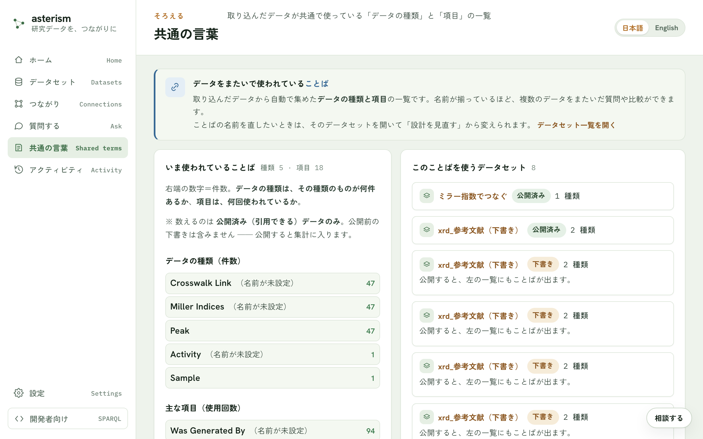

<!--
  Asterism マニュアル（人間向けヘルプ = AI 相談チャットの知識、単一の真実源）。
  getting-started.md の冒頭コメントに書いた表記規約（ボタンは「文言」ボタン、
  タブは「文言」タブ、サイドバーのメニュー項目はメニューの「文言」の形で書く
  こと）は本ファイルにも適用される。
-->

# 共通の言葉 — ことばを揃える・標準に合わせる

## 共通の言葉とは

取り込んだデータが使っている「データの種類」と「項目」の一覧を、共通の言
葉と呼びます。複数のデータセットで名前が揃っているほど、データをまたいだ
質問や比較ができるようになります。

## 入口

メニューの「共通の言葉」から、ことばの地図と、いま使われていることばの一
覧を見られます。

## ことばの地図

ページの最初に「ことばの地図」が表示されます。設計のあるデータセットの
「種類」（箱）と「項目」（箱の中）をひとつの図に重ねたもので、データセッ
トがつながるほどこの地図は育ちます。箱を押すと、そのデータセットの詳細
ページに移動します。

図の下の帯は標準のことば（世界共通の語彙）です。線は 4 種類あります。

- 灰色の実線 — データの中のつながり（種類どうしの関係）
- 緑の実線 — 標準のことばを使っている（確定）
- 琥珀の点線 — 接地の候補（名前がほぼ一致する標準のことば。まだ確定して
  いません。候補は一覧から機械的に探すもので、AI は使いません）
- 青の点線 — データセット間の対応（「視点をつなぐ」で確定したもの）

図の上の集計（データセット・種類・項目・標準のことばを使用・接地の候補・
対応）は、同じ内容を数字で表したものです。

## 一覧の見方

一覧に並ぶのは、いま使われていることばです。データの種類は件数（その種類
のものが何件あるか）、項目は使用回数で表示されます。数えるのは公開済みの
データだけです。公開前の下書きは含まれず、公開すると集計に入ります。

それぞれのことばには、そのことばを使っているデータセットの一覧も付きます。

## ことばの名前を直す

ことばの名前を直したいときは、そのデータセットを開いて「設計を見直す」ボ
タンから変更できます。複数のデータセットが共通で使うことばは、名前を変え
るとそれを使うすべてのデータの検索・回答に影響するので注意してください。

## 標準のことばに合わせる（任意）

自分のデータ専用のことばを、よく使われる標準のことば（QUDT・schema.org
など）に結びつけることができます。合わせておくと、他のデータと自動でつな
がり、外部のツールや AI もそのまま理解できます。合わせるかどうかは任意で、
合わせなくても検索・引用はそのまま使えます。

## 合わせ方

データセットの「中身」タブを開き、候補から選びます。候補は標準のことばの
一覧から機械的に探すもので、AI は使いません。英語のふつうの言い方（例:
temperature, crystal structure）でも検索できます。合わせたい候補が見つ
かったら「この標準に合わせる」ボタンで確定します。あとから解除することも
できます。

## この列は何を測っているか

項目名を標準に合わせるのとは別に、「この列は何を測っているか」という問い
にも合わせられます。単位が手がかりになるので、項目名が略記でも見つかるこ
とがあります。合わせておくと、「熱伝導率を測った人」のようにデータをまた
いで横断的に探せるようになります。

## すでに使われている標準

データの中ですでに使われていた、よく知られた標準のことばは、自動で検出さ
れて一覧に表示されます。あらためて合わせる操作をしなくても、最初から標準
に沿っている場合はそのまま表示されます。

## 関連

- データどうしをつなぐ話は [crosswalk.md](./crosswalk.md) を参照してくだ
  さい。
- 公開の流れは [getting-started.md](./getting-started.md) を参照してくだ
  さい。
