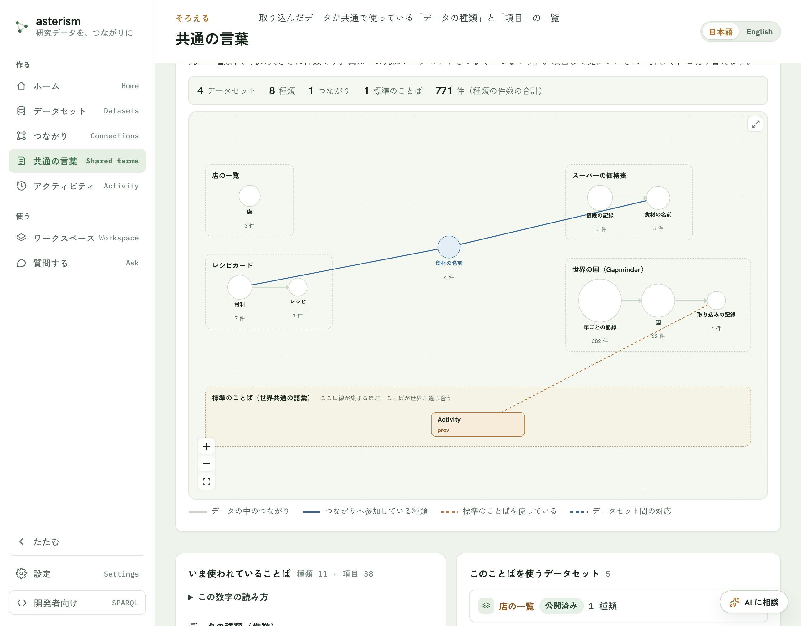
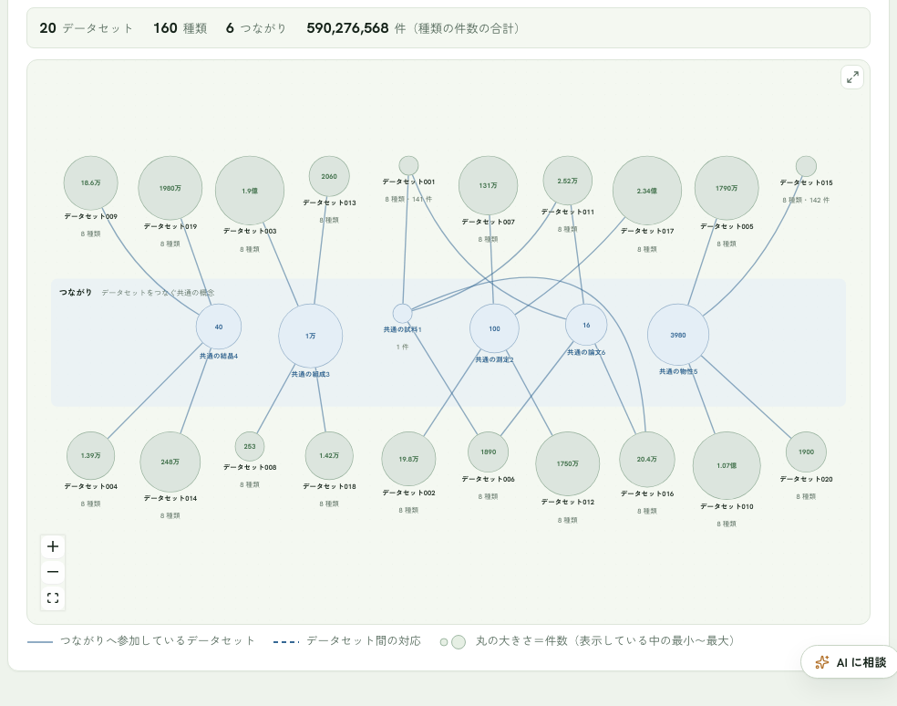
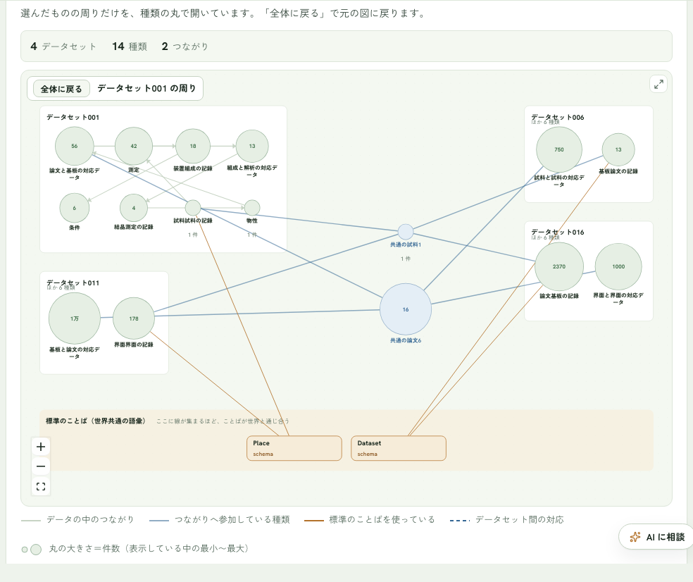

<!--
  Asterism マニュアル（人間向けヘルプ = AI 相談チャットの知識、単一の真実源）。
  getting-started.md の冒頭コメントに書いた表記規約（ボタンは「文言」ボタン、
  タブは「文言」タブ、サイドバーのメニュー項目はメニューの「文言」の形で書く
  こと）は本ファイルにも適用される。
-->

# ことば — 問いから決める・標準に合わせる・線でつなぐ

## ことばとは

複数のデータセットをまたいで使う「データの種類」と「項目」の名前を、ことば
と呼びます。ことばには 2 通りあります。

- **取り込んだデータが使っていることば** — 各データセットの設計から自動で
  集まります。複数のデータセットで名前が揃っているほど、データをまたいだ質
  問や比較ができます。
- **共有のことば** — 人が名前を付けて作る、実体を持たないことばです。個々の
  データは持たず、名前だけを持ちます。データセットや標準のことばと線でつな
  いで初めて、質問に答えられるようになります。

共有のことばは、**問いに答えるために**作ります。問いのないことばは作れませ
ん。

## 入口

メニューの「ことば」から、次の 4 つが同じ画面で見られます。

- 問いを書く入口（「問いから始める」）
- ことばの地図
- ことばの一覧（共有のことばを作る）
- 線の一覧

<!-- 撮影は統合時: ../screenshots/vocab-words.png（「ことば」画面の全体） -->

## 問いから始める

画面の最初に「問いから始める」の節があります。知りたいことを 1 文で「問い」
に書き、答えに要るもの（データの種類・項目）を「答えに要る語を置く」で置い
ていきます。データがまだ無くても書けます。保存するときは、ことばと問いを
いっしょに保存します。

問いが先でも、ことばが先でも、「問いのないことばは作らない」ことは同じで
す。

### Ask からの持ち込み

Ask（質問する）で、問いに答えられなかったとき（答えが無かった回答の下）
は、「この問いに答えられるように、ことばをつなぐ」ボタンでここへ来られます。
問いの題だけが持ち込まれ、答えに要る語はあなたが置きます（AI は使いません）。

## 共有のことばを作る

「ことばを作る」で作ります。

1. **標準の語を先に探します。** 英語の名前（または取り込み時の列名）で標準の
   ことばの一覧から機械的に探します（AI は使いません）。合うものがあれば
   「この標準の語を使う」を選ぶのがはじめの選択です。選ぶと、ことばは作り
   ません（書きかけの問いも保存されません）。「線」の節の「標準の語へ」で、
   データセットの種類・項目をその標準の語に合わせてください。標準の語を照
   合している間は、「ことばを作る」は押せません。
2. 標準の語を使わないときだけ、「使わずに新しく作る」を選び、理由を書きます
   （記録に残ります）。
3. 名前・ID（slug）・ひとこと説明を入れます。ID は半角英数字（小文字で始まり、
   英小文字・数字・アンダースコア）で、人が入れます。英語の名前や標準の語が
   あれば、それを元にした案が入ります。同じ ID のことばがすでにあるときは作れ
   ません（そのことばを使ってください）。
4. **問いを 1 つ以上書きます**（必須）。作る画面の「問いを足す」で、保存す
   る前に問いを増やせます。作ったあとは、「ことば」の一覧にある各ことばの
   「問いを足す」から、あとで問いを足せます（題を書くと、問いの数え方は種
   類なら件数、項目なら値と決まっています）。

種類は「データの種類」か「項目」のどちらか一方です。

### まだ線になっていない（孤立の札）

作ったばかりのことばには「まだ線になっていない」の札が付きます。そのことば
の問いに答えるデータセットがまだ 1 つも無い状態です。この間は、ことばは一覧
と地図には出ますが、質問（Ask）や外部のツール（MCP）には出ません。線が引か
れて答えられるデータセットができると、札は外れます。ことば同士の線だけでは
札は外れません。札の付いたことばが 20 個を超えると、一覧の上に注意が出ます
（作れる数の上限ではありません）。

### ことばを外す

「ことばを外す」で外せます。線が残っているときは外せないので、先に線を外し
てください。

## ことばの地図 <Badge type="tip" text="v0.40.0 (2026-09-02) で追加" />

「ことば」画面の中に「ことばの地図」が表示されます。データセットがつながる
ほど、この地図は育ちます。見せかたは「全体」（はじめの表示）と「詳しく」
の 2 つで、次の「「全体」と「詳しく」」で違いを説明します。以下の線の説明
と集計は、おもに「詳しく」の表示のものです。

「詳しく」では、設計のあるデータセットの「種類」（箱）と「項目」（箱の
中）をひとつの図に重ねます。箱を押すと、そのデータセットの詳細ページに
移動します。図の下の帯は標準のことば（世界共通の語彙）です。線は 4 種類
あります。

- 灰色の実線 — データの中のつながり（種類どうしの関係）
- 緑の実線 — 標準のことばを使っている（確定）
- 琥珀の点線 — 接地の候補（名前がほぼ一致する標準のことば。まだ確定して
  いません。候補は一覧から機械的に探すもので、AI は使いません）
- 青の点線 — データセット間の対応（「視点をつなぐ」で確定したもの）

なお、琥珀の点線は「詳しく」の接地の候補だけです。「全体」では、標準の
ことばを使っている（確定）線を琥珀の実線（細め）で描きます。

### 共有のことばの帯と「線を引く」

地図には、標準のことばの帯の上に**共有のことばの帯**が出ます（「全体」の
種類まで開いたときと「詳しく」。データセットごとの丸の段では描きません）。
種類の丸から共有のことばへ向きのある線が、共有のことばから標準のことばへ
同じ意味の線が伸びます。丸の大きさは、つながっているものの件数の合計です
（派生した値です）。データセットが 0 件でも帯は描きます。配置は、同じ入力な
ら必ず同じになります。

地図で丸を 2 つ選ぶと「線を引く」が出ます。小さなフォームで関係を選んで確
定します。選べる関係は、2 つの端の種類で絞られます。線を引く理由になる問い
は、書いても書かなくても構いません。引いた線は「線」の一覧に入ります。

図の上の集計（データセット・種類・項目・標準のことばを使用・接地の候補・
対応）は、同じ内容を数字で表したものです。「全体」のときの集計は、全体図に
描いたもの（データセット・種類・つながり・標準のことば・種類の件数の合計）
だけを数えます。

### 「全体」と「詳しく」 <Badge type="tip" text="v0.51.0 (2026-10-07) で追加" />

地図の上の「全体 ／ 詳しく」で見せかたを切り替えられます。はじめは「全体」です（選んだほうは次に開くときも覚えています）。

- **全体** — 種類を丸で描きます。丸が大きいほど、その種類のものが多く入っています。大きさは、いま図に出ている丸の中での比べです（図が変わると、同じ件数でも大きさが変わります）。件数は大きい丸なら丸の中に短く（「120万」など）、小さい丸なら名前の下に「820 件」と出ます。マウスを載せると正確な数が出ます。丸はデータセットの枠の中に並び、真ん中の丸は複数のデータセットをつなぐ「つながり」です。種類からつながりへ線が伸びます。標準のことばは下の帯です。線は、間にある別の丸やその名前に重ならないよう、曲がることがあります。項目までは描きません。
  - **データセットが多いとき**（7 つ以上、または種類が合わせて 41 以上のとき）は、丸が種類ではなく**データセット**になります。丸の大きさは種類の件数の合計（図の中での比べ）で、件数は丸の中に、名前の下には「N 種類」と出ます（小さい丸は名前の下に「N 種類・M 件」）。真ん中の帯が「つながり」で、データセットはその上と下に並びます。線はデータセットからつながりへ 1 本ずつ（線に載せると「N 種類が参加」と出ます）。

    

  - その丸（またはつながり）を**押すと、その周りだけが種類の丸で開きます**。ほかのデータセットは、つながりに参加している種類だけが出て、枠に「ほか N 種類」と書かれます。参加者が多いときは、上の帯に「ほか N 個のデータセットは省いています」と出て、数の多い順に一部だけが描かれます。上の「全体に戻る」を押すと元の図に戻ります。

    

  - 丸やつながりに**マウスを載せる**と、そこにつながる線が濃くなり、ほかの線は薄くなります。
- **詳しく** — 種類を箱で描き、箱の中に項目を並べます。項目が標準のことばに合っているか（使っている・候補・対応）まで見られます。

どちらの表示も、右上のボタンで窓いっぱいに広げて見られます（広げた中ではホイールで拡大縮小・Esc で戻る）。

「全体」（データセットが少ないとき、または周りを開いたとき）で丸を押すとその種類のページ、枠の名前のあたりを押すとそのデータセット、真ん中のつながりの丸を押すと「つながり」の画面に移ります。「全体」の線は、灰の実線がデータの中のつながり、青い実線がつながりへの参加、琥珀の実線が標準のことばを使っている種類、青の点線がデータセット間の対応です。

## 一覧の見方

一覧に並ぶのは、いま使われていることばです。データの種類は件数（その種類
のものが何件あるか）、項目は使用回数で表示されます。数えるのは公開済みの
データだけです。公開前の下書きは含まれず、公開すると集計に入ります。

それぞれのことばには、そのことばを使っているデータセットの一覧も付きます。

## 線

ことばの下の「線」に、ことばどうしを結んだ線が一覧で並びます。見る範囲を
次の 4 つから選べます。

| 範囲 | 何の線か |
|---|---|
| つながり同士 | 別々に作ったつながりが、同じものを指しているという対応 |
| 標準の語へ | データセットを選び、そのデータセットが作った種類・項目を標準のことばに合わせる（合わせた線もここで見られる） |
| ことばへ | データの種類・項目から、共有のことばへ結んだ線 |
| データセット同士 | データセットの種類どうしの対応 |

各行には両端（データセット・つながり・ことば・標準の語の札つき）、関係、
日付が出ます。線が答える問いを選んで引いたときは、問いの題も出ます。結んだ先が今は見つからない線は「切れて
いる」と表示されます。「線を外す」で取り消せます。取り消した線は、いつでも
引き直せます。

線を引くときは、ことばの結び先を循環させることはできません（すでに下にあ
るものを上に結ぶなど）。まだ作っていないことばや、種類と項目を混ぜた線も引
けません。

従来の「つながりどうしを対応づける」と、標準のことばへの対応は、ここに移
りました。元の画面には、ここへの案内だけが残っています。

## ことばの名前を直す

ことばの名前を直したいときは、そのデータセットを開いて「設計を見直す」ボ
タンから変更できます。複数のデータセットが共通で使うことばは、名前を変え
るとそれを使うすべてのデータの検索・回答に影響するので注意してください。

## 標準のことばに合わせる（任意） <Badge type="tip" text="v0.5.0 (2026-06-15) で追加" />

自分のデータ専用のことばを、よく使われる標準のことば（QUDT・schema.org
など）に結びつけることができます。合わせておくと、他のデータと自動でつな
がり、外部のツールや AI もそのまま理解できます。合わせるかどうかは任意で、
合わせなくても検索・引用はそのまま使えます。

## 合わせ方

データセットの「中身」タブを開き、候補から選びます。候補は標準のことばの
一覧から機械的に探すもので、AI は使いません。英語のふつうの言い方（例:
temperature, crystal structure）でも検索できます。合わせたい候補が見つ
かったら「この標準に合わせる」ボタンで確定します。あとから解除することも
できます。

## この列は何を測っているか <Badge type="tip" text="v0.17.5 (2026-08-21) で追加" />

項目名を標準に合わせるのとは別に、「この列は何を測っているか」という問い
にも合わせられます。単位が手がかりになるので、項目名が略記でも見つかるこ
とがあります。合わせておくと、「熱伝導率を測った人」のようにデータをまた
いで横断的に探せるようになります。

## すでに使われている標準

データの中ですでに使われていた、よく知られた標準のことばは、自動で検出さ
れて一覧に表示されます。あらためて合わせる操作をしなくても、最初から標準
に沿っている場合はそのまま表示されます。

## 関連

- データどうしをつなぐ話は [crosswalk.md](./crosswalk.md) を参照してくだ
  さい。
- 公開の流れは [getting-started.md](./getting-started.md) を参照してくだ
  さい。
