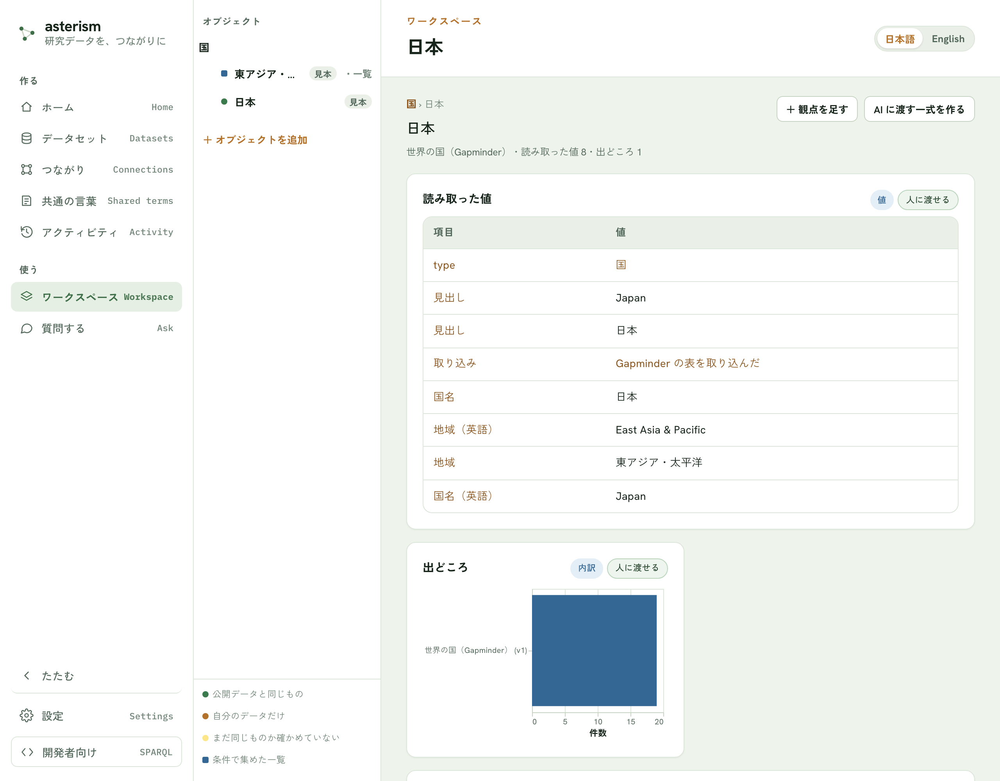
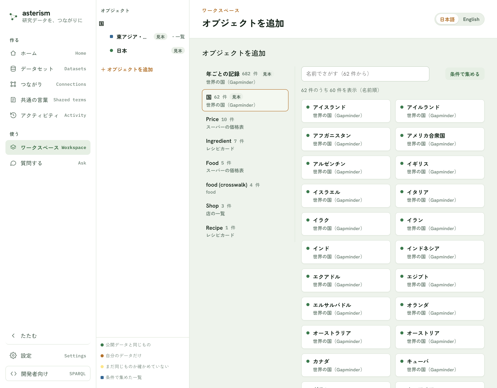
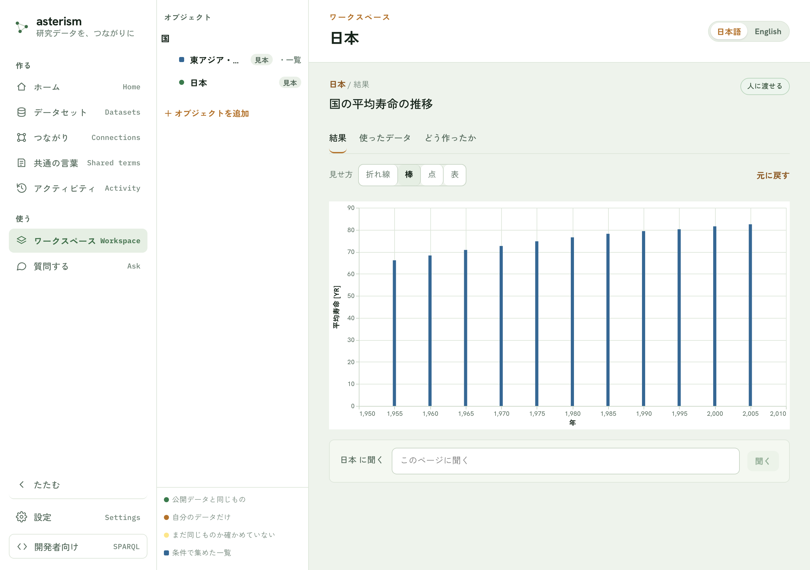
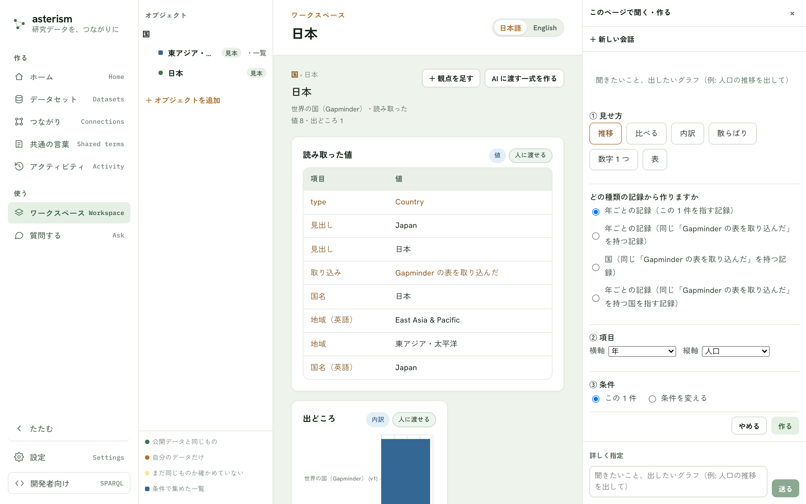
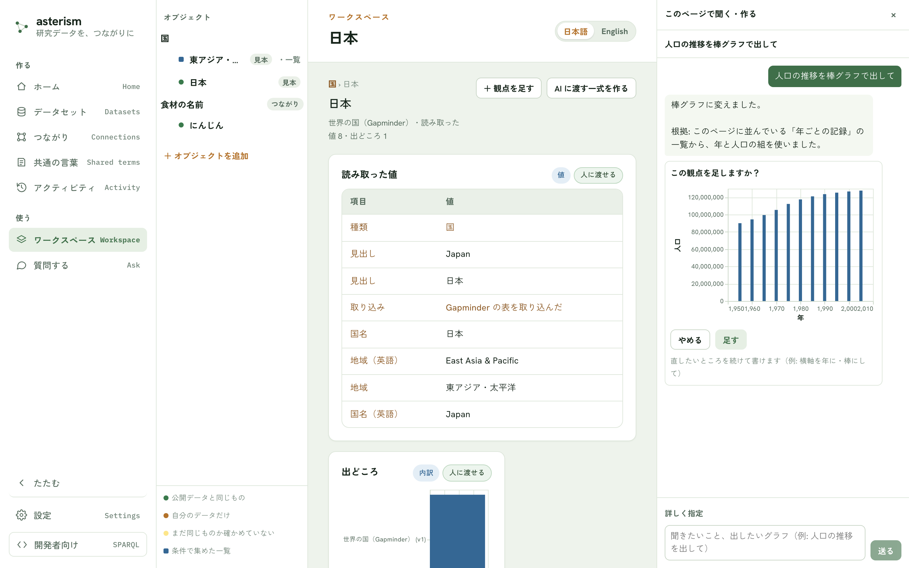
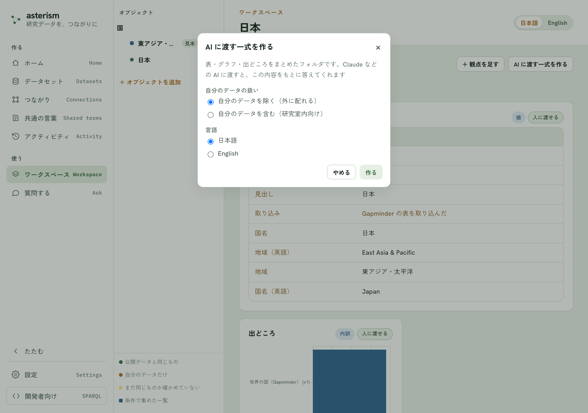
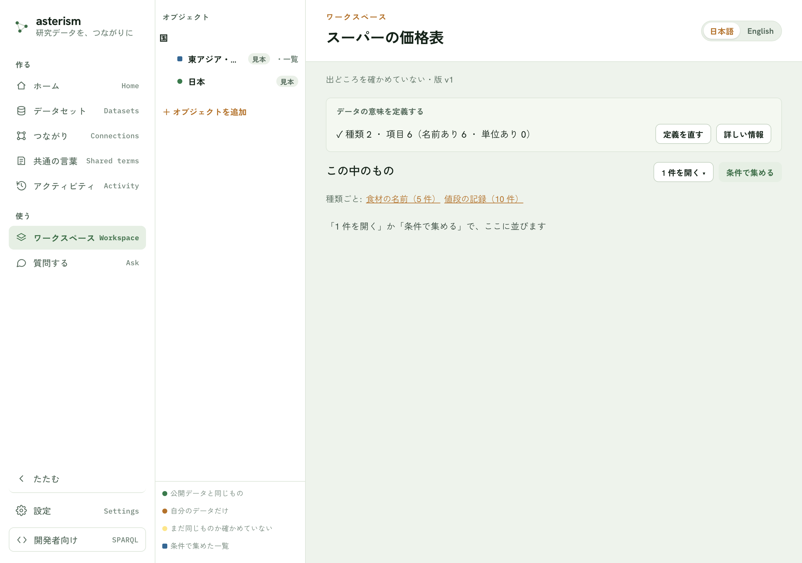
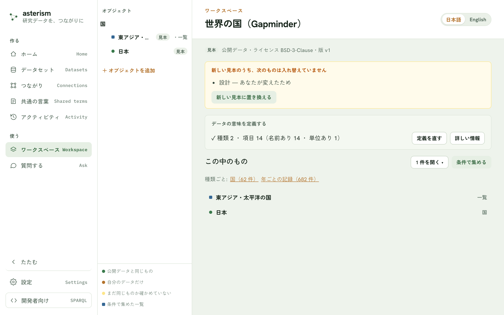

<!--
  Asterism マニュアル（人間向けヘルプ = AI 相談チャットの知識、単一の真実源）。
  getting-started.md の冒頭コメントに書いた表記規約（ボタンは「文言」ボタン、
  タブは「文言」タブ、サイドバーのメニュー項目はメニューの「文言」の形で書く
  こと）は本ファイルにも適用される。
-->

# ワークスペース — 1 件を開いて、見る・聞く・作る <Badge type="tip" text="v0.46.0 (2026-09-29) で追加" />

## ワークスペースとは

ワークスペースは、取り込んで公開したデータを「種類 › オブジェクト › 観点」
の順に開いて使う場所です。オブジェクトは、あるデータセットに出てくる 1 件
（例: 1 つの国）のことです。観点は、その 1 件についてのグラフや表（推移・
比べる・内訳など）のことです。

デスクトップ版では、最初に起動したときに見本「世界の国（Gapminder）」が
入るので、自分のデータがまだ無くても試せます。種類は「国」、記録は「年ごとの記録」で、1 件として
「日本」を開いたり、「東アジア・太平洋の国」のような一覧を作ったりできます。
「国の人口の推移」「国の平均寿命の推移」は、この見本にあらかじめ用意された
観点です。アプリを新しくすると見本も新しくなります。あなたが変えたところはそのままです
（くわしくは、このあとの「見本が新しくなったとき」）。

メニューの「ワークスペース」で開きます。アプリを開いたときに最初に映る
画面でもあります。

## 画面の見かた

画面は左から 3 つに分かれています。

| 列 | 何があるか |
|---|---|
| ナビ | 左のいちばん端。「作る」「使う」の見出しでメニュー項目が並びます。メニューの「ワークスペース」もここにあります |
| オブジェクトの列 | 追加したオブジェクトが種類ごとに並びます。種類の名前を押すと、その種類のページが開きます。行の色の点の意味は、列のいちばん下の凡例（公開データと同じもの／自分のデータだけ／まだ同じものか確かめていない／条件で集めた一覧）にあります |
| ページ | いま選んでいる 1 件・条件で集めた一覧・種類・データセットのいずれかの中身が表示されます |

オブジェクトの列の下にある「＋ オブジェクトを追加」ボタンから、新しい
オブジェクトを選べます。

## オブジェクトを追加する

「＋ オブジェクトを追加」ボタンを押すと、追加の画面が開きます。

1. 左の一覧から種類を選びます。種類の名前の横に件数、その下にどのデータ
   セットのものかが出ています
2. 右側に、その種類のオブジェクトが並びます。名前でさがすか、
   「条件で集める」ボタンで条件を指定します

| 選びかた | 開くページ | あとから変えられるもの |
|---|---|---|
| 名前でさがして 1 件を選ぶ | その 1 件のページ | 変わりません（いつも同じ 1 件を指します） |
| 「条件で集める」ボタンで条件を決める | 条件に合うものの一覧のページ | 「条件を変える」ボタンで、集める条件を変えられます |

## 1 件のページを読む

1 件のページを開くと、最初から次のカードが並びます。

- 読み取った値
- 出どころ
- 作られた手順（何かから作られた記録のときだけ）
- そのデータセットにあらかじめ用意された観点（見本なら「国の人口の推移」
  「国の平均寿命の推移」など）

同じデータの別のページで足された観点があるときは、「同じデータで使われている
観点」の帯に並びます。押すと、このページの条件で同じグラフを足せます。

各カードの右上には、そのカードの中身を表す印が付きます（値・内訳・手順・
条件と量・量・量と量・順位など）。AI が書いた見せ方のカードには「AI が
書いた見せ方」の印が付きます。カードの中身が外に配ってよいものかどうかは
「人に渡せる」または「自分だけ」の印で分かります。

## カードを開く

カードを押すとカードの詳細が開きます。詳細には 3 つのタブがあります。

- 「結果」タブ — グラフや表そのもの
- 「使ったデータ」タブ — 使ったデータ・出どころ・いつの版か・ライセンスの一覧
- 「どう作ったか」タブ — AI に渡す一式に何が入るかの内訳、この観点をめぐって
  交わした会話の記録、ふだんは見なくてよい技術情報（使ったツール・実行した
  クエリなど）

## 見せ方を変える

グラフや表になっているカードは、結果の形に応じて折れ線・棒・点・表を
切り替えられます。ほかに、縦横を入れ替える、色分けする、が選べる場合が
あります。切り替えたあとは「元に戻す」で既定の見せ方に戻せます。

選べる見せ方は結果の形で決まります（例えば 1 つの数字しか無いカードには
折れ線の選択肢は出ません）。選んだ見せ方は自分の手元にだけ残り、他の人には
影響しません。カードの詳細で選んだ見せ方は、一覧に並ぶカードの絵にも
そのまま反映されます。

## 観点を足す

「＋ 観点を足す」ボタンを押すと、ページの右に「このページで聞く・作る」の
パネルが開きます。ページは隠れず、横に並びます。作りかたは 2 つあります。

| 作りかた | どうするか | AI を使うか |
|---|---|---|
| 言葉で頼む | パネルのいちばん下の入力欄に、出したいグラフを書いて「送る」ボタンを押す | 使います |
| 自分で選ぶ | 「詳しく指定」を押してフォームを開く | 使いません |

フォームは次の 3 段階です。

1. 見せ方（推移・比べる・内訳・散らばり・数字 1 つ・表）を選ぶ
2. 項目（横軸・縦軸・分類・集計のしかたなど）を選ぶ
3. 条件（この 1 件だけ／このページの条件など）を選ぶ

1 件のページでは、どの種類の記録から作るかの候補が 2 つ以上あるときだけ、
見せ方を選んだあとにそれを聞かれます（この 1 件を指す記録のほか、同じ親を持つ
記録なども候補になります）。候補が 1 つなら、機械がそれを使います。

「作る」ボタンを押すとその場でカードが足されます。

AI の鍵を登録していないときは、パネルを開くとフォームがそのまま表示されます
（「詳しく指定」を押す必要はありません）。

## このページで聞く・作る

ページの下にある入力欄に聞きたいことを書いて「聞く」ボタンを押すと、同じ
パネルが右に開いて、AI との会話がはじまります。

- 質問には、このページに並んでいるカードの結果をもとに答えます
- 答えるのに必要な観点がページに無いときは、先に観点を足すことを提案して
  から答えます
- グラフや表を頼むと、提案がプレビューつきで出ます。「足す」ボタンを押すと、
  ページにカードとして足されます。直したいところは、続けて書けば作り直します

足したカードをあとから直したいときは、カードの「直す」ボタンから同じ会話に
戻れます。直した結果は、次のどちらかを選べます。

| ボタン | どうなるか |
|---|---|
| 「差し替える」ボタン | 元のカードを、同じ位置のまま置き換えます |
| 「別のカードとして足す」ボタン | 元のカードは残し、もう 1 枚足します |

会話は観点（カード）ごとにまとまります。パネルの上の「＋ 新しい会話」ボタンで、
別の話題をはじめられます。

## AI に渡す一式を作る

「AI に渡す一式を作る」ボタンから、いま並んでいるカードをまとめて、
Claude などの AI に渡せるフォルダを作れます。中身は、カードの詳細の
「どう作ったか」タブに出る内訳と同じで、読み取った値・使った道具・カードの
記録・何ができるかの説明・起動の設定です。

作るときに、自分のデータを含めるかどうかを選べます。自分のデータを除けば
外部に配れる版になり、含めれば研究室内向けの版になります。ライセンスが
決まっていないデータや、再配布できないデータが混ざっている場合は、外に
配れる版として作れません。

## データセットのページ

データセットのページは、公開した直後の画面の
「データセットのページを見る」ボタンから開けます。ワークスペースからは、
種類のページ（オブジェクトの列で種類の名前を押す）の「データの定義を見る」ボタンと
「定義を直す」ボタンで、下と同じ「見る」「直す」に直接進めます。

- 「定義を直す」ボタン — 列・単位・名前などの定義を見直せます。まだ公開して
  いないデータセットでは、このボタンは「続きから」になります
- 「詳しい情報」ボタン — 中身・取り込み・公開・つながり・元のファイルとの
  対応をまとめた詳細画面が開きます（公開済みのデータセットにだけ出ます）
- 「この中のもの」— 「1 件を開く」でこのデータセットの中から名前で選ぶか、
  「条件で集める」で一覧を作れます

### 見本が新しくなったとき

見本のページ（出どころの行に「見本」の印が付きます）には、見本の新しさについての知らせが出ます。
アプリを新しくすると、見本もアプリと一緒に新しい版になります。ただし、**あなたが変えたところは
そのまま**残ります。

- 新しくなったとき — 「この見本は ○月○日 に新しい版になりました — ……」と 1 行で知らせます
- あなたが変えたので新しくしていないものがあるとき — 「新しい見本のうち、次のものは入れ替えて
  いません」の帯に、設計・説明・AI に渡す道具・名前・データのうち何が、どんな理由で入れ替わって
  いないかが並びます
- 帯の「新しい見本に置き換える」ボタン — あなたが変えたもの（設計・説明・AI に渡す道具・名前）を、
  新しい見本に置き換えます。押すと確認が出て、いまの内容は**控えとして残る**ことが示されます。
  データを追記した・取り込み直した場合と、引用の住所が変わる版は、あなたのデータや引用の住所を
  守るため、このボタンでは置き換えません
- 「控えから戻す」ボタン — 置き換える前の内容を控えているときに出ます。押すと確認が出て、置き換える
  前の内容に戻ります（戻した部分は、また「入れ替えていないもの」に並びます）。置き換えたあとに直した
  分があれば、戻す前のいまの内容を別の控えとして残すので、そこから戻せます

AI に渡す道具を置き換えたときは、外部の AI からは、アプリを次に起動したときから新しくなります。
置き換えと戻しは、メニューの「アクティビティ」にも 1 行ずつ残ります。

## 同じものは 1 つのページ

別々のデータセットにある同じ対象は、つながりを作ると 1 つのページに
まとまります。詳しい仕組みは [crosswalk.md](./crosswalk.md#同じものは-1-つのページ)
を参照してください。

## 関連

- 新しいデータを取り込んで公開するまでの流れは
  [はじめる](./getting-started.md) を参照してください
- データセット単位の公開・追記・見直しは
  [データセットの管理](./datasets.md) を参照してください
- データセット間のつながりの作りかたは [つながり](./crosswalk.md)
  を参照してください
- 公開済みデータにまとめて自然な言葉で質問したいときは
  [質問する](./ask.md) を参照してください（このページで聞く・作るとの
  違いは同章の「関連」に書いています）
